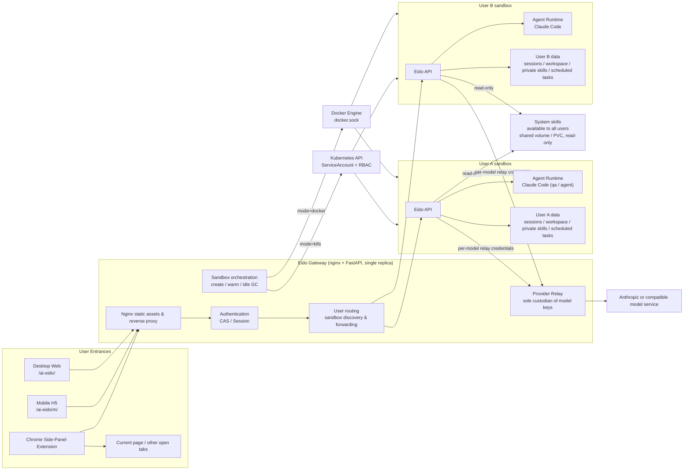

# Eido

Eido is an AI agent platform for real-world workflows: starting from a conversation, it connects web content, attachments, workspace files, reusable skills, and scheduled tasks, letting the agent plan, execute, produce, and accumulate results.

The project ships three client surfaces — desktop web, mobile H5, and a Chrome side-panel extension — and four deployment options: local development, single-tenant Docker, multi-user Docker sandbox, and multi-user Kubernetes sandbox (DaoCloud DCE 5.0).

> 中文版：[README.md](README.md)

## Highlights

- **Agent execution core**: The backend drives streaming conversations, tool calls, file output, and multi-turn execution through the Claude Agent SDK / Claude Code harness.
- **Dual runtime modes**: Each session can run in **QA** mode — a single-turn text answer with no tools, skills, or project context, lightweight and cheap — or **Agent** mode — the full Claude Code capability set (tools, skills, MCP, projects, and native memory) with autonomous multi-turn execution.
- **Skill system**: Skills are described in `SKILL.md` files covering capability, usage boundaries, and tool constraints; supports system skills, per-user private skills, and online create/upload/edit/delete with file-level management.
- **Multi-skill orchestration**: The frontend lets you select or `@`-mention skills in a conversation; the backend chains multiple skills into one task context — suited to research, document parsing, email, search, and file-processing scenarios.
- **Observable process**: Streams model reasoning, execution steps, cited sources, workflow Mermaid diagrams, pending confirmations, and the final answer; the frontend shows task progress step by step.
- **Session workspaces**: Every session gets an isolated workspace with rich attachment upload (Word, PDF, TXT/LOG, spreadsheets, code, images, archives) and result-file view/download/delete; history and file context remain reusable.
- **Project knowledge**: Project sessions automatically receive project instructions and shared materials; generated results in a session's `outputs/` can be copied into project materials in one click for later sessions.
- **Persistent memory & MCP**: Claude Code auto-memory is persisted per user and per personal/project scope; users can configure private HTTP, SSE, or stdio MCP servers from the UI, with sensitive values encrypted at rest.
- **Unified search**: The desktop sidebar searches project metadata, session titles, and full message bodies, with last-updated timestamps.
- **Web context analysis**: The Chrome extension opens in the browser's Side Panel, reads the current page, and can pull in other open tabs for analysis.
- **Scheduled tasks**: Create, edit, run now, and schedule skill, script, and conversation tasks — for daily reports, monitoring, summarization, and other automation.
- **Multi-surface experience**: Desktop web for the full workbench; mobile H5 and the Chrome extension reuse the core API and data model with layouts tuned for narrow screens.
- **Auth & isolation**: Supports password-free local development, CAS login, admin users, and system/user skill separation; in multi-user sandbox mode the gateway is the single entry point and provisions isolated containers (Docker) or Pods + PVCs (Kubernetes) per user, with idle reclamation and persistent data.
- **Fast deployment**: Four deployment paths — local, single-tenant Docker, multi-user Docker sandbox, and Kubernetes; works with any Anthropic-API-compatible model service.

## Tech Stack

| Module | Key technologies |
| --- | --- |
| Backend | FastAPI, Pydantic v2, Uvicorn, SQLite, APScheduler, python-cas, Docker SDK, Kubernetes client |
| Agent | Claude Agent SDK, Claude Code harness |
| File processing | PyMuPDF, pypdf, pdfplumber, ReportLab, fpdf2, python-docx, python-pptx, pandas/openpyxl |
| Desktop frontend | React 19, Vite 6, TypeScript, Ant Design 6, Tailwind CSS, Mermaid, react-markdown |
| Mobile H5 | React 19, Vite 6, antd-mobile, Tailwind CSS, shared desktop API/type layer |
| Chrome extension | Manifest V3, Chrome Side Panel API, React 19, antd-mobile, content/background scripts |
| Deployment | Nginx, Supervisor, Docker Compose profiles, Kubernetes manifests, app / gateway / user images |

## Architecture



In multi-user sandbox mode, the gateway owns static assets, authentication, user routing, sandbox orchestration, and the model provider relay. The orchestration backend is chosen by `EIDO_SANDBOX_MODE`: `docker` creates per-user containers and volumes through the Docker SDK (mounted docker.sock); `k8s` creates a Pod + PVC per user via a ServiceAccount and the Kubernetes API — no docker.sock involved, and every sandbox is visible and observable in the DCE console. Both backends share the same data semantics: idle reclamation deletes only the runtime (container/Pod) while data (volume/PVC) is retained forever; the next visit rebuilds and reuses it. The system skill library is a platform-level shared capability — available to all users, read-only for regular users — while private skills, session data, workspace files, and execution environments stay isolated. Model keys are held only by the gateway; user sandboxes receive per-model relay credentials.

The single-tenant mode is a simplified form of this architecture: drop the gateway orchestration and per-user sandboxes and keep a single application runtime.

## Repository Layout

| Path | Description |
| --- | --- |
| `backend/` | FastAPI backend: auth, sessions, chat, skills, tasks, workspace, and sandbox proxy APIs |
| `frontend/` | Desktop web workbench, entry `/ai-eido/` |
| `frontend-mobile/` | Mobile H5, entry `/ai-eido/m/`; also the narrow-layout base for the extension |
| `frontend-extension/` | Chrome Manifest V3 extension running in the Side Panel |
| `docker/` | Dockerfiles, Compose profiles, Nginx/Supervisor configs, deployment notes |
| `k8s/` | Kubernetes (DaoCloud DCE 5.0) multi-user sandbox deployment: manifests (namespace / RBAC / storage / Secret / gateway / CAS), kind cluster config, deployment guide |
| `extension-update-server/` | Standalone Chrome extension update service: hosts CRX files and serves update manifests to Chrome's native updater |
| `deployment/` | Enterprise intranet extension distribution package (Windows AD/GPO install + Nginx-hosted update manifest) |
| `docs/` | Topic docs: architecture, API, skill secret protection, models, sandbox |
| `skill-example/` | Skill development examples |
| `.agents/skills/` | Built-in / example skill assets; the runtime default skill directory is `.claude/skills/` |
| `quick-start.md` | More detailed local & Docker quick-start guide (Chinese) |

## Local Development

### 1. Configure model access

Eido calls models through the Claude Agent SDK. For development, configure `backend/.env`:

```bash
cd backend
cp .env.example .env
```

Official Anthropic API (recommended):

```env
ANTHROPIC_API_KEY=sk-ant-xxxxx
```

The Agent SDK requires non-interactive API credentials; a local `claude /login` with a
Claude.ai Pro/Max account cannot authenticate the Eido backend. `backend/.env` is read
by the backend config layer and passed explicitly to the SDK's bundled CLI — no manual
`export` needed before startup.

MiniMax-compatible gateway example:

```env
ANTHROPIC_BASE_URL=https://api.minimaxi.com/anthropic
ANTHROPIC_API_KEY=your_minimax_key
```

DeepSeek example:

```env
ANTHROPIC_BASE_URL=https://api.deepseek.com/anthropic
ANTHROPIC_AUTH_TOKEN=your_deepseek_key
ANTHROPIC_MODEL=deepseek-chat
ANTHROPIC_SMALL_FAST_MODEL=deepseek-chat
API_TIMEOUT_MS=600000
CLAUDE_CODE_DISABLE_NONESSENTIAL_TRAFFIC=1
```

The Agent SDK bundles a matching Claude Code CLI; no separate CLI install is needed.

### 2. Start the backend

```bash
cd backend
python -m venv .venv
source .venv/bin/activate
pip install -r requirements.txt
python run.py
```

The backend listens on `http://127.0.0.1:8000`. Set `AUTH_DISABLED=True` in `backend/.env` to skip login during local development.

### 3. Start the desktop frontend

```bash
cd frontend
npm install
npm run dev
```

Open `http://localhost:3000/ai-eido/`. Vite proxies `/ai-eido/api` to the backend `/api`.

### 4. Start the mobile H5

```bash
cd frontend-mobile
npm install
npm run dev
```

Open `http://localhost:3001/ai-eido/m/`.

### 5. Build the Chrome extension

```bash
cd frontend-extension
npm install
npm run build
```

Then open `chrome://extensions`, enable developer mode, choose "Load unpacked", and select `frontend-extension/dist`.

The extension connects to `http://localhost:8000` by default. To target another backend:

```bash
VITE_EIDO_BACKEND_URL=https://your-domain.example.com npm run build
```

The extension opens in the browser's Side Panel; the debug console entry is under "My Settings", and the native DevTools are available from the extension details page's Inspect views.

### 6. Choose a model

Desktop, mobile, and the extension all switch the session model below the chat input. The catalog is maintained in [`backend/config/models.yaml`](backend/config/models.yaml); the choice persists per session, switching clears the old native SID and resumes onto the new model from existing messages.

Each model can have its own Anthropic-compatible provider. Prefer referencing environment variables in the YAML to keep keys out of the repo:

```yaml
version: 1
default: glm
models:
  - id: glm
    label: GLM
    model: glm-5.3
    provider:
      base_url_env: GLM_BASE_URL
      api_key_env: GLM_API_KEY
      small_fast_model_env: GLM_SMALL_FAST_MODEL
  - id: deepseek
    label: DeepSeek
    model: deepseek-chat
    provider:
      base_url: https://your-deepseek-compatible-endpoint.example
      auth_token_env: DEEPSEEK_AUTH_TOKEN
```

`provider` supports `base_url`, `api_key` (or `key`), `auth_token`, `small_fast_model`, plus matching `*_env` fields. Single-container mode hands the selected model's config straight to Claude Code; multi-user sandbox mode keeps real endpoints and keys in the gateway, and user containers only see the per-model provider relay. `GET /chat/models` never returns provider config.

## Docker Deployment

### Single-tenant mode

For personal use, on-machine service, or a trusted small team:

```bash
cp docker/.env.example docker/.env
$EDITOR docker/.env
set -a && . docker/.env && set +a
docker compose -f docker/docker-compose.yml --profile default up -d
```

Default entry: `http://localhost/ai-eido/`. Change the host port with `EIDO_PORT`.

### Multi-user sandbox mode

For multi-user environments. The gateway exposes the single entry point and provisions isolated containers per user:

```bash
cp docker/.env.example docker/.env
$EDITOR docker/.env
set -a && . docker/.env && set +a
docker compose -f docker/docker-compose.yml --profile sandbox up -d
```

Sandbox mode requires careful configuration of `SESSION_SECRET_KEY`, `EIDO_GATEWAY_SECRET`, model keys, admin accounts, and CAS/auth variables. Compose mounts the Docker socket into the gateway to create per-user containers — deploy only on trusted machines.

Reaching upstream LLMs (e.g. `open.bigmodel.cn`) requires resolving public domains, so Compose configures public DNS for `eido` / `eido-gateway` (defaults `223.5.5.5` / `114.114.114.114`; override with `EIDO_DNS_1` / `EIDO_DNS_2`). In intranet deployments, point these at your corporate DNS.

### Building images

```bash
cd frontend
npm install
npm run build

cd ../frontend-mobile
npm install
npm run build

cd ..
docker build -f docker/app.Dockerfile -t damaohongtu/eido:latest .
docker build -f docker/gateway.Dockerfile -t damaohongtu/eido-gateway:latest .
docker build -f docker/user.Dockerfile -t damaohongtu/eido-user:latest .
```

The `gateway` / `user` images serve both the Docker sandbox and Kubernetes deployments. The extension is not baked into the app image; build `frontend-extension/dist` separately to distribute it.

## Kubernetes Deployment (Multi-User Sandbox · DaoCloud DCE 5.0)

The Kubernetes flavor of the multi-user sandbox: the gateway runs with `EIDO_SANDBOX_MODE=k8s` and provisions a **Pod + PVC** per logged-in user through a ServiceAccount and the Kubernetes API — no docker.sock. User data (sessions, workspace, private skills, scheduled tasks) lives on a dedicated PVC (default `5Gi`); idle reclamation (`EIDO_SANDBOX_IDLE_TTL`, default 900 s) deletes only the Pod and keeps the PVC, and the next visit rebuilds the Pod reusing the same data. The system skill library is mounted read-only from a shared PVC. Every user Pod/PVC is visible and observable in the DCE console.

End-to-end verified on kind + DaoCloud DCE 5.0 community edition (installer v0.44.0, Apple Silicon): multi-account CAS login callback, SSE streaming chat (GLM via provider relay), two-user data isolation, idle GC with rebuild-and-reuse, and license activation.

```bash
# 1. kind cluster (with DCE / eido port mappings)
kind create cluster --config k8s/kind-eido-dce.yaml

# 2. Build images (see "Building images" above), then load them
kind load docker-image damaohongtu/eido-gateway:latest --name eido-dce
kind load docker-image damaohongtu/eido-user:latest --name eido-dce

# 3. Deploy
cd k8s
./gen-secret.sh   # generates 30-secret.yaml from docker/.env (or copy 30-secret.example.yaml and fill in)
kubectl apply -f 00-namespace.yaml
kubectl apply -f 10-rbac.yaml -f 20-storage.yaml -f 30-secret.yaml
kubectl apply -f 40-gateway.yaml -f 50-cas.yaml
kubectl -n eido-system get po,pvc   # wait for Running / Bound
```

Open `http://localhost:19080/ai-eido/` in a browser, log in via the local CAS (test1/123456), and the first visit automatically creates the `eido-user-<user>` Pod + PVC.

> Two local-verification notes: ① the CAS address must be reachable by both the
> browser and the Pods — add `127.0.0.1 cas.eido-system.svc.cluster.local` to
> `/etc/hosts` (remove after verification); ② the host port is 19080, not 10080 —
> 10080 is on the browsers' blocked-port list (amanda) and Chrome/Safari will fail
> with `ERR_UNSAFE_PORT`.

See [k8s/README.md](k8s/README.md) (Chinese) for the DCE community-edition install (field-tested on Apple Silicon), the license activation flow, and production differences (image registry, multi-node RWX storage, Ingress entry).

## Common Configuration

| Variable | Description |
| --- | --- |
| `ANTHROPIC_BASE_URL` | Anthropic-compatible API base URL; leave empty for the official API |
| `ANTHROPIC_API_KEY` / `ANTHROPIC_AUTH_TOKEN` | Non-interactive model credentials for the Agent SDK; prefer `ANTHROPIC_API_KEY` with the official API |
| `ANTHROPIC_MODEL` | Default provider model for legacy deployments; overrides the catalog default when it matches a catalog `model` |
| `CLAUDE_MODELS_FILE` | Model catalog file; default `backend/config/models.yaml`, ships GLM and DeepSeek |
| `GLM_*` / `DEEPSEEK_*` | Standalone `BASE_URL`, `API_KEY`, `AUTH_TOKEN`, `SMALL_FAST_MODEL` referenced by the built-in catalog |
| `CLAUDE_EFFORT` | Optional reasoning effort, set per model support; empty = native default |
| `CLAUDE_COMPACT_PERCENT` | Native auto-compact trigger percentage, default 80 |
| `CLAUDE_SIMPLE_SYSTEM_PROMPT` | Use Claude Code's lean native system prompt, default on; keeps tools, hooks, MCP, skills, memory, and CLAUDE.md |
| `ANTHROPIC_SMALL_FAST_MODEL` | Fast/small model name |
| `AUTH_DISABLED` | Skip login for local development |
| `SESSION_SECRET_KEY` | Session encryption key; must be changed in production |
| `FRONTEND_URL` | Frontend URL used for auth redirects and CORS |
| `CAS_SERVER_URL` | CAS service URL |
| `EIDO_ADMIN_USERS` | Admin username list, used for system skill management |
| `SKILLS_DIR` | Skill root directory, usually `.claude/skills` |
| `EIDO_SANDBOX_MODE` | Sandbox mode: `local` (single process) / `docker` (per-user containers) / `k8s` (per-user Pod + PVC) |
| `EIDO_GATEWAY_INTERNAL_URL` | URL sandboxes use to reach back to the gateway; defaults to `http://eido-gateway/ai-eido` in docker mode, set to the in-cluster Service DNS in k8s mode |
| `EIDO_GATEWAY_SECRET` | Gateway master secret; derives per-user trust credentials and model proxy credentials |
| `EIDO_USER_IMAGE` | Sandbox user image |
| `EIDO_USER_MEM` / `EIDO_USER_CPUS` | Per-user sandbox resource limits, default `2g` / `1.0` |
| `EIDO_SANDBOX_IDLE_TTL` | Idle reclamation threshold in seconds, default 900; reclamation deletes only the container/Pod, volume/PVC is kept |
| `EIDO_K8S_NAMESPACE` | Namespace in k8s mode, default `eido-system` |
| `EIDO_K8S_STORAGE_CLASS` | StorageClass for user PVCs; empty = cluster default |
| `EIDO_K8S_SKILLS_CLAIM` | Shared skill library PVC name, default `eido-skills` |
| `EIDO_K8S_USER_STORAGE` | Per-user PVC size, default `5Gi` |
| `EIDO_K8S_IMAGE_PULL_SECRET` | imagePullSecret injected into user Pods when using a private registry |
| `EIDO_DNS_1` / `EIDO_DNS_2` | Public DNS for Compose containers (resolving upstream LLM domains), defaults `223.5.5.5` / `114.114.114.114` |
| `EIDO_PROJECT_MAX_FILES` / `EIDO_PROJECT_MAX_BYTES` | Per-project shared material count/byte limits, default 100 / 512 MiB |
| `EIDO_USER_PROJECT_MAX_FILES` / `EIDO_USER_PROJECT_MAX_BYTES` | Per-user project material count/byte limits, default 500 / 2 GiB |
| `BACKEND_CORS_ORIGIN_REGEX` | CORS regex allowing dynamic origins such as the Chrome extension |

## Runtime Data

- Skill directory: default `.claude/skills/`, containing `system/` and `users/<username>/`.
- Session database: default `.eido/chat_sessions.db`.
- Claude Code persistent data: default `.eido/claude/<user>/`, containing transcripts and auto-memory isolated per personal/project scope.
- User MCP config: default `.eido/mcp_servers.db`; environment variables and headers are encrypted with a host-persisted key.
  The desktop edits the standard `{ "mcpServers": { ... } }` JSON config as a whole; `disabled: true`
  keeps an entry without loading it, and saved secrets echo back as `__EIDO_SECRET__` (safe to keep as-is).
- Scheduled task database: default `.eido/scheduled_tasks.db`.
- Session workspaces: default `.eido/workspaces/<session_id>/`.
- Project shared materials: default `.eido/projects/<project_id>/files/`; plain direct chats create or bind no default project.
- Docker logs: `/var/log/eido/` inside containers, also mounted to a named volume by Compose.
- Kubernetes mode: all of the above live on PVCs — gateway databases and registry on `eido-gateway-data`, the system skill library on `eido-skills` (read-only in user Pods), and user data on each user's `eido-user-<user>`; in-container paths are identical to local mode.

## API Overview

| Capability | Path |
| --- | --- |
| Auth | `/api/v1/auth/*` |
| Streaming chat | `/api/v1/chat/chat` |
| Attachment upload | `/api/v1/chat/upload` |
| Session management | `/api/v1/sessions/*` |
| Projects & shared materials | `/api/v1/projects/*` |
| Skill management | `/api/v1/skills/*` |
| Scheduled tasks | `/api/v1/tasks/*` |
| Workspace files | `/api/v1/workspace/*` |
| MCP config | `/api/v1/mcp/*` |
| Unified search | `/api/v1/search/*` |

In multi-user sandbox mode, user requests are authenticated by the gateway and forwarded to the user's own sandbox (container/Pod); model requests all go through the gateway provider relay — real keys never leave the gateway.

See `docs/api.md` and `docs/architecture.md` for fuller API documentation.

## Development Checks

```bash
# Backend tests
cd backend
python -m pytest

# Frontend builds
cd frontend
npm run build

cd ../frontend-mobile
npm run build

cd ../frontend-extension
npm run build
```

## Reference Documentation

- `quick-start.md` (Chinese): detailed local/Docker quick start, model config, and skill directories.
- `k8s/README.md` (Chinese): Kubernetes (DaoCloud DCE 5.0) deployment guide — kind local verification, DCE community-edition install and licensing, production differences.
- `docs/architecture.md`: single-tenant and sandbox architecture.
- `docs/api.md`: backend API reference.
- `docs/project-design.md`: Project data, context, concurrency, files, and publishing design.
- `docs/skill-secret-protection.md`: skill secret protection.
- `frontend-extension/README.md`: Chrome extension build, login, and blank-page troubleshooting.
- `extension-update-server/README.md`: Chrome extension CRX update service.

Notes on native capabilities, performance, isolation, and upgrades: [Claude Code Platform Optimization Notes](docs/claude-native-platform-optimization.md).
