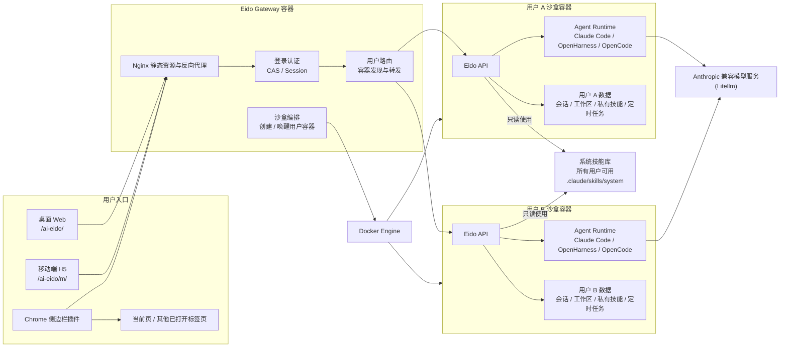

# Eido

Eido 是一个面向真实工作流的 AI 智能体平台：以对话为入口，把网页内容、附件、工作区文件、可复用技能和定时任务连接起来，让智能体可以规划、执行、产出并沉淀结果。

项目包含桌面 Web、移动端 H5 和 Chrome 侧边栏插件三类入口，并提供本地运行、Docker 单租户和 Docker 沙盒多用户三种部署方式。

## 核心亮点

- **智能体执行内核**：后端通过 Claude Agent SDK / Claude Code harness 驱动流式对话、工具调用、文件产出和多轮执行，并提供 OpenHarness 与 OpenCode 兼容入口。
- **技能系统**：以 `SKILL.md` 描述技能能力、使用边界和工具约束，支持系统技能、用户私有技能、在线创建、上传、编辑、删除和文件级管理。
- **多技能协作**：前端支持在对话中选择或 `@` 提及技能，后端可把多个技能串成任务上下文，适合投研、文档解析、邮件、搜索、文件处理等复合场景。
- **过程可观测**：流式返回模型思考、执行步骤、引用来源、工作流 Mermaid 图、待确认操作和最终回答，前端可逐步展示任务进展。
- **会话工作区**：每个会话拥有独立 workspace，支持附件上传、结果文件查看/下载/删除，历史消息和文件上下文可持续复用。
- **网页上下文分析**：Chrome 插件在当前浏览器右侧 Side Panel 打开，可读取当前页内容，也可选择用户已打开的其他标签页加入分析。
- **本机 Agent 模式**：Chrome 插件可直接连接本机 OpenCode；除用户认证外，会话、网页上下文、附件和执行结果均保留在浏览器与本机，不经过 Eido 后端。
- **定时任务**：支持技能、脚本和对话类任务的创建、编辑、手动运行和周期调度，用于日报、监控、摘要生成等自动化场景。
- **多端体验**：桌面 Web 适合完整工作台，移动端 H5 和 Chrome 插件复用核心 API 与数据模型，针对窄屏做了独立布局。
- **认证与隔离**：支持本地开发免登录、CAS 登录、管理员用户、系统/用户技能隔离，以及 gateway + per-user Docker 容器的多用户沙盒模式。
- **快速部署**：提供本地开发、Docker 单租户、Docker 沙盒多用户三种路径，并支持 Anthropic API 兼容模型服务。

## 技术栈

| 模块 | 主要技术 |
| --- | --- |
| 后端 | FastAPI, Pydantic v2, Uvicorn, SQLite, APScheduler, python-cas, Docker SDK |
| Agent | claude-agent-sdk, Claude Code harness, OpenHarness/OpenCode 兼容层, LiteLLM 相关依赖 |
| 桌面前端 | React 19, Vite 6, TypeScript, Ant Design 6, Tailwind CSS, Mermaid, react-markdown |
| 移动端 H5 | React 19, Vite 6, antd-mobile, Tailwind CSS, 共享桌面端 API/type 层 |
| Chrome 插件 | Manifest V3, Chrome Side Panel API, React 19, antd-mobile, content/background scripts |
| 本机 Agent | OpenCode Server API, HTTP/SSE, loopback-only connection |
| 部署 | Nginx, Supervisor, Docker Compose profiles, app/gateway/user 多镜像 |

## 架构概览



沙盒多用户模式下，gateway 负责静态资源、认证、用户路由和容器编排；每个用户进入独立沙盒容器，容器内运行 API、Agent runtime、会话数据库、工作区、私有技能和定时任务。系统技能库是平台级共享能力，所有用户都可以使用，普通用户以只读方式访问；用户私有技能、会话数据、工作区文件和执行环境保持隔离。单租户模式可以理解为该架构的简化形态：去掉 gateway 编排和 per-user 容器，只保留一个应用运行环境。

## 目录结构

| 路径 | 说明 |
| --- | --- |
| `backend/` | FastAPI 后端、认证、会话、聊天、技能、任务、工作区和沙盒代理接口 |
| `frontend/` | 桌面 Web 工作台，默认入口 `/ai-eido/` |
| `frontend-mobile/` | 移动端 H5，默认入口 `/ai-eido/m/`，并为插件提供窄屏布局基础 |
| `frontend-extension/` | Chrome Manifest V3 插件，在浏览器右侧 Side Panel 运行 |
| `docker/` | Dockerfile、Compose profiles、Nginx/Supervisor 配置和部署说明 |
| `docs/` | 架构、API、技能密钥保护、模型与沙盒等专题文档 |
| `skill-example/` | 技能开发示例 |
| `.agents/skills/` | 仓库内置/示例技能资产；运行时默认技能目录是 `.claude/skills/` |
| `quick-start.md` | 更细的本地与 Docker 快速开始说明 |

## 本地开发

### 1. 准备模型访问

Eido 通过 Anthropic 兼容接口调用模型。开发时通常在 `backend/.env` 中配置：

```bash
cd backend
cp .env.example .env
```

MiniMax 示例：

```env
ANTHROPIC_BASE_URL=https://api.minimaxi.com/anthropic
ANTHROPIC_API_KEY=your_minimax_key
```

DeepSeek 示例：

```env
ANTHROPIC_BASE_URL=https://api.deepseek.com/anthropic
ANTHROPIC_AUTH_TOKEN=your_deepseek_key
ANTHROPIC_MODEL=deepseek-chat
ANTHROPIC_SMALL_FAST_MODEL=deepseek-chat
API_TIMEOUT_MS=600000
CLAUDE_CODE_DISABLE_NONESSENTIAL_TRAFFIC=1
```

如使用 Claude Code 相关能力，本机还需要安装 Claude Code CLI：

```bash
npm install -g @anthropic-ai/claude-code --registry https://registry.npmmirror.com
```

### 2. 启动后端

```bash
cd backend
python -m venv .venv
source .venv/bin/activate
pip install -r requirements.txt
python run.py
```

后端默认监听 `http://127.0.0.1:8000`。本地开发可在 `backend/.env` 中设置 `AUTH_DISABLED=True` 跳过登录。

### 3. 启动桌面前端

```bash
cd frontend
npm install
npm run dev
```

访问 `http://localhost:3000/ai-eido/`。Vite 会把 `/ai-eido/api` 代理到后端 `/api`。

### 4. 启动移动端 H5

```bash
cd frontend-mobile
npm install
npm run dev
```

访问 `http://localhost:3001/ai-eido/m/`。

### 5. 构建 Chrome 插件

```bash
cd frontend-extension
npm install
npm run build
```

然后打开 Chrome `chrome://extensions`，启用开发者模式，选择“加载已解压的扩展程序”，目录选择 `frontend-extension/dist`。

插件默认连接 `http://localhost:8000`。如需连接其他后端：

```bash
VITE_EIDO_BACKEND_URL=https://your-domain.example.com npm run build
```

插件会在当前浏览器右侧 Side Panel 打开；调试控制台入口在“我的设置”中，也可以从扩展详情页的 Inspect views 打开原生 DevTools。

### 6. 使用本机 OpenCode

本机模式仅复用 Eido 用户认证，不调用 Eido 的聊天、会话、技能、文件、任务或沙盒接口。安装 OpenCode 与 Eido Native Launcher 后，可在插件“我的设置 -> 执行位置”中选择“本机”，选择项目文件夹并点击“尝试唤起 OpenCode”。插件会自动探测、启动并连接本机服务。

开发环境也可以手工启动 OpenCode：

```bash
opencode /path/to/project --hostname 127.0.0.1 --port 4096
```

插件会优先复用健康且凭据匹配的现有实例。若 OpenCode 配置了 `OPENCODE_SERVER_PASSWORD`，需在插件中填写相同密码。完整的功能和技术解析见 [`docs/local-agent-overview.md`](docs/local-agent-overview.md)。

## Docker 部署

### 单租户模式

适合个人、本机服务或可信小团队部署：

```bash
cp docker/.env.example docker/.env
$EDITOR docker/.env
set -a && . docker/.env && set +a
docker compose -f docker/docker-compose.yml --profile default up -d
```

默认访问地址为 `http://localhost/ai-eido/`。可通过 `EIDO_PORT` 修改宿主机端口。

### 沙盒多用户模式

适合多用户环境。gateway 暴露统一入口，并按用户创建隔离容器：

```bash
cp docker/.env.example docker/.env
$EDITOR docker/.env
set -a && . docker/.env && set +a
docker compose -f docker/docker-compose.yml --profile sandbox up -d
```

沙盒模式需要重点配置 `SESSION_SECRET_KEY`、`EIDO_GATEWAY_SECRET`、模型密钥、管理员账号和 CAS/认证相关变量。Compose 会挂载 Docker socket 给 gateway 用于创建 per-user container，请只在可信机器上部署。

### 构建镜像

```bash
cd frontend
npm install
npm run build

cd ../frontend-mobile
npm install
npm run build

cd ..
docker build -f docker/app.Dockerfile -t damaohongtu/eido:latest .
docker build -f docker/gateway.Dockerfile -t damaohongtu/eido-gateway:latest .
docker build -f docker/user.Dockerfile -t damaohongtu/eido-user:latest .
```

插件不打入 app 镜像，如需分发插件请单独构建 `frontend-extension/dist`。

## 常用配置

| 变量 | 说明 |
| --- | --- |
| `ANTHROPIC_BASE_URL` | Anthropic 兼容 API 地址 |
| `ANTHROPIC_API_KEY` / `ANTHROPIC_AUTH_TOKEN` | 模型服务密钥 |
| `ANTHROPIC_MODEL` | 主模型名称 |
| `ANTHROPIC_SMALL_FAST_MODEL` | 快速/小模型名称 |
| `AGENT_HARNESS` | 默认 agent harness：`claude_code`、`open_harness` 或 `opencode` |
| `OPENCODE_MODEL` | OpenCode 使用的可选模型，格式为 `provider/model`；留空时使用 OpenCode 自身默认配置 |
| `AUTH_DISABLED` | 本地开发免登录开关 |
| `SESSION_SECRET_KEY` | 登录 session 加密密钥，生产环境必须修改 |
| `FRONTEND_URL` | 后端认证回跳与 CORS 使用的前端地址 |
| `CAS_SERVER_URL` | CAS 服务地址 |
| `EIDO_ADMIN_USERS` | 管理员用户名列表，用于系统技能管理 |
| `SKILLS_DIR` | 技能根目录，默认通常为 `.claude/skills` |
| `EIDO_SANDBOX_MODE` | `local` 或 `docker` |
| `EIDO_GATEWAY_SECRET` | gateway 与 user container 之间的信任密钥 |
| `EIDO_USER_IMAGE` | 沙盒 user container 镜像 |
| `BACKEND_CORS_ORIGIN_REGEX` | 允许 Chrome 插件等动态 origin 的 CORS 正则 |

## 运行时数据

- 技能目录：默认 `.claude/skills/`，包含 `system/` 和 `users/<username>/`。
- 会话数据库：默认 `.eido/chat_sessions.db`。
- 定时任务数据库：默认 `.eido/scheduled_tasks.db`。
- 会话工作区：默认 `.eido/workspaces/<session_id>/`。
- Docker 日志：容器内 `/var/log/eido/`，Compose 中也挂载到命名 volume。

## API 概览

| 能力 | 路径 |
| --- | --- |
| 认证 | `/api/v1/auth/*` |
| 聊天流式执行 | `/api/v1/chat/chat` |
| 附件上传 | `/api/v1/chat/upload` |
| 会话管理 | `/api/v1/sessions/*` |
| 技能管理 | `/api/v1/skills/*` |
| 定时任务 | `/api/v1/tasks/*` |
| 工作区文件 | `/api/v1/workspace/*` |

更完整的接口说明见 `docs/api.md` 和 `docs/architecture.md`。

## 开发检查

```bash
# 后端测试
cd backend
python -m pytest

# 前端构建
cd frontend
npm run build

cd ../frontend-mobile
npm run build

cd ../frontend-extension
npm run build
```

## 参考文档

- `quick-start.md`：本地、Docker、模型配置和技能目录的详细快速开始。
- `docs/local-agent-overview.md`：Local Agent 功能全景、架构、数据边界与使用路径。
- `docs/browser-extension-local-agent-design.md`：Chrome 插件本机 OpenCode Runtime 技术方案。
- `docs/browser-extension-opencode-launch-design.md`：插件唤起 OpenCode 与 Native Launcher 技术方案。
- `docs/architecture.md`：单租户与沙盒模式架构。
- `docs/api.md`：后端 API 说明。
- `docs/skill-secret-protection.md`：技能密钥保护方案。
- `frontend-extension/README.md`：Chrome 插件构建、登录和空白页排查。
