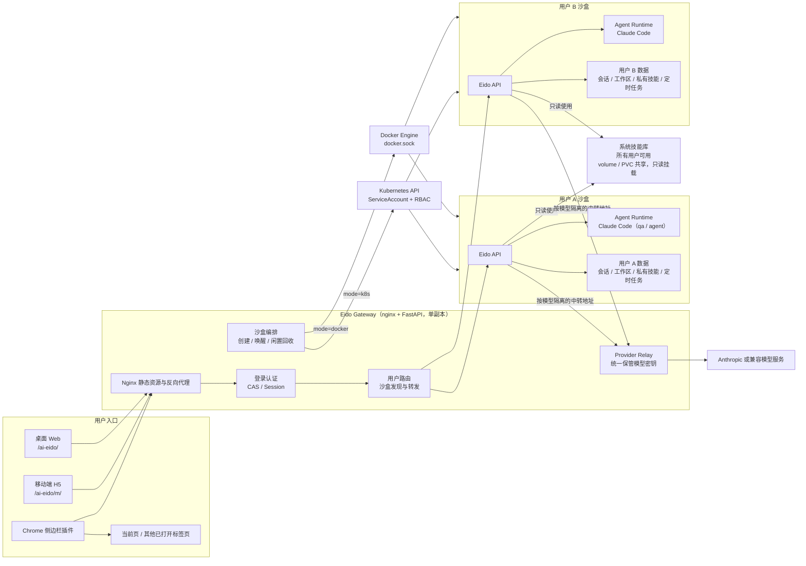

# Eido

Eido 是一个面向真实工作流的 AI 智能体平台：以对话为入口，把网页内容、附件、工作区文件、可复用技能和定时任务连接起来，让智能体可以规划、执行、产出并沉淀结果。

项目包含桌面 Web、移动端 H5 和 Chrome 侧边栏插件三类入口，提供四种部署方式：本地开发、Docker 单租户、Docker 沙盒多用户，以及 K8s（DaoCloud DCE 5.0）沙盒多用户。

> English version: [README-EN.md](README-EN.md)

## 核心亮点

- **智能体执行内核**：后端通过 Claude Agent SDK / Claude Code harness 驱动流式对话、工具调用、文件产出和多轮执行。
- **双运行模式**：会话可选「问答（qa）」——单轮文本回答，不加载工具、技能或项目上下文，轻量省资源；或「Agent」——完整 Claude Code 能力，支持工具、技能、MCP、项目与原生记忆的多轮自主执行。
- **技能系统**：以 `SKILL.md` 描述技能能力、使用边界和工具约束，支持系统技能、用户私有技能、在线创建、上传、编辑、删除和文件级管理。
- **多技能协作**：前端支持在对话中选择或 `@` 提及技能，后端可把多个技能串成任务上下文，适合投研、文档解析、邮件、搜索、文件处理等复合场景。
- **过程可观测**：流式返回模型思考、执行步骤、引用来源、工作流 Mermaid 图、待确认操作和最终回答，前端可逐步展示任务进展。
- **会话工作区**：每个会话拥有独立 workspace，支持 Word、PDF、TXT/LOG、表格、代码、图片、压缩包等丰富附件上传，以及结果文件查看/下载/删除；历史消息和文件上下文可持续复用。
- **项目知识沉淀**：Project 会话自动获得项目指令和共享资料；会话 `outputs/` 中的生成结果可一键复制为项目资料，供后续会话继续使用。
- **持久记忆与 MCP**：Claude Code auto-memory 按用户及个人/Project 范围隔离持久化；用户可在界面配置私有 HTTP、SSE 或 Stdio MCP Server，敏感配置加密保存。
- **统一检索**：桌面侧栏可检索 Project 元数据、会话标题和历史消息正文，并显示会话最近更新时间。
- **网页上下文分析**：Chrome 插件在当前浏览器右侧 Side Panel 打开，可读取当前页内容，也可选择用户已打开的其他标签页加入分析。
- **定时任务**：支持技能、脚本和对话类任务的创建、编辑、手动运行和周期调度，用于日报、监控、摘要生成等自动化场景。
- **多端体验**：桌面 Web 适合完整工作台，移动端 H5 和 Chrome 插件复用核心 API 与数据模型，针对窄屏做了独立布局。
- **认证与隔离**：支持本地开发免登录、CAS 登录、管理员用户、系统/用户技能隔离；多用户沙盒模式下 gateway 统一入口，按用户创建隔离的容器（Docker）或 Pod + PVC（K8s），闲置自动回收、数据持久保留。
- **快速部署**：本地开发、Docker 单租户、Docker 沙盒多用户、K8s 四条部署路径；支持 Anthropic API 兼容模型服务。

## 技术栈

| 模块 | 主要技术 |
| --- | --- |
| 后端 | FastAPI, Pydantic v2, Uvicorn, SQLite, APScheduler, python-cas, Docker SDK, Kubernetes client |
| Agent | Claude Agent SDK, Claude Code harness |
| 文件处理 | PyMuPDF, pypdf, pdfplumber, ReportLab, fpdf2, python-docx, python-pptx, pandas/openpyxl |
| 桌面前端 | React 19, Vite 6, TypeScript, Ant Design 6, Tailwind CSS, Mermaid, react-markdown |
| 移动端 H5 | React 19, Vite 6, antd-mobile, Tailwind CSS, 共享桌面端 API/type 层 |
| Chrome 插件 | Manifest V3, Chrome Side Panel API, React 19, antd-mobile, content/background scripts |
| 部署 | Nginx, Supervisor, Docker Compose profiles, Kubernetes manifests, app / gateway / user 多镜像 |

## 架构概览


```mermaid
flowchart LR
  subgraph Entrances["用户入口"]
    Desktop["桌面 Web<br/>/ai-eido/"]
    Mobile["移动端 H5<br/>/ai-eido/m/"]
    Extension["Chrome 侧边栏插件"]
    Pages["当前页 / 其他已打开标签页"]
  end

  subgraph Gateway["Eido Gateway（nginx + FastAPI，单副本）"]
    Nginx["Nginx 静态资源与反向代理"]
    Auth["登录认证<br/>CAS / Session"]
    Router["用户路由<br/>沙盒发现与转发"]
    Orchestrator["沙盒编排<br/>创建 / 唤醒 / 闲置回收"]
    Relay["Provider Relay<br/>统一保管模型密钥"]
  end

  Docker["Docker Engine<br/>docker.sock"]
  K8s["Kubernetes API<br/>ServiceAccount + RBAC"]
  SystemSkills["系统技能库<br/>所有用户可用<br/>volume / PVC 共享，只读挂载"]
  Models["Anthropic 或兼容模型服务"]

  subgraph UserA["用户 A 沙盒"]
    ApiA["Eido API"]
    AgentA["Agent Runtime<br/>Claude Code（qa / agent）"]
    DataA["用户 A 数据<br/>会话 / 工作区 / 私有技能 / 定时任务"]
  end

  subgraph UserB["用户 B 沙盒"]
    ApiB["Eido API"]
    AgentB["Agent Runtime<br/>Claude Code"]
    DataB["用户 B 数据<br/>会话 / 工作区 / 私有技能 / 定时任务"]
  end

  Desktop --> Nginx
  Mobile --> Nginx
  Extension --> Nginx
  Extension --> Pages
  Nginx --> Auth
  Auth --> Router
  Router --> ApiA
  Router --> ApiB
  Orchestrator -->|mode=docker| Docker
  Orchestrator -->|mode=k8s| K8s
  Docker --> UserA
  Docker --> UserB
  K8s --> UserA
  K8s --> UserB
  ApiA --> AgentA
  ApiB --> AgentB
  ApiA --> DataA
  ApiB --> DataB
  ApiA -->|只读使用| SystemSkills
  ApiB -->|只读使用| SystemSkills
  ApiA -->|按模型隔离的中转地址| Relay
  ApiB -->|按模型隔离的中转地址| Relay
  Relay --> Models
```

多用户沙盒模式下，gateway 负责静态资源、认证、用户路由、沙盒编排和模型 provider relay。编排后端由 `EIDO_SANDBOX_MODE` 决定：`docker` 通过 Docker SDK（挂载 docker.sock）为每用户创建容器和数据卷；`k8s` 通过 ServiceAccount 调 K8s API 为每用户创建 Pod + PVC，不依赖 docker.sock，沙盒在 DCE 等控制台可见、可观测。两种后端的用户数据语义一致：闲置回收只删除运行载体（容器/Pod），数据（volume/PVC）永久保留，再次访问自动重建并复用。系统技能库是平台级共享能力，所有用户可用，普通用户只读访问；用户私有技能、会话数据、工作区文件和执行环境保持隔离。模型密钥由 gateway 统一保管，用户沙盒只持有按模型隔离的 relay 凭据。

单租户模式可以理解为该架构的简化形态：去掉 gateway 编排和 per-user 沙盒，只保留一个应用运行环境。

## 目录结构

| 路径 | 说明 |
| --- | --- |
| `backend/` | FastAPI 后端、认证、会话、聊天、技能、任务、工作区和沙盒代理接口 |
| `frontend/` | 桌面 Web 工作台，默认入口 `/ai-eido/` |
| `frontend-mobile/` | 移动端 H5，默认入口 `/ai-eido/m/`，并为插件提供窄屏布局基础 |
| `frontend-extension/` | Chrome Manifest V3 插件，在浏览器右侧 Side Panel 运行 |
| `docker/` | Dockerfile、Compose profiles、Nginx/Supervisor 配置和部署说明 |
| `k8s/` | K8s（DaoCloud DCE 5.0）沙盒多用户部署：清单（namespace / RBAC / 存储 / Secret / gateway / CAS）、kind 集群配置与部署手册 |
| `extension-update-server/` | 独立的 Chrome 插件更新服务：托管 CRX 并为 Chrome 原生更新器返回 update manifest |
| `deployment/` | 插件企业内网分发包（Windows AD/GPO 强装 + Nginx 静态托管更新清单） |
| `docs/` | 架构、API、技能密钥保护、模型与沙盒等专题文档 |
| `skill-example/` | 技能开发示例 |
| `.agents/skills/` | 仓库内置/示例技能资产；运行时默认技能目录是 `.claude/skills/` |
| `quick-start.md` | 更细的本地与 Docker 快速开始说明 |

## 本地开发

### 1. 准备模型访问

Eido 通过 Claude Agent SDK 调用模型。开发时通常在 `backend/.env` 中配置：

```bash
cd backend
cp .env.example .env
```

Anthropic 官方 API（推荐）：

```env
ANTHROPIC_API_KEY=sk-ant-xxxxx
```

Agent SDK 使用非交互式 API 凭据；本机 `claude /login` 的 Claude.ai
Pro/Max 登录不能作为 Eido 后端的认证方式。`backend/.env` 会由后端配置层读取并
显式传给 SDK 内置 CLI，不需要在启动前手工 `export`。

MiniMax 兼容网关示例：

```env
ANTHROPIC_BASE_URL=https://api.minimaxi.com/anthropic
ANTHROPIC_API_KEY=your_minimax_key
```

DeepSeek 示例：

```env
ANTHROPIC_BASE_URL=https://api.deepseek.com/anthropic
ANTHROPIC_AUTH_TOKEN=your_deepseek_key
ANTHROPIC_MODEL=deepseek-chat
ANTHROPIC_SMALL_FAST_MODEL=deepseek-chat
API_TIMEOUT_MS=600000
CLAUDE_CODE_DISABLE_NONESSENTIAL_TRAFFIC=1
```

Agent SDK 已随包携带与其匹配的 Claude Code CLI，后端无需再单独安装一套 CLI。

### 2. 启动后端

```bash
cd backend
python -m venv .venv
source .venv/bin/activate
pip install -r requirements.txt
python run.py
```

后端默认监听 `http://127.0.0.1:8000`。本地开发可在 `backend/.env` 中设置 `AUTH_DISABLED=True` 跳过登录。

### 3. 启动桌面前端

```bash
cd frontend
npm install
npm run dev
```

访问 `http://localhost:3000/ai-eido/`。Vite 会把 `/ai-eido/api` 代理到后端 `/api`。

### 4. 启动移动端 H5

```bash
cd frontend-mobile
npm install
npm run dev
```

访问 `http://localhost:3001/ai-eido/m/`。

### 5. 构建 Chrome 插件

```bash
cd frontend-extension
npm install
npm run build
```

然后打开 Chrome `chrome://extensions`，启用开发者模式，选择“加载已解压的扩展程序”，目录选择 `frontend-extension/dist`。

插件默认连接 `http://localhost:8000`。如需连接其他后端：

```bash
VITE_EIDO_BACKEND_URL=https://your-domain.example.com npm run build
```

插件会在当前浏览器右侧 Side Panel 打开；调试控制台入口在“我的设置”中，也可以从扩展详情页的 Inspect views 打开原生 DevTools。

### 6. 选择模型

桌面、移动端与插件都在聊天输入框下方切换当前会话模型。目录由 [`backend/config/models.yaml`](backend/config/models.yaml) 维护，选择结果随会话持久化；切换模型会清理旧的原生 SID，并从已有消息恢复到新模型。

每个模型可以配置独立的 Anthropic 兼容 provider。推荐在 YAML 中引用环境变量，避免把密钥提交到仓库：

```yaml
version: 1
default: glm
models:
  - id: glm
    label: GLM
    model: glm-5.3
    provider:
      base_url_env: GLM_BASE_URL
      api_key_env: GLM_API_KEY
      small_fast_model_env: GLM_SMALL_FAST_MODEL
  - id: deepseek
    label: DeepSeek
    model: deepseek-chat
    provider:
      base_url: https://your-deepseek-compatible-endpoint.example
      auth_token_env: DEEPSEEK_AUTH_TOKEN
```

`provider` 支持 `base_url`、`api_key`（或 `key`）、`auth_token`、`small_fast_model`，以及对应的 `*_env` 字段。单容器模式直接把选中模型的配置交给 Claude Code；多用户沙箱模式由 gateway 保管真实地址和密钥，用户容器只访问按模型隔离的 provider relay。`GET /chat/models` 不返回 provider 配置。

## Docker 部署

### 单租户模式

适合个人、本机服务或可信小团队部署：

```bash
cp docker/.env.example docker/.env
$EDITOR docker/.env
set -a && . docker/.env && set +a
docker compose -f docker/docker-compose.yml --profile default up -d
```

默认访问地址为 `http://localhost/ai-eido/`。可通过 `EIDO_PORT` 修改宿主机端口。

### 沙盒多用户模式

适合多用户环境。gateway 暴露统一入口，并按用户创建隔离容器：

```bash
cp docker/.env.example docker/.env
$EDITOR docker/.env
set -a && . docker/.env && set +a
docker compose -f docker/docker-compose.yml --profile sandbox up -d
```

沙盒模式需要重点配置 `SESSION_SECRET_KEY`、`EIDO_GATEWAY_SECRET`、模型密钥、管理员账号和 CAS/认证相关变量。Compose 会挂载 Docker socket 给 gateway 用于创建 per-user container，请只在可信机器上部署。

直连上游 LLM（如 `open.bigmodel.cn`）需要解析外网域名，Compose 已为 `eido` / `eido-gateway` 配置外网 DNS（默认 `223.5.5.5` / `114.114.114.114`，可用 `EIDO_DNS_1` / `EIDO_DNS_2` 覆盖）；内网部署可换成公司 DNS。

### 构建镜像

```bash
cd frontend
npm install
npm run build

cd ../frontend-mobile
npm install
npm run build

cd ..
docker build -f docker/app.Dockerfile -t damaohongtu/eido:latest .
docker build -f docker/gateway.Dockerfile -t damaohongtu/eido-gateway:latest .
docker build -f docker/user.Dockerfile -t damaohongtu/eido-user:latest .
```

`gateway` / `user` 镜像同时用于 Docker 沙盒与 K8s 部署。插件不打入 app 镜像，如需分发插件请单独构建 `frontend-extension/dist`。

## K8s 部署（沙盒多用户 · DaoCloud DCE 5.0）

沙盒多用户模式的 K8s 形态：gateway 以 `EIDO_SANDBOX_MODE=k8s` 运行，通过 ServiceAccount + K8s API 为每个登录用户动态创建 **Pod + PVC**，不再依赖 docker.sock。用户数据（会话、工作区、私有技能、定时任务）落在专属 PVC（默认 `5Gi`）；闲置回收（`EIDO_SANDBOX_IDLE_TTL`，默认 900 秒）只删除 Pod、保留 PVC，再次访问自动重建并复用数据；系统技能库由共享 PVC 只读挂载。所有用户 Pod / PVC 在 DCE 控制台可见、可观测。

已在 kind + DaoCloud DCE 5.0 社区版（installer v0.44.0，Apple Silicon）完成端到端实测：CAS 多账号登录回调、SSE 流式聊天（GLM 经 provider relay）、双用户数据隔离、闲置 GC 与重建复用、License 激活。

```bash
# 1. kind 集群（含 DCE / eido 端口映射）
kind create cluster --config k8s/kind-eido-dce.yaml

# 2. 构建镜像（见上文「构建镜像」）并加载
kind load docker-image damaohongtu/eido-gateway:latest --name eido-dce
kind load docker-image damaohongtu/eido-user:latest --name eido-dce

# 3. 部署
cd k8s
./gen-secret.sh   # 从 docker/.env 生成 30-secret.yaml（或复制 30-secret.example.yaml 手工填写）
kubectl apply -f 00-namespace.yaml
kubectl apply -f 10-rbac.yaml -f 20-storage.yaml -f 30-secret.yaml
kubectl apply -f 40-gateway.yaml -f 50-cas.yaml
kubectl -n eido-system get po,pvc   # 等待 Running / Bound
```

浏览器访问 `http://localhost:19080/ai-eido/`，本地 CAS 登录（test1/123456）后首次访问自动创建 `eido-user-<user>` Pod + PVC。

> 两点本地验证注意：① CAS 地址需浏览器与 Pod 同时可达，`/etc/hosts` 需加一行
> `127.0.0.1 cas.eido-system.svc.cluster.local`（验证完删除）；② 宿主机端口用
> 19080 而非 10080——10080 在浏览器封禁端口名单（amanda），Chrome/Safari 会报
> `ERR_UNSAFE_PORT`。

DCE 社区版安装（Apple Silicon 实测）、License 激活流程、生产环境差异（镜像仓库、多节点 RWX 存储、Ingress 接入）见 [k8s/README.md](k8s/README.md)。

## 常用配置

| 变量 | 说明 |
| --- | --- |
| `ANTHROPIC_BASE_URL` | Anthropic 兼容 API 地址；使用官方 API 时留空 |
| `ANTHROPIC_API_KEY` / `ANTHROPIC_AUTH_TOKEN` | Agent SDK 非交互式模型服务凭据；官方 API 推荐 `ANTHROPIC_API_KEY` |
| `ANTHROPIC_MODEL` | 兼容旧部署的默认 provider 模型；若与目录中的 `model` 匹配，会覆盖目录默认项 |
| `CLAUDE_MODELS_FILE` | 模型目录文件；默认 `backend/config/models.yaml`，当前内置 GLM 与 DeepSeek |
| `GLM_*` / `DEEPSEEK_*` | 内置模型目录引用的独立 `BASE_URL`、`API_KEY`、`AUTH_TOKEN`、`SMALL_FAST_MODEL` |
| `CLAUDE_EFFORT` | 可选推理强度，按模型支持情况设置；留空使用原生默认值 |
| `CLAUDE_COMPACT_PERCENT` | 原生自动压缩触发百分比，默认 80 |
| `CLAUDE_SIMPLE_SYSTEM_PROMPT` | 使用 Claude Code 原生精简系统提示，默认开启；保留 tools、hooks、MCP、Skills、memory 与 CLAUDE.md |
| `ANTHROPIC_SMALL_FAST_MODEL` | 快速/小模型名称 |
| `AUTH_DISABLED` | 本地开发免登录开关 |
| `SESSION_SECRET_KEY` | 登录 session 加密密钥，生产环境必须修改 |
| `FRONTEND_URL` | 后端认证回跳与 CORS 使用的前端地址 |
| `CAS_SERVER_URL` | CAS 服务地址 |
| `EIDO_ADMIN_USERS` | 管理员用户名列表，用于系统技能管理 |
| `SKILLS_DIR` | 技能根目录，默认通常为 `.claude/skills` |
| `EIDO_SANDBOX_MODE` | 沙盒模式：`local`（单进程本地）/ `docker`（per-user 容器）/ `k8s`（per-user Pod + PVC） |
| `EIDO_GATEWAY_INTERNAL_URL` | 沙盒回连 gateway 的地址；docker 模式默认 `http://eido-gateway/ai-eido`，k8s 模式设为集群内 Service DNS |
| `EIDO_GATEWAY_SECRET` | 网关主密钥；派生每用户独立的信任凭据与模型代理凭据 |
| `EIDO_USER_IMAGE` | 沙盒 user 镜像 |
| `EIDO_USER_MEM` / `EIDO_USER_CPUS` | 单用户沙盒资源上限，默认 `2g` / `1.0` |
| `EIDO_SANDBOX_IDLE_TTL` | 沙盒闲置回收阈值（秒），默认 900；回收只删容器/Pod，数据卷/PVC 保留 |
| `EIDO_K8S_NAMESPACE` | K8s 模式命名空间，默认 `eido-system` |
| `EIDO_K8S_STORAGE_CLASS` | 用户 PVC 的 StorageClass；留空使用集群默认 |
| `EIDO_K8S_SKILLS_CLAIM` | 共享技能库 PVC 名称，默认 `eido-skills` |
| `EIDO_K8S_USER_STORAGE` | 每用户 PVC 容量，默认 `5Gi` |
| `EIDO_K8S_IMAGE_PULL_SECRET` | 私有镜像仓库时注入用户 Pod 的 imagePullSecret |
| `EIDO_DNS_1` / `EIDO_DNS_2` | Compose 容器外网 DNS（解析上游 LLM 域名），默认 `223.5.5.5` / `114.114.114.114` |
| `EIDO_PROJECT_MAX_FILES` / `EIDO_PROJECT_MAX_BYTES` | 单 Project 共享资料数量/字节上限，默认 100 / 512 MiB |
| `EIDO_USER_PROJECT_MAX_FILES` / `EIDO_USER_PROJECT_MAX_BYTES` | 单用户项目资料数量/字节上限，默认 500 / 2 GiB |
| `BACKEND_CORS_ORIGIN_REGEX` | 允许 Chrome 插件等动态 origin 的 CORS 正则 |

## 运行时数据

- 技能目录：默认 `.claude/skills/`，包含 `system/` 和 `users/<username>/`。
- 会话数据库：默认 `.eido/chat_sessions.db`。
- Claude Code 持久数据：默认 `.eido/claude/<user>/`，包含 transcript 和按个人/Project 隔离的 auto-memory。
- 用户 MCP 配置：默认 `.eido/mcp_servers.db`，环境变量和请求头使用本机持久化密钥加密保存。
  桌面端通过标准 `{ "mcpServers": { ... } }` JSON 配置文件整体编辑；`disabled: true`
  表示保留但不加载，已保存密钥回显为 `__EIDO_SECRET__` 并可原样保留。
- 定时任务数据库：默认 `.eido/scheduled_tasks.db`。
- 会话工作区：默认 `.eido/workspaces/<session_id>/`。
- 项目共享资料：默认 `.eido/projects/<project_id>/files/`；普通直接聊天不创建或绑定默认项目。
- Docker 日志：容器内 `/var/log/eido/`，Compose 中也挂载到命名 volume。
- K8s 模式：上述数据全部落在 PVC——gateway 数据库与 registry 在 `eido-gateway-data`，系统技能库在 `eido-skills`（用户 Pod 只读挂载），用户数据在各自的 `eido-user-<user>`；容器内路径与本地模式一致。

## API 概览

| 能力 | 路径 |
| --- | --- |
| 认证 | `/api/v1/auth/*` |
| 聊天流式执行 | `/api/v1/chat/chat` |
| 附件上传 | `/api/v1/chat/upload` |
| 会话管理 | `/api/v1/sessions/*` |
| 项目与共享资料 | `/api/v1/projects/*` |
| 技能管理 | `/api/v1/skills/*` |
| 定时任务 | `/api/v1/tasks/*` |
| 工作区文件 | `/api/v1/workspace/*` |
| MCP 配置 | `/api/v1/mcp/*` |
| 统一检索 | `/api/v1/search/*` |

多用户沙盒模式下，用户请求由 gateway 认证后按用户转发到对应沙盒（容器/Pod）；模型请求统一经 gateway provider relay，真实密钥不出网关。

更完整的接口说明见 `docs/api.md` 和 `docs/architecture.md`。

## 开发检查

```bash
# 后端测试
cd backend
python -m pytest

# 前端构建
cd frontend
npm run build

cd ../frontend-mobile
npm run build

cd ../frontend-extension
npm run build
```

## 参考文档

- `quick-start.md`：本地、Docker、模型配置和技能目录的详细快速开始。
- `k8s/README.md`：K8s（DaoCloud DCE 5.0）部署手册——kind 本地验证、DCE 社区版安装与 License、生产差异。
- `docs/architecture.md`：单租户与沙盒模式架构。
- `docs/api.md`：后端 API 说明。
- `docs/project-design.md`：Project 数据、上下文、并发、文件与发布设计。
- `docs/skill-secret-protection.md`：技能密钥保护方案。
- `frontend-extension/README.md`：Chrome 插件构建、登录和空白页排查。
- `extension-update-server/README.md`：Chrome 插件 CRX 更新服务。

本次原生能力、性能、隔离与升级说明见 [Claude Code 平台优化记录](docs/claude-native-platform-optimization.md)。
