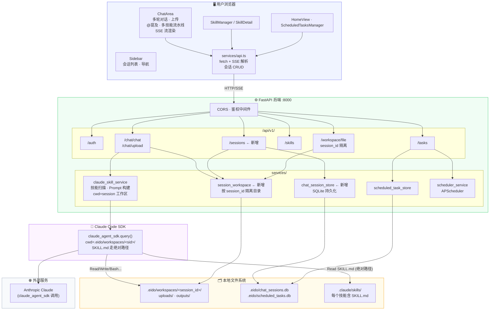
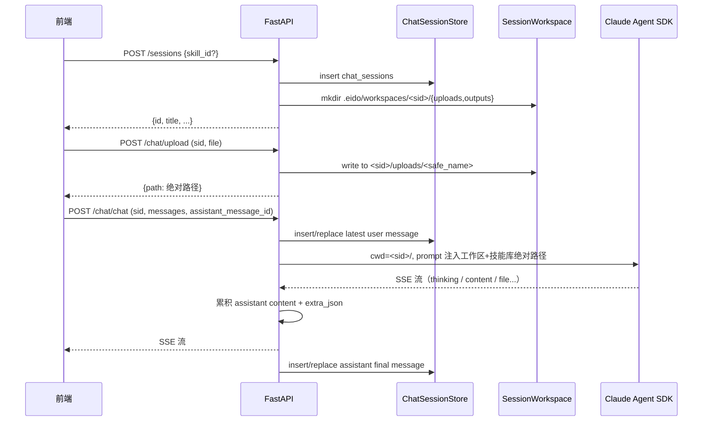
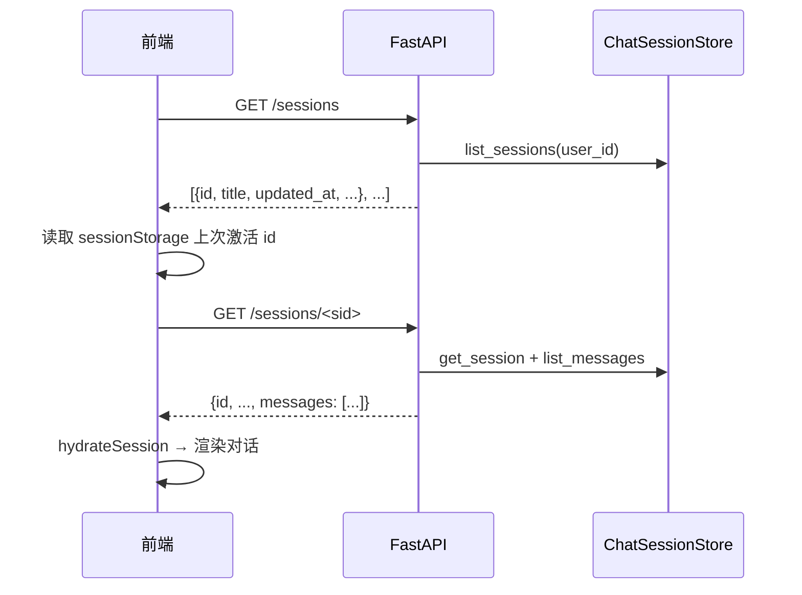
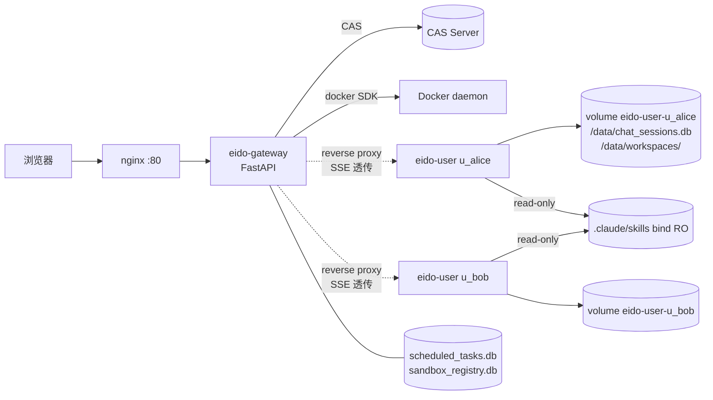
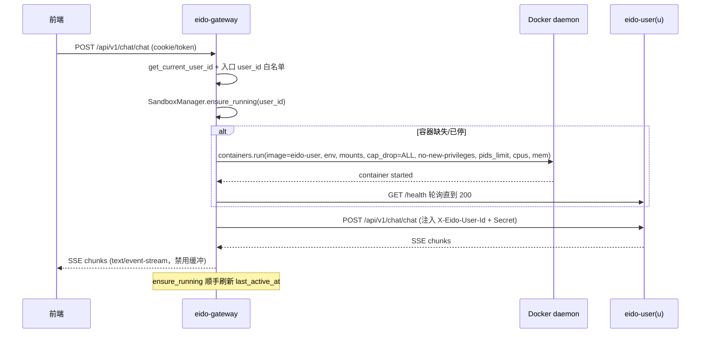

# Eido 架构文档

## 一、整体架构

Eido 是一个基于 Claude Code SDK 的可扩展技能助手，由 React 前端 + FastAPI 后端 + 本地技能库构成。



---

## 二、会话隔离与持久化（本期重点）

### 2.1 文件隔离 — `.eido/workspaces/<session_id>/`

每个会话独占一个工作区目录，agent cwd 切到该目录，**物理上**杜绝跨会话文件污染。

```
.eido/
├── workspaces/
│   ├── <sid_a>/
│   │   ├── uploads/    ← 用户上传文件
│   │   └── outputs/    ← agent 生成产物
│   └── <sid_b>/
│       ├── uploads/
│       └── outputs/
└── chat_sessions.db    ← 会话与消息 SQLite 持久化
```

关键约束：
- `session_id` 字符白名单 `[A-Za-z0-9_\-]{1,64}`，杜绝路径遍历
- `/chat/upload` 会先校验 session 归属当前用户，再写入 `uploads/`
- 所有路径解析（上传、文件预览）通过 `SessionWorkspaceManager.safe_resolve` 校验
- `/workspace/file?session_id=...` 会先校验 session 归属当前用户，再解析文件路径
- 删除会话时同步删除工作区目录
- 技能库（`.claude/skills/`）通过**绝对路径**注入 prompt 让 agent 仍可读取

### 2.2 对话持久化 — SQLite

```sql
-- 会话元信息（按 user_id 隔离）
CREATE TABLE chat_sessions (
    id TEXT PRIMARY KEY,
    user_id TEXT NOT NULL,
    title TEXT NOT NULL DEFAULT '新建会话',
    skill_id TEXT,
    created_at TEXT NOT NULL,
    updated_at TEXT NOT NULL
);

-- 消息（复合主键，跨会话不同 id 各自独立）
CREATE TABLE chat_messages (
    id TEXT NOT NULL,
    session_id TEXT NOT NULL,
    role TEXT NOT NULL,
    content TEXT NOT NULL,
    extra_json TEXT NOT NULL DEFAULT '{}',
    created_at TEXT NOT NULL,
    PRIMARY KEY (session_id, id),
    FOREIGN KEY(session_id) REFERENCES chat_sessions(id) ON DELETE CASCADE
);
```

`extra_json` 容纳前端 `Message` 的 `thinking / thinkingLog / executionSteps / references / workflowMermaid / pendingConfirmation` 等可变字段，避免后续频繁 ALTER TABLE。

主聊天链路的消息写入由后端 `/chat/chat` 统一负责：
- 请求进入时，后端保存本轮最新 `user` 消息
- SSE 透传过程中，后端同步累积 assistant 的 `content` 与 `extra_json`
- 流结束、异常或客户端中断时，后端保存本轮 `assistant` 最终状态
- 前端只传递 `message.id` / `assistant_message_id` 用于幂等写入，不再主动调用 `/sessions/{id}/messages` 保存聊天内容

---

## 三、关键数据流

### 3.1 创建会话 + 上传 + 流式问答



### 3.2 重新打开浏览器恢复会话



---

## 四、目录与模块对应

| 层 | 路径 | 说明 |
|---|---|---|
| 前端 | `frontend/App.tsx` | 会话状态/拉取/本地 UI 更新；不负责聊天消息落库 |
| 前端 | `frontend/components/ChatArea.tsx` | 上传 / 流式 / 文件预览（透传 sessionId 与 assistant_message_id） |
| 前端 | `frontend/services/api.ts` | 会话 CRUD + SSE 解析；`streamChat` 不再触发消息保存 |
| 后端路由 | `backend/app/api/v1/endpoints/chat.py` | `/chat/chat` `/chat/upload`；主聊天链路消息持久化边界 |
| 后端路由 | `backend/app/api/v1/endpoints/sessions.py` | `/sessions/...` 增删改查；`/messages` 仅用于非主聊天补充写入 |
| 后端路由 | `backend/app/api/v1/endpoints/workspace.py` | `/workspace/file` 隔离访问 |
| 后端服务 | `backend/app/services/session_workspace.py` | 会话工作区管理（路径白名单 + 安全解析） |
| 后端服务 | `backend/app/services/chat_session_store.py` | SQLite 持久化 |
| 后端服务 | `backend/app/services/claude_skill_service.py` | 切 cwd + 注入技能库绝对路径 |

---

## 五、迁移与兼容性

- 旧的 `uploads/`、`output/`、`outputs/` 全局目录保留（兼容历史数据），新数据一律走 `.eido/workspaces/<sid>/`
- `/workspace/file` 不带 `session_id` 时仍按全局 WORKSPACE_ROOT 解析（向后兼容历史链接）；带 `session_id` 时要求会话属于当前用户
- 浏览器旧版 sessionStorage 中的会话不再恢复，首次打开自动从后端拉取
- `.eido/workspaces/` 与 SQLite 文件均已加入 `.gitignore`

## 六、风险与权衡

| 风险 | 应对 |
|---|---|
| agent cwd 切走后相对路径访问技能库失效 | prompt 注入技能库**绝对路径**，并在所有 SKILL.md 索引项中给出绝对路径 |
| `.eido/workspaces` 长期膨胀 | 删除会话时联动删除工作区目录；后续可加 TTL 清理 |
| 前端主动保存导致丢消息或状态不同步 | `/chat/chat` 后端统一落库，前端只负责展示 SSE |
| 流式过程频繁落盘成本高 | 请求开始保存 user；assistant 只在流结束/异常/中断时保存一次最终状态 |
| 跨会话 message id 撞车 | `chat_messages` 主键改为复合主键 `(session_id, id)` |
| 会话文件 URL 被他人复用 | `/workspace/file` 对 `session_id` 做用户归属校验 |

---

## 七、多用户沙箱（per-user 容器）

会话级隔离解决了「同一用户内不同对话之间」的污染，多用户层面仍共享同一 SQLite + 同一进程。
当 `EIDO_SANDBOX_MODE=docker` 时切换到下面的双层架构，把每个用户的后端进程、文件系统、SQLite 都拆到独立容器：



### 7.1 组件职责

| 组件 | 职责 |
|---|---|
| `eido-gateway` | CAS 鉴权、`SandboxManager` 编排 user 容器、`/chat/**` `/sessions/**` `/workspace/**` 反向代理（含 SSE）、调度 `scheduled_tasks.db`、提供 `/sandbox/warmup` 与 `/sandbox/status` |
| `eido-user`   | 单纯跑 `uvicorn app.main:app`，承载 `chat / sessions / workspace`，使用 `EIDO_TRUST_GATEWAY=1` 信任 gateway 注入的 `X-Eido-User-Id` + `X-Eido-Gateway-Secret` |
| `sandbox_registry.db` | gateway 持有的 rendezvous 表：`user_id → container_name, host, port, last_active_at, status` |
| 共享网络 `eido-net` | gateway 与所有 user 容器同处一个 docker bridge 网络，内部以容器名解析（`eido-user-<safe_user_id>:8000`） |
| 命名卷 `eido-user-<safe>` | per-user 持久化 `/data/chat_sessions.db` 与 `/data/workspaces/`，gc 时只删容器不删卷 |

### 7.2 一次 chat 请求时序（含懒拉起 + SSE 透传）



### 7.3 生命周期与 GC

| 事件 | 行为 |
|---|---|
| 用户登录后 | 前端调用 `POST /api/v1/sandbox/warmup`，gateway 立即拉起容器，分摊冷启动（local 模式 no-op） |
| 首次业务请求 | `ensure_running` 幂等启动，等待 `/health` 200 后再代理；后续请求直接复用 |
| 持续闲置 | `idle_gc_loop` 每 60s 扫描 `last_active_at`，超过 `EIDO_SANDBOX_IDLE_TTL`（默认 900s）即 stop+remove，**volume 永远保留** |
| 任意时刻 | `release(user_id)` / `_upsert_row` 都会刷新 `last_active_at`，避免误回收活跃容器 |
| 调度任务触发 | `task_executor` 在 docker 模式下走 `SandboxManager.ensure_running` + 内部 HTTP（注入 trust headers），等同于一次模拟用户请求 |

### 7.4 安全加固清单

- gateway 启动时强制要求 `EIDO_GATEWAY_SECRET` ≥ 16 字符且 `SESSION_SECRET_KEY` 非默认值，否则拒绝启动
- gateway 反代时**剥离**入站的 `Cookie / X-Eido-User-Id / X-Eido-Gateway-Secret / X-Eido-User-Token / X-Forwarded-User`，再重新注入（防客户端伪造受信网关头）
- `auth.py` 校验受信网关头：`hmac.compare_digest(secret)`，且与容器 `EIDO_USER_ID` 严格一致才放行
- user 容器：`cap_drop=["ALL"] + no-new-privileges + pids_limit + nano_cpus + mem_limit + tmpfs(/tmp) + 非 root user(uid 10001)`
- `.claude/skills/` 在 user 容器内是只读 bind-mount，技能文件由 gateway 侧的 `/skills` 路由统一管理
- `/var/run/docker.sock` 仅挂到 gateway，user 容器不接触 docker daemon
- `eido-net` 仅 gateway 与 user 容器互通，user 之间不主动建立连接（仍可通过 docker 网络隔离策略进一步收紧）

### 7.5 部署与回退

| 模式 | 启动方式 | 关键变量 |
|---|---|---|
| 单租户/兼容 | `docker compose --profile default up -d` | `EIDO_SANDBOX_MODE=local` |
| 沙箱多用户 | `docker compose --profile sandbox up -d` | `EIDO_SANDBOX_MODE=docker`、`EIDO_GATEWAY_SECRET=<32+ random>`、`EIDO_USER_IMAGE`、`EIDO_SANDBOX_IDLE_TTL`、`EIDO_USER_MEM/CPUS/PIDS_LIMIT` |
| 临时回滚 | 切回 `--profile default` 即可，sandbox 注册表与 user volume 保留，下次切回时复用 |
