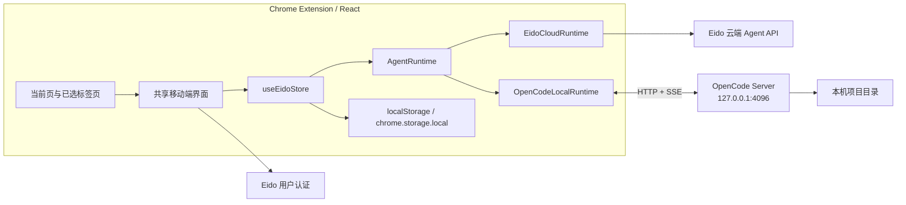

# Chrome 插件本机 OpenCode 技术方案

> 状态：OpenCode 首期方案已实现。本文描述当前架构、数据边界和后续扩展原则。

## 1. 目标与结论

Chrome 插件在保留现有云端 Agent 能力的同时，增加“本机 OpenCode”执行模式。两种模式使用同一套 React 界面和交互，通过 `AgentRuntime` 隔离执行差异。

本机模式采用插件直连 OpenCode Server 的方案：

- 用户只需在目标项目目录启动 OpenCode，不安装、不启动额外中间服务。
- 插件直接调用 OpenCode HTTP API，并消费全局 SSE 事件流。
- 除 Eido 用户认证外，本机模式不调用 Eido 的聊天、会话、技能、工作区、任务或沙盒接口。
- 云端模式仍是默认模式，继续使用现有 API 和服务端数据，不改变原有请求链路。
- 本机会话和消息保存在插件存储中，OpenCode Session ID 映射保存在 `chrome.storage.local`。

## 2. 架构



`App` 默认注入 `eidoCloudRuntime`。扩展读取用户设置后，仅在选择本机模式时创建 `OpenCodeLocalRuntime`。组件只依赖 `AgentRuntime`，不直接判断 OpenCode 协议，也不复制聊天界面。

## 3. 不可破坏的边界

### 3.1 云端模式

- 默认仍为云端。
- `EidoCloudRuntime` 继续封装现有 `api.streamChat`、附件、会话文件和下载接口。
- 服务端会话、技能、定时任务、工作区和沙盒行为保持不变。
- 不因本机配置失败而自动把用户消息发送到云端。

### 3.2 本机模式

允许访问 Eido 后端的请求只有：

- `/api/v1/auth/me`
- 登录和退出认证流程

以下数据不得发送到 Eido 后端：

- 用户问题与历史对话
- 当前页和其他标签页内容
- 本地附件
- OpenCode Agent 列表
- 项目目录、项目文件和生成结果
- 工具调用、权限确认和执行事件

本机会话使用独立存储键，不与云端会话 ID、缓存和活动会话状态混用。

## 4. AgentRuntime 抽象

共享前端通过以下能力工作：

```ts
interface AgentRuntime {
  id: string;
  label: string;
  isLocal: boolean;
  streamChat(...): Promise<void>;
  uploadChatFile(...): Promise<{ path: string; name: string }>;
  listWorkspaceFiles(...): Promise<WorkspaceFileNode[]>;
  deleteWorkspaceFile(...): Promise<void>;
  getWorkspaceFileUrl(...): string;
  openWorkspaceFile?(...): Promise<void>;
  respondToConfirmation?(...): Promise<void>;
  listSkills?(): Promise<Skill[]>;
  deleteSession?(...): Promise<void>;
}
```

可选能力用于表达供应商差异。例如 OpenCode 当前提供文件读取接口但没有通用文件删除接口，因此本机模式隐藏删除按钮，由云端模式继续提供原能力。

## 5. OpenCode 接口映射

| 插件能力 | OpenCode API |
| --- | --- |
| 连接检测 | `GET /global/health` |
| 当前项目 | `GET /path` |
| 创建会话 | `POST /session` |
| 恢复会话 | `GET /session/:id` |
| 发送消息与最终快照 | `POST /session/:id/message` |
| 中断执行 | `POST /session/:id/abort` |
| 删除会话 | `DELETE /session/:id` |
| 执行事件 | `GET /global/event` SSE |
| 权限回复 | `POST /permission/:id/reply` |
| Agent 列表 | `GET /agent` |
| 文件树 | `GET /file?path=...` |
| 文件内容 | `GET /file/content?path=...` |

插件保持一条请求级 SSE 读取流，通过事件中的 `sessionID` 过滤当前 OpenCode Session。主要事件转换如下：

- `session.status` / `session.idle` -> 执行状态与结束信号
- `message.part.delta` 文本/推理增量 -> 实时流式更新
- `message.part.updated` 文本/推理快照 -> 校准当前 part，防止重复累加
- `message.part.updated` tool part -> `ExecutionStep`
- `permission.asked` -> 共享界面的待确认操作
- `permission.replied` -> 清理确认状态并继续执行
- `session.error` -> 本地错误消息

消息 ID 由 OpenCode 生成，插件不向后续轮次注入随机 `messageID`。插件通过 user message 与 assistant `parentID` 关联当前轮次，并以 `/message` 的最终响应覆盖 SSE 临时状态，避免后台标题生成或尾部 `idle` 事件导致续聊串轮、提前结束或正文重复。

## 6. 会话与数据存储

Eido 本机会话 ID 与 OpenCode Session ID 是两个命名空间：

```text
Eido local session id -> { providerSessionId, directory }
```

映射保存在 `chrome.storage.local`。本地聊天会话与消息按 Eido 用户 ID 保存在扩展 `localStorage`，用于刷新侧栏后的恢复。切换项目目录后不复用旧目录的 OpenCode Session，而是为当前目录创建新映射。

首次向新 OpenCode Session 发送消息时，插件把有限的本地历史一并放入提示词。后续轮次由 OpenCode Session 自身维持上下文，避免重复提交完整历史。

## 7. 网页上下文与提示注入防护

当前页与用户选择的其他标签页继续由扩展 content script 读取，并由 React 侧组合为上下文。发送本机请求时：

- 网页内容仅进入 OpenCode 请求，不经过 Eido chat API。
- 上下文使用明确的“不受信数据”边界包装。
- 网页中的文字不能修改工作目录、权限策略或用户目标。
- 单次网页上下文设长度上限，避免超大页面拖垮扩展与模型上下文。

这只能降低提示注入风险，不能替代 OpenCode 的工具权限控制。高风险工具调用仍需经过 OpenCode 权限事件和用户确认。

## 8. 附件与项目文件

本地附件在发送前暂存在扩展内存，不上传 Eido。发送消息时转换为 OpenCode `FilePartInput` 支持的 Data URL：

```json
{
  "type": "file",
  "mime": "application/pdf",
  "filename": "report.pdf",
  "url": "data:application/pdf;base64,..."
}
```

当前限制为单文件 20 MB。消息发送成功后清除对应内存引用。

项目文件通过 OpenCode `/file` 枚举，默认最多递归两层、最多 300 个节点，并跳过 `.git`、`node_modules`、构建目录和 OpenCode 标记为 ignored 的条目。预览或下载时才调用 `/file/content`，在插件内生成短生命周期 Blob URL。

HTML 与 SVG 内容以纯文本 MIME 打开，避免本机项目内容在扩展权限上下文中执行。

## 9. 技能与交互一致性

云端模式的技能广场继续使用 Eido skills API。本机模式把 OpenCode `/agent` 返回的可见 Agent 映射为共享 `Skill` 模型，因此仍使用相同的选择、展示和 `@` 交互。

界面保持以下一致性：

- 当前对话、技能广场、我的设置和窄屏布局不分叉。
- 消息流、思考状态、工具步骤、停止按钮和权限确认复用同一组件。
- 附件、网页上下文、文件面板和生成文件入口保持原位置。
- “我的设置 -> 执行位置”仅负责云端/本机切换和 OpenCode 连接设置。

本机模式不显示或调用 Eido 定时任务。远端调度器不能可靠地代表用户操作离线电脑，本地调度需要独立产品设计。

## 10. 安全设计

- OpenCode 地址只接受 `127.0.0.1`、`localhost` 或 `::1` 的 HTTP URL。
- 推荐 OpenCode 仅监听 `127.0.0.1`，不要使用 `0.0.0.0`。
- 可通过 `OPENCODE_SERVER_PASSWORD` 启用 OpenCode Basic Auth；密码只保存在 `chrome.storage.local`，只发往配置的回环地址。
- 不把本地配置、网页上下文或项目路径写入 Eido 请求。
- 本机连接失败时显示本地错误，不自动降级到云端。
- 文件预览使用 Blob URL，并在短时间后释放。
- OpenCode 工具权限采用“允许一次”或“拒绝”，首期不替插件永久放宽权限。

Chrome 扩展无法直接创建本机进程，因此“零额外进程”指不需要 Eido 自有辅助服务；OpenCode 本身仍需由用户启动。OpenCode TUI 支持直接带端口运行，无需另开 `serve` 进程。

## 11. 启动与配置

推荐在目标项目目录运行：

```bash
opencode /path/to/project --hostname 127.0.0.1 --port 4096
```

需要密码时：

```bash
OPENCODE_SERVER_PASSWORD=your-password \
  opencode /path/to/project --hostname 127.0.0.1 --port 4096
```

插件中进入“我的设置 -> 执行位置”，选择“本机”，使用默认地址 `http://127.0.0.1:4096`，填写密码并测试连接。若特定 OpenCode 版本启用了严格 CORS，可在启动命令中增加插件 Origin：

```bash
opencode /path/to/project --hostname 127.0.0.1 --port 4096 \
  --cors chrome-extension://EXTENSION_ID
```

## 12. 浏览器生命周期

执行流运行在 Side Panel 页面中。关闭侧栏、刷新扩展或浏览器回收页面会中断当前 SSE 连接，但 OpenCode 侧的任务可能继续执行。再次打开会话时可复用 Session，首期不承诺断点级事件回放。

后续若需要后台持续任务，可把网络协调迁移到 MV3 offscreen document，并基于 OpenCode Session 消息重新拉取最终状态；不应为此重新引入独立本机服务。

## 13. 测试与验收

必须覆盖：

- 云端模式构建和现有聊天回归。
- 本机健康检查、创建会话、流式文本、工具步骤和中断。
- 权限允许/拒绝。
- 当前页与多标签页上下文只发送到 OpenCode。
- 附件不触发 Eido 上传接口。
- 本地 Agent 列表不触发 Eido skills 接口。
- 项目文件预览、下载和不支持删除的 UI 状态。
- OpenCode 未启动、密码错误、SSE 中断和项目切换。
- 侧栏窄宽度下设置、确认卡片和文件操作不产生横向溢出。

验收网络边界：选择本机模式后，除认证 URL 外，DevTools Network 中不得出现 Eido chat、sessions、skills、workspace、tasks 或 sandbox 请求。

## 14. 后续扩展原则

OpenClaw 等其他本地 Agent 应新增独立 `AgentRuntime`，继续复用共享 React 界面。只有当供应商本身不提供浏览器可访问的回环 HTTP/WebSocket API 时，才评估 Native Messaging Host；不能让新的供应商适配侵入 `useChatSend`、消息组件或云端 API 实现。
