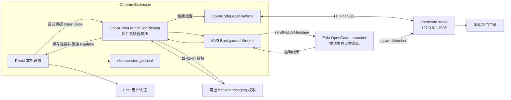
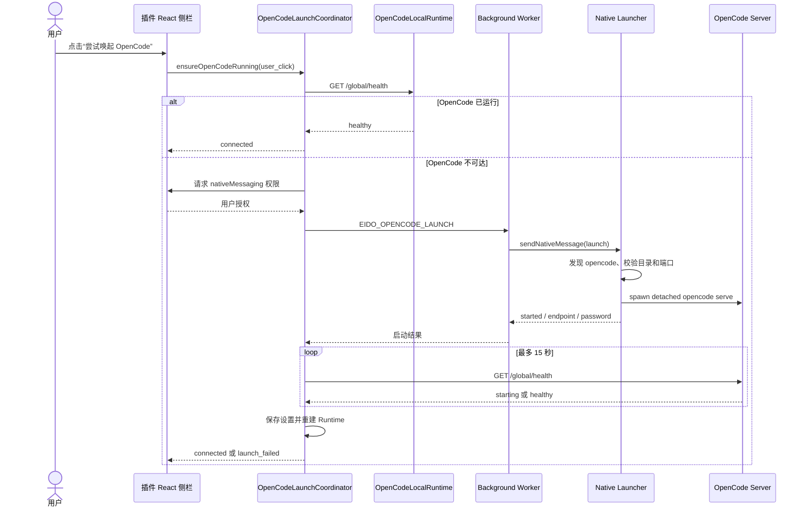
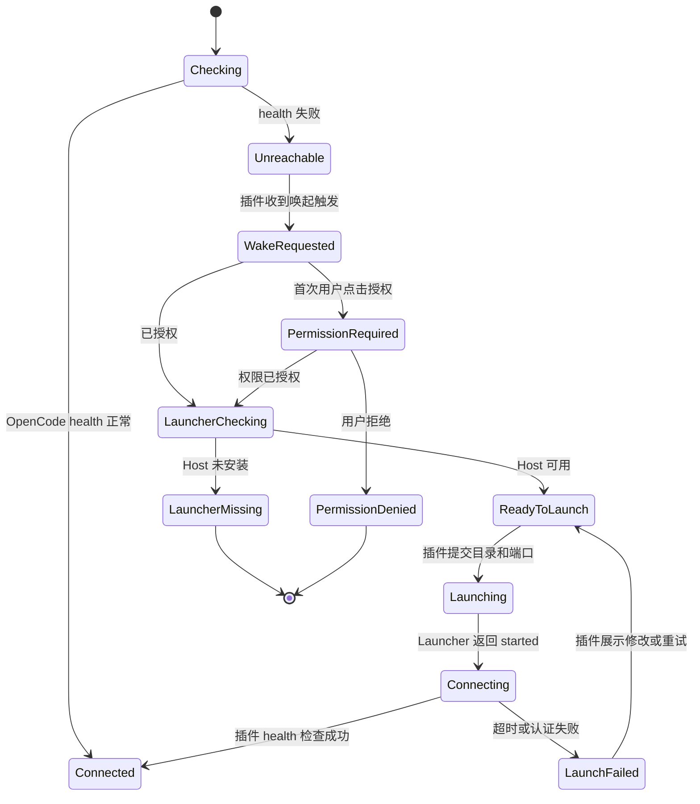

# Chrome 插件尝试唤起并启动 OpenCode 技术方案

> 状态：阶段 1 核心链路及 macOS、Windows 生产分发链路已实现。插件启动协调器、可选权限、Native Messaging 白名单、系统原生目录选择、启动探活、开发安装脚本、macOS universal `.pkg`、Windows x64/arm64 用户级 `.exe`、代码签名流水线和自动测试均已落地。正式发布仍需配置固定扩展 ID 与各平台签名凭据后运行发布工作流。
>
> 目标：当插件本机模式无法连接 OpenCode 时，由插件发起并编排一次“尝试唤起”，尽可能直接启动本机 OpenCode；启动成功后自动连接现有 HTTP/SSE Agent Runtime，失败时留在本机模式并给出可恢复操作。
>
> 产品约束：目标用户不会使用命令行。目录选择、启动、探活、日志和重试必须由插件图形界面完成，文档中的命令只用于说明内部实现。
>
> 前置条件：OpenCode 已经安装完成。本方案不下载、安装或升级 OpenCode，只负责由插件触发其启动。

实现位置：

- 插件协调器：`frontend-extension/src/local-agent/openCodeLaunchCoordinator.ts`
- Native Messaging 客户端：`frontend-extension/src/local-agent/nativeLauncherClient.ts`
- Background 白名单：`frontend-extension/public/native-launcher-protocol.js`
- Native Launcher：`native-launcher/`

## 1. 结论

Chrome 扩展页面和 Manifest V3 Service Worker 不能直接执行 `opencode`、`spawn` 子进程或访问任意本机可执行文件。推荐在插件中实现 **OpenCodeLaunchCoordinator**，并通过 **Chrome Native Messaging + 一次性 Native Launcher** 完成本机进程创建：

- 插件仍然优先连接用户已经启动的 OpenCode。
- 健康检查失败时，插件直接提供“尝试唤起 OpenCode”动作，不再只展示手工命令。
- 用户点击后，插件负责权限申请、Launcher 探测、启动请求、健康轮询、连接设置更新和 Runtime 重建。
- Chrome 按请求启动 Launcher；Launcher 完成探测或拉起进程、返回结果后立即退出，不需要用户独立启动，不监听端口，也不常驻。
- Launcher 只负责 OpenCode 的发现和进程生命周期，不代理聊天请求，不接收网页内容、附件、会话或文件。
- OpenCode 启动后，聊天继续由现有 `OpenCodeLocalRuntime` 直接访问 `127.0.0.1` HTTP/SSE。
- 云端模式和 Eido 用户认证链路保持不变。

从用户视角，启动动作发生在插件内；用户不需要打开终端运行 OpenCode，也不需要单独启动 Launcher。Native Launcher 作为部署前置组件完成一次注册，运行时由 Chrome 自动调用，用户不感知它的启动和退出。

这不是恢复 `local-agent-bridge`。Launcher 是一个由插件按需唤起的本机命令入口，不是本地 Agent 协议层或 HTTP 服务。

### 1.1 “通过插件尝试唤起”的明确定义

插件必须提供统一方法：

```ts
ensureOpenCodeRunning({
  trigger: 'user_click' | 'send_message' | 'auto_start',
  workspace,
  endpoint,
}): Promise<OpenCodeLaunchResult>
```

该方法完整执行：

1. 插件请求当前 endpoint 的 `/global/health`。
2. 健康时直接返回 `connected`，不创建新进程。
3. 不健康时，插件检查用户是否允许本机唤起。
4. 首次唤起由插件界面申请可选 `nativeMessaging` 权限。
5. 插件通过 Background Worker 调用 Native Launcher。
6. Launcher 尝试发现并启动 `opencode serve`，随后返回并退出。
7. 插件按实际 endpoint/password 轮询 OpenCode 健康状态。
8. 成功后插件保存连接设置、重建 `OpenCodeLocalRuntime` 并恢复原操作。
9. 失败后插件保持本机模式，不向云端发送消息，展示具体失败原因和重试入口。

“尝试”意味着插件主动发起上述流程，但启动结果仍可能受以下本机条件影响：Launcher 未注册、OpenCode 安装路径不可发现、用户拒绝权限、目录无效、端口冲突或系统禁止创建进程。

### 1.2 零命令行体验

插件可以封装启动指令，但可执行代码不能直接放进 CRX 后由 Chrome 执行。假设 OpenCode 和 Native Launcher 均已完成部署，运行时用户体验应为：

1. 首次点击“尝试唤起 OpenCode”。
2. 插件自动检测已注册的 Launcher 和已安装的 OpenCode。
3. 插件调用原生目录选择器，让用户选择项目文件夹。
4. 插件发起唤起，Launcher 在后台执行固定的 `opencode serve` 指令。
5. 插件自动连接，用户直接开始聊天。

如果 Launcher 未注册，插件展示“安装启动组件”入口，下载已签名、公证的 `.pkg`，由用户在 macOS Installer 中确认安装；Chrome 不允许扩展自动执行下载的安装包。如果 OpenCode 路径不可发现，插件展示“未找到已安装的 OpenCode”，不向用户展示命令行，也不静默安装软件。

## 2. 官方能力边界

Chrome 官方提供 Native Messaging 用于扩展与已注册本机应用通信。Chrome 会启动 Native Host，并通过 stdin/stdout 交换带长度前缀的 JSON 消息；Native Host 的 `allowed_origins` 必须列出准确的扩展 ID，不能使用通配符。`runtime.sendNativeMessage()` 每次调用都会启动一个新的 Host 进程，适合本方案的“一次请求、立即退出”模式。

参考：

- [Chrome Native Messaging](https://developer.chrome.com/docs/extensions/develop/concepts/native-messaging)
- [chrome.runtime Native Messaging API](https://developer.chrome.com/docs/extensions/reference/api/runtime)
- [Chrome 可选权限](https://developer.chrome.com/docs/extensions/reference/api/permissions)
- [OpenCode Server](https://opencode.ai/docs/server/)

OpenCode 官方提供 `opencode serve` 启动无界面 HTTP Server，默认监听 `127.0.0.1:4096`，支持通过 `OPENCODE_SERVER_PASSWORD` 启用 Basic Auth。这比尝试在无终端环境启动 TUI 更适合插件调用。

## 3. 目标与非目标

### 3.1 目标

- 用户无需手工启动额外 Bridge 或常驻守护进程。
- 用户无需输入任何 OpenCode 安装或启动命令。
- OpenCode 未运行时，由插件主动发起启动尝试，而不是只告诉用户执行命令。
- OpenCode 已运行时零额外步骤，继续直接连接。
- OpenCode 未运行时，用户一次点击即可尝试启动并连接。
- 支持检测 OpenCode 是否安装、解析其绝对路径、启动、探活和返回结构化错误。
- 首期覆盖 macOS，协议和目录结构预留 Windows、Linux 实现。
- 本机模式除 Eido 认证外不与 Eido 后端交互。
- 不破坏当前云端 Agent、React 组件和 `AgentRuntime` 抽象。

### 3.2 非目标

- 不把 Native Launcher 做成聊天代理、文件代理或本地 HTTP 服务。
- 不负责下载、安装或升级 OpenCode。
- 不在用户无感知的情况下启动本机进程。
- 不在首期实现 OpenCode TUI 窗口、终端控制或复杂进程管理器。
- 不自动结束用户手工启动的 OpenCode。
- 不允许插件传入任意命令、环境变量或 Shell 参数。

## 4. 方案对比

| 方案 | 能否启动进程 | 可获取结果 | 安装成本 | 安全与维护 | 结论 |
| --- | --- | --- | --- | --- | --- |
| 纯 Chrome 扩展 | 否 | - | 无 | 浏览器沙箱禁止 | 不可行 |
| Localhost HTTP Bridge | 可以 | 可以 | 需用户常驻启动 | 会恢复已移除的 Bridge | 不采用 |
| 自定义 URL Scheme | 可以唤起已注册应用 | 很弱 | 需注册协议 | 参数校验、回调和错误处理较差 | 仅作为未来备选 |
| Native Messaging Host | 可以 | 结构化 JSON | 一次安装 | Chrome 官方机制、权限明确 | 推荐 |

## 5. 总体架构



### 5.1 职责边界

**React 设置界面**

- 展示连接和 Launcher 状态。
- 提供“尝试唤起 OpenCode”按钮，并在用户点击后申请可选权限。
- 收集工作目录、端口和可选密码。
- 展示启动进度和可操作错误。

**OpenCodeLaunchCoordinator**

- 位于插件前端，不属于 `AgentRuntime`。
- 接收设置页、发送消息失败和可选自动启动的统一唤起请求。
- 先直连健康检查，再决定是否调用 Native Launcher。
- 对并发唤起去重，同一 endpoint 同时只允许一个启动 Promise。
- 负责 15 秒探活、端口/password 回写和 Runtime 重建。
- 返回统一状态，不让 React 组件理解 Native Messaging 协议。

**Background Worker**

- 作为 React 与 Native Messaging 的唯一入口。
- 校验消息类型和请求字段。
- 调用 `chrome.runtime.sendNativeMessage()`。
- 将 Launcher 结果原样转换为插件内部错误模型。

**Native Launcher**

- 检测操作系统和 OpenCode 安装路径。
- 校验工作目录、端口和可执行文件。
- 以固定模板启动 `opencode serve`。
- 将子进程完全脱离 Host stdin/stdout。
- 返回 PID、端点、版本、日志路径和错误码后退出。

**OpenCodeLocalRuntime**

- 继续负责健康检查、会话、消息、SSE、权限、附件和文件。
- 不依赖 Native Launcher 是否安装。
- 不通过 Native Messaging 发送任何业务数据。

### 5.2 插件发起唤起时序



整个流程由插件发起、跟踪并收口。Native Launcher 不显示独立操作界面，用户也不需要先启动 Launcher。

## 6. 权限设计

### 6.1 使用可选权限

建议在扩展 Manifest 中声明：

```json
{
  "optional_permissions": ["nativeMessaging"]
}
```

原因：

- 手工启动 OpenCode 的用户不需要授予本机应用通信权限。
- 新增权限不会在扩展升级时直接影响现有用户。
- 可以在“尝试唤起 OpenCode”按钮附近说明用途，再由用户主动授权。

`chrome.permissions.request()` 必须由明确的用户手势触发。推荐在 React 按钮点击处理器中完成权限申请，再向 Background Worker 发送启动消息，不依赖异步转发后仍保留用户手势。

### 6.2 固定扩展 ID

Native Host Manifest 的 `allowed_origins` 必须配置准确扩展 ID：

```json
{
  "name": "ai.eido.opencode_launcher",
  "description": "Launch OpenCode for the Eido extension",
  "path": "/absolute/path/eido-opencode-launcher",
  "type": "stdio",
  "allowed_origins": [
    "chrome-extension://EXTENSION_ID/"
  ]
}
```

实施前必须确定稳定扩展 ID：

- Chrome Web Store 版本使用商店固定 ID。
- 开发版可通过固定 Manifest 公钥稳定 ID，或由开发安装脚本接收当前 ID 后生成 Host Manifest。
- Native Host 不允许 `allowed_origins: ["*"]`。

## 7. Launcher 协议

Host 名称建议：

```text
ai.eido.opencode_launcher
```

协议版本首期固定为 `1`。所有消息只允许 JSON，不传输文件二进制或网页内容。

### 7.1 Ping 与能力检测

请求：

```json
{
  "protocol": 1,
  "command": "ping"
}
```

响应：

```json
{
  "ok": true,
  "protocol": 1,
  "launcherVersion": "0.1.0",
  "platform": "darwin-arm64",
  "capabilities": ["detect", "select_directory", "launch", "status"]
}
```

### 7.2 检测 OpenCode

请求：

```json
{
  "protocol": 1,
  "command": "detect"
}
```

响应：

```json
{
  "ok": true,
  "installed": true,
  "executable": "/Users/user/.opencode/bin/opencode",
  "version": "1.17.18"
}
```

### 7.3 选择项目目录

插件点击“选择项目文件夹”后调用：

```json
{
  "protocol": 1,
  "command": "select_directory",
  "initialDirectory": "/Users/user/work"
}
```

用户在系统图形目录选择器中确认后返回：

```json
{
  "ok": true,
  "selected": true,
  "workspace": "/Users/user/work/project"
}
```

用户取消时返回 `selected: false`，不作为错误处理。Launcher 必须返回 canonical absolute path。

### 7.4 启动 OpenCode

请求：

```json
{
  "protocol": 1,
  "command": "launch",
  "workspace": "/Users/user/work/project",
  "hostname": "127.0.0.1",
  "preferredPort": 4096,
  "username": "opencode",
  "password": "optional-existing-password",
  "allowPortFallback": true
}
```

成功响应：

```json
{
  "ok": true,
  "status": "started",
  "pid": 12345,
  "endpoint": "http://127.0.0.1:4096",
  "workspace": "/Users/user/work/project",
  "username": "opencode",
  "password": "generated-or-existing-password",
  "version": "1.17.18",
  "logPath": "/Users/user/Library/Logs/Eido/opencode-4096.log"
}
```

如果目标端口已经是健康的 OpenCode：

```json
{
  "ok": true,
  "status": "already_running",
  "endpoint": "http://127.0.0.1:4096"
}
```

### 7.5 状态查询

状态查询只验证 Launcher 自己记录的进程，不扫描或终止任意系统进程：

```json
{
  "protocol": 1,
  "command": "status",
  "endpoint": "http://127.0.0.1:4096"
}
```

## 8. 启动命令与进程模型

首期固定启动无界面 Server：

```bash
OPENCODE_SERVER_USERNAME=opencode \
OPENCODE_SERVER_PASSWORD=<password> \
opencode serve --hostname 127.0.0.1 --port 4096
```

以上命令完全封装在 Native Launcher 内，是实现细节，不出现在普通用户界面，也不要求用户复制、粘贴或打开终端。

Launcher 不通过 Shell 拼接执行上述文本，而是使用进程 API 的参数数组和显式环境变量：

```text
executable = /absolute/path/opencode
argv       = ["serve", "--hostname", "127.0.0.1", "--port", "4096"]
cwd        = canonical workspace path
env        = inherited safe env + fixed OpenCode variables
```

### 8.1 脱离 Native Host

OpenCode 子进程不能继承 Native Host 的 stdout，因为 Native Messaging 要求 stdout 只能包含带 32 位长度前缀的协议消息。

- stdin 重定向到空设备。
- stdout/stderr 重定向到 Launcher 日志文件。
- macOS/Linux 创建独立 session/process group。
- Windows 使用 detached process flags，并关闭继承句柄。
- Host 写回一条 JSON 响应后退出，OpenCode 独立运行。

### 8.2 工作目录

OpenCode Server 的当前目录决定 `/path` 和文件操作范围，因此启动前必须有明确 workspace。

首期建议：

- 插件点击“选择项目文件夹”后，由 Native Launcher 打开系统目录选择器。
- 插件只保存 Launcher 返回的 canonical absolute path，用户不需要理解绝对路径。
- Launcher 只接受绝对路径，执行 realpath/canonicalize。
- 路径必须存在且为目录。
- 保存最近一次成功目录到 `chrome.storage.local`。
- 不允许网页上下文、模型输出或标签页内容修改 workspace。

浏览器 File System Access API 通常不能向 Native Host 提供可直接使用的绝对路径，因此目录选择必须由本机组件完成。macOS 首期可使用固定、受控的系统目录选择调用；其 stdout 不能进入 Native Messaging 协议 stdout。

### 8.3 端口策略

1. 插件先对当前 `opencodeUrl` 执行 `/global/health`。
2. 如果已是健康 OpenCode，直接连接，不调用 Launcher。
3. Launcher 检查首选端口是否被占用。
4. 如果被非 OpenCode 进程占用且允许 fallback，在有限范围 `4096-4105` 选择空闲端口。
5. Launcher 返回实际 endpoint，插件校验它仍是 loopback 后保存。
6. 插件轮询健康检查，成功后创建 `OpenCodeLocalRuntime`。

禁止监听 `0.0.0.0`、局域网地址或由调用方传入任意 hostname。

### 8.4 密码策略

- 如果用户已配置密码，Launcher 复用该密码启动。
- 如果为空，Launcher 生成至少 32 字节随机密码并返回插件。
- 插件将密码保存到现有本机设置，不写入 Eido 后端。
- 密码仅通过 Native Messaging 和 loopback Basic Auth 使用。
- 日志、错误和调试控制台不得打印密码。

首期可保存在 `chrome.storage.local`，后续可评估操作系统 Keychain/Credential Manager。

## 9. OpenCode 可执行文件发现

发现顺序：

1. Launcher 安装配置中记录的绝对路径。
2. 上次成功启动记录的绝对路径。
3. 平台常见安装位置。
4. 受控调用登录 Shell，仅执行 `command -v opencode` 或等价平台查询。

macOS 常见候选：

```text
~/.opencode/bin/opencode
~/.local/bin/opencode
/opt/homebrew/bin/opencode
/usr/local/bin/opencode
```

安全约束：

- canonicalize 后必须是普通可执行文件。
- 不接受插件传入任意可执行路径作为首期默认能力。
- 不运行 `which` 返回内容以外的 Shell 文本。
- 使用 `opencode --version` 做短超时验证。
- 检测不到时返回 `OPENCODE_NOT_FOUND`，由 UI 提供官方安装说明，不静默安装。

## 10. 插件尝试唤起状态机



### 10.1 设置页建议

本机模式卡片保持当前布局，增加：

- OpenCode 连接状态。
- 项目目录摘要和“选择项目文件夹”按钮，不要求用户输入路径。
- “尝试唤起 OpenCode”按钮，仅在健康检查失败时出现。
- Launcher 缺失时显示“本机启动组件未部署”，提供诊断或修复入口。
- 可选“打开启动日志”。
- 后续可增加“打开插件时自动启动”，默认关闭。

推荐默认流程：

1. 用户选择“本机”，插件立即健康检查。
2. 已运行则插件直接保存并连接。
3. 未运行则插件显示“尝试唤起 OpenCode”。
4. 用户点击后，插件首次请求 Native Messaging 权限。
5. 插件调用 Launcher 尝试启动 OpenCode。
6. 插件在 15 秒内进行指数退避探活，而不是让用户手工测试连接。
7. 成功后插件保存实际 endpoint/password、重建 Runtime 并进入聊天。
8. 如果本次唤起来自发送消息，启动成功后恢复该消息发送，但必须防止重复提交。

### 10.2 三种插件触发方式

| 触发方式 | 首期行为 | 是否需要显式同意 |
| --- | --- | --- |
| 设置页点击“尝试唤起 OpenCode” | 立即执行完整唤起流程 | 首次需要 |
| 本机模式发送消息但 OpenCode 不可达 | 暂存本次消息，提示并允许一键唤起；成功后只恢复一次 | 首次需要 |
| 打开插件时自动启动 | 仅在用户提前开启“自动尝试启动”后执行 | 设置时同意 |

首期必须实现设置页触发。发送消息触发建议同阶段实现，避免用户在连接失效时只看到聊天错误。自动启动可延后，但协调器接口必须预留 `trigger`。

不建议在仅打开侧边栏时无条件启动进程。自动尝试启动必须由用户显式开启，且失败后不能循环拉起。

## 11. Background 消息边界

React 只发送内部消息：

```text
EIDO_NATIVE_LAUNCHER_PING
EIDO_OPENCODE_DETECT
EIDO_OPENCODE_SELECT_DIRECTORY
EIDO_OPENCODE_LAUNCH
EIDO_OPENCODE_STATUS
```

Background Worker 维护固定 allowlist，并限制字段：

- `workspace`: 绝对路径字符串，限制长度。
- `preferredPort`: `1024-65535`，推荐限制到本机配置范围。
- `hostname`: 不接受前端输入，Background 固定为 `127.0.0.1`。
- 不接受 `command`、`args`、`env`、Shell 字符串或网页内容。

Native Messaging API 不应暴露给 content script。

## 12. 错误模型

| 错误码 | 含义 | UI 行为 |
| --- | --- | --- |
| `NATIVE_PERMISSION_DENIED` | 用户拒绝权限 | 保留手工启动说明 |
| `NATIVE_HOST_NOT_FOUND` | Launcher 未部署或未注册 | 展示环境诊断和修复入口 |
| `NATIVE_HOST_FORBIDDEN` | 扩展 ID 不在 allowed origins | 提示重新安装 Launcher |
| `PROTOCOL_MISMATCH` | 插件和 Launcher 协议不兼容 | 提示升级组件 |
| `OPENCODE_NOT_FOUND` | 无法发现已安装的 OpenCode | 展示“未找到已安装的 OpenCode”和诊断入口，不展示命令行 |
| `OPENCODE_VERSION_UNSUPPORTED` | 版本过低 | 提示升级 OpenCode |
| `WORKSPACE_INVALID` | 目录不存在或不可访问 | 聚焦项目目录输入 |
| `PORT_IN_USE` | 端口被非 OpenCode 进程占用 | 自动换端口或允许修改 |
| `SPAWN_FAILED` | 系统拒绝创建进程 | 展示简化错误和日志入口 |
| `START_TIMEOUT` | 进程存在但健康检查超时 | 展示日志和重试按钮 |
| `AUTH_MISMATCH` | 已运行实例密码不同 | 要求输入正确密码，不重启 |

错误响应不得携带完整环境变量、密码或无裁剪的系统命令输出。

## 13. 安全模型

### 13.1 威胁面

- 恶意网页试图借插件启动任意命令。
- Prompt Injection 试图修改工作目录或启动参数。
- 扩展 ID 被伪造或开发版 ID 变化。
- 端口被其他本机进程抢占。
- Native Host stdout 被日志污染，破坏协议。
- PID 被复用后错误终止其他进程。

### 13.2 必须措施

- Native Host Manifest 使用精确 `allowed_origins`。
- `nativeMessaging` 使用可选权限和用户手势。
- 只有扩展页面/Background 可以调用 Native Host。
- Launcher 命令和参数使用固定模板，不经过 Shell。
- hostname 固定为 loopback。
- workspace canonicalize，拒绝相对路径和不存在路径。
- OpenCode stdout/stderr 与 Native Host stdout 完全隔离。
- 密码使用安全随机数，日志永不输出密码。
- 不把网页正文、Prompt、附件、会话或文件发送给 Launcher。
- 不自动停止非 Launcher 创建的进程。

## 14. 跨平台安装与分发

Native Messaging Host 必须经过一次本机安装和注册，这是 Chrome 安全模型决定的，无法仅靠 CRX 静默完成。

### 14.1 实现语言

推荐使用 Go 构建单文件 Launcher：

- 无需依赖用户 Node/Python 环境。
- 容易生成 macOS arm64/amd64、Windows amd64/arm64、Linux amd64/arm64 二进制。
- 便于实现长度前缀协议、路径校验和跨平台进程 flags。
- 二进制体积和启动耗时可控。

Node 脚本可用于原型，但不建议作为正式分发形态，因为 Windows shebang、Node 路径和运行时版本会增加安装失败面。

### 14.2 macOS 首期

正式 `.pkg` 使用系统级安装，供当前机器上的 Chrome 读取：

```text
/Library/Application Support/Eido/bin/eido-opencode-launcher
/Library/Google/Chrome/NativeMessagingHosts/ai.eido.opencode_launcher.json
~/Library/Logs/Eido/opencode-<port>.log
```

生产构建同时生成 x86_64 和 arm64 二进制并通过 `lipo` 合成为 universal Launcher。二进制使用 Developer ID Application 与 hardened runtime 签名，Installer 使用 Developer ID Installer 签名，随后通过 `notarytool` 公证并 staple 票据。开发阶段继续保留可重复执行的用户级安装/卸载脚本，参数包含扩展 ID。

Native Launcher 的部署包只需要完成：

- 安装 Native Launcher。
- 注册 Native Messaging Host Manifest。
- 清理当前用户可能覆盖正式注册的开发版 Manifest。
- 展示安装说明和完成后的 Chrome 重启提示。

OpenCode 的安装和升级由现有交付流程负责，不属于插件唤起功能。开发脚本只用于开发者，不应出现在普通用户运行流程中。

### 14.3 Windows

- 安装二进制到 `%LOCALAPPDATA%\Eido\bin\`。
- Host Manifest 写入 `%LOCALAPPDATA%\Eido\`。
- 注册 HKCU NativeMessagingHosts 键，不要求管理员权限。
- 子进程使用 detached flags，stdin/stdout/stderr 不继承 Host 管道。
- Inno Setup 生成 x64/arm64 用户级安装器，Authenticode 同时签名 Launcher 和安装器。
- 插件根据浏览器平台选择稳定的 Windows 安装器下载地址。

### 14.4 Linux

- 安装到 `~/.local/lib/eido/` 或 `~/.local/bin/`。
- Host Manifest 写入 Chrome/Chromium 对应用户目录。
- 使用新 session/process group 启动 OpenCode。

## 15. 代码边界建议

```text
frontend-extension/
  src/
    local-agent/
      settings.ts
      openCodeRuntime.ts
      openCodeLaunchCoordinator.ts
      nativeLauncherClient.ts
      launcherTypes.ts
    LocalAgentSettingsControl.tsx
  public/
    background.js

native-launcher/
  cmd/eido-opencode-launcher/
  internal/protocol/
  internal/opencode/
  internal/process/
  internal/platform/
  installers/
    macos/
    windows/
    linux/
```

原则：

- `OpenCodeLocalRuntime` 不导入 Launcher 进程实现。
- `AgentRuntime` 不增加 start/stop 方法；启动属于环境管理，不属于聊天能力。
- `OpenCodeLaunchCoordinator` 是插件尝试唤起的唯一业务入口，React 不直接调用 Native Messaging。
- Native Launcher Client 只存在插件目录，通过 Background 消息调用。
- Launcher 使用独立协议类型和版本，不复用 Eido chat API DTO。
- 云端代码不感知 `nativeMessaging`。

## 16. 分阶段实施

### 阶段 0：协议与基线

- 固定扩展 ID 策略。
- 固化 Host 名称、协议版本、命令和错误码。
- 为当前本机聊天建立回归基线。

### 阶段 1：macOS 最小闭环

- Go Launcher 实现 `ping`、`detect`、`select_directory`、`launch`。
- 用于预部署 Launcher 的签名安装包，以及开发用安装/卸载脚本。
- Manifest 增加可选权限。
- Background 增加 Native Messaging 消息处理。
- 设置页增加“选择项目文件夹”和“尝试唤起 OpenCode”。
- Launcher 增加原生目录选择命令。
- 插件实现 `ensureOpenCodeRunning()`，设置页通过“尝试唤起 OpenCode”调用。
- 本机消息发送遇到连接失败时可进入一次性唤起与恢复流程。
- 启动后探活并更新 endpoint/password。

### 阶段 2：诊断与生命周期

- `status`、日志入口和结构化诊断。
- 记录 Launcher 创建的 PID、端口、目录和启动时间。
- 可选停止命令，只操作 Launcher 自己创建且身份仍匹配的进程。
- 用户显式开启的自动启动。

### 阶段 3：Windows/Linux

- Windows HKCU 注册、系统目录选择器、detached process 与签名安装器。（已实现）
- Linux Chrome/Chromium Manifest 安装。
- CI 构建 Windows 多架构二进制、安装器和校验和。（已实现）

### 阶段 4：分发完善

- macOS 签名、公证和图形安装包。（已实现）
- Windows 签名安装器。
- Launcher 与扩展协议兼容矩阵和升级提示。

## 17. 测试重点

### 17.1 Launcher 单元测试

- Native Messaging 长度前缀和 UTF-8。
- 非法协议、超大消息和未知 command。
- workspace canonicalize 与路径拒绝。
- 原生目录选择确认、取消和异常。
- 可执行文件发现优先级。
- 端口占用和 fallback。
- 参数数组无 Shell 注入。
- stdout 无日志污染。

### 17.2 插件测试

- 未授予 optional permission 时现有功能不受影响。
- 用户拒绝权限后仍可手工连接。
- Host 未安装、ID 不匹配、版本不兼容。
- 从插件打开目录选择器，全程不要求路径输入。
- OpenCode 已运行时不调用 Launcher。
- 启动成功后保存实际 endpoint/password。
- 启动失败绝不回退到云端发送用户消息。
- 本机模式仅认证请求访问 Eido 后端。

### 17.3 集成测试

- macOS arm64/amd64 安装、启动、重启 Chrome 和卸载。
- OpenCode 不同安装路径。
- 4096 被非 OpenCode 进程占用。
- 错误密码连接已存在实例。
- Side Panel 关闭后 OpenCode 不被意外终止。
- 连续多次点击启动保持幂等，只产生一个目标实例。

## 18. 验收标准

- OpenCode 已运行：插件直接连接，交互与当前版本一致。
- OpenCode 未运行且 Launcher 已安装：用户在插件中点击“尝试唤起 OpenCode”后，插件在 15 秒内完成启动尝试和连接。
- Launcher 未部署：插件明确提示环境缺失，不要求普通用户执行命令。
- 在 OpenCode 和 Launcher 已部署的前提下，普通用户启动 OpenCode 全程不需要打开终端或复制命令。
- Launcher 请求结束后自身退出，系统中只有 OpenCode Server 持续运行。
- Native Launcher 从未收到 Prompt、网页正文、附件、会话或项目文件内容。
- 任何启动失败都不会切换或提交到云端 Agent。
- 端口只绑定 loopback，启动参数不能由网页或模型修改。
- 云端模式构建和功能回归通过。

## 19. 实施前决策

开始编码前需要确认以下产品选择：

1. 首期是否只支持 macOS；建议是。
2. Native Launcher 是否可以作为环境部署前置组件完成注册；这是插件触发本机进程的必要条件。
3. 首期是否只启动 headless `opencode serve`；建议是。
4. 项目目录首期确定使用原生选择器，满足零命令行和零路径输入要求。
5. 端口冲突时是否自动在 `4096-4105` 选择空闲端口；建议允许并自动保存实际端点。
6. 是否默认生成 OpenCode Server 密码；建议是。
7. 是否首期提供停止按钮；建议延后到阶段 2。
8. 正式扩展 ID 和 Launcher 签名/分发渠道。

## 20. 推荐首期范围

首期建议只实现以下最小闭环：

- macOS 用户级 Native Host。
- Go 单文件 Launcher。
- 签名部署包，只负责安装和注册 Launcher，不管理 OpenCode。
- `ping`、`detect`、`select_directory`、`launch` 四个命令。
- `select_directory` 原生目录选择命令。
- headless `opencode serve`。
- 固定 loopback、自动密码、首选端口加有限 fallback。
- 插件侧 `OpenCodeLaunchCoordinator`。
- React 设置页“选择项目文件夹”和“尝试唤起 OpenCode”。
- 发送消息时连接失败的一次性唤起入口。
- 启动后 15 秒探活。
- Host 缺失、OpenCode 缺失、目录错误、端口冲突和启动超时提示。

这个范围能显著减少用户操作，同时保持现有本机 Agent 直连架构，不引入常驻 Bridge，也不给云端链路增加耦合。
