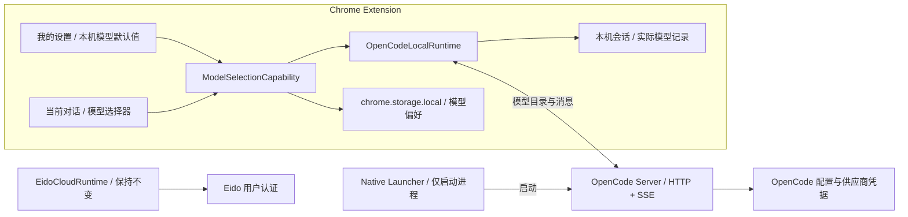
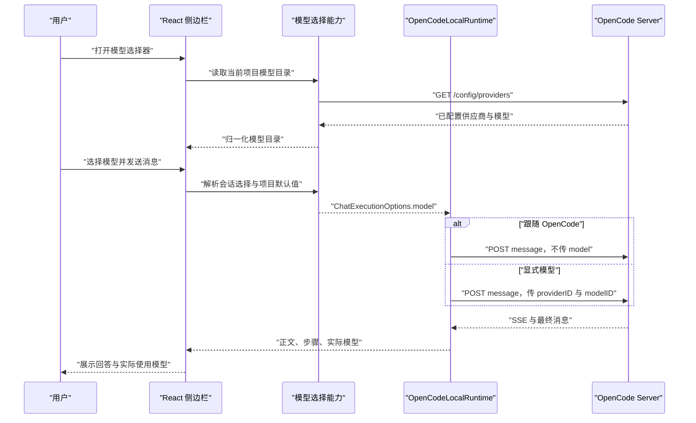

# Chrome 插件本机 OpenCode 模型配置技术方案

> 状态：方案设计，尚未实施。
>
> 适用范围：Chrome 侧边栏插件的“本机 OpenCode”模式。云端 Agent、Eido 用户认证和 Native Launcher 行为均不在本方案中变更。

## 1. 背景与结论

当前插件已经通过 `OpenCodeLocalRuntime` 直连本机 OpenCode Server，并复用移动端 React 聊天界面，但本机消息请求只传递 Agent、系统提示和消息内容，模型完全由 OpenCode 自行选择。用户无法在插件中查看当前可用模型，也无法为本机对话明确选择模型。

本方案建议增加“本机模型选择”能力，核心结论如下：

1. **模型列表来自 OpenCode，不在插件中维护静态模型表。** 插件只展示当前工作目录下已配置、可连接的供应商和模型。
2. **默认选择为“跟随 OpenCode”。** 此时发送消息不携带 `model`，完整保留 OpenCode 现有默认模型、Agent 模型和最近使用模型的解析逻辑。
3. **显式选择模型时按消息传递。** 插件在 `POST /session/:id/message` 中传递 `model: { providerID, modelID }`；后续支持 variant 时单独传递 `variant`。
4. **不写入 `opencode.json`。** 插件模型偏好只影响 Eido 发出的本机请求，不修改 OpenCode TUI、其他客户端或项目的全局默认值。
5. **供应商凭据继续由 OpenCode 管理。** 插件不读取、不保存 API Key，也不通过 Eido 后端或 Native Launcher 传递供应商凭据。
6. **云端链路保持原样。** 模型配置是本机 Runtime 的可选能力，不改变 `EidoCloudRuntime` 的请求、界面和服务端模型策略。
7. **Native Launcher 不承载模型逻辑。** Launcher 仍只负责发现、启动 OpenCode 和选择项目目录，不代理模型列表、聊天请求或认证信息。

## 2. 设计目标

- 用户在插件中能够查看本机 OpenCode 当前可用的模型。
- 用户可以选择“跟随 OpenCode”或一个明确的 `provider/model`。
- 模型偏好可按 OpenCode 实例和项目目录隔离，避免不同项目相互覆盖。
- 同一会话可以从下一条消息开始切换模型，不强制创建新会话。
- 用户可以看到回答实际使用的模型，便于确认 Agent 覆盖、故障排查和费用审计。
- OpenCode 配置变化后，插件能够刷新、校验并处理失效选择。
- 本机模式除 Eido 用户认证外，模型目录、模型选择和消息仍不与 Eido 后端交互。
- 保持现有 React 交互、`AgentRuntime` 隔离和窄侧栏布局。

## 3. 非目标

- 不在插件中录入或保存 OpenAI、Anthropic、DeepSeek 等供应商 API Key。
- 不在首期实现 OpenCode `/connect`、OAuth 回调或供应商账户管理。
- 不修改 OpenCode 全局或项目配置文件中的 `model`、`small_model`、provider 配置。
- 不让 Launcher 注入任意供应商环境变量、模型参数或用户自定义命令。
- 不改变云端 Agent 的模型配置和服务端路由逻辑。
- 不在模型失效时静默切换到另一个可能产生费用的模型。
- 首期不提供模型成本估算、余额查询或模型效果排行榜。

### 3.1 “配置模型”的范围

本方案中的“配置模型”是指：从当前 OpenCode 已接入的供应商中读取模型，设置项目默认模型或当前会话模型，并可选设置 variant。供应商开户、API Key/OAuth、私有网关地址和自定义模型定义仍属于 OpenCode 配置。

如果产品后续要求普通用户也能在不打开终端的情况下接入新供应商，应单独设计“供应商接入向导”：优先打开 OpenCode 官方图形界面或受控授权流程；只有经过凭据存储、OAuth 回调、日志脱敏和权限边界安全评审后，才考虑在插件内调用 OpenCode Auth API。该能力不应与首期模型选择一起交付。

## 4. OpenCode 能力依据

OpenCode Server 已提供本方案需要的协议能力：

| 能力 | OpenCode API | 插件用途 |
| --- | --- | --- |
| 获取项目配置 | `GET /config` | 读取 OpenCode 当前配置的默认模型，只用于展示 |
| 获取可用供应商与默认模型 | `GET /config/providers` | 模型目录的首选数据源 |
| 获取全部供应商和连接状态 | `GET /provider` | 兼容回退，并按 `connected` 过滤 |
| 获取 Agent | `GET /agent` | 识别 Agent 自带的模型和 variant |
| 发送消息 | `POST /session/:id/message` | 传递可选 `model` 和 `variant` |
| 获取实际结果 | 消息响应和 SSE 事件 | 读取 assistant 的 `providerID`、`modelID`、`variant` |
| 协议探测 | `GET /global/health`、`GET /doc` | 获取版本并辅助兼容性诊断 |

模型完整标识采用 `provider_id/model_id`。在 HTTP 请求中不拼接字符串，而是使用 OpenCode 的结构化请求：

```json
{
  "model": {
    "providerID": "openai",
    "modelID": "gpt-5"
  },
  "variant": "high",
  "agent": "build",
  "parts": []
}
```

当选择“跟随 OpenCode”时，必须省略 `model` 和 `variant` 字段，而不是发送空字符串或猜测一个默认模型。

参考：

- [OpenCode Server API](https://opencode.ai/docs/server/)
- [OpenCode Models](https://opencode.ai/docs/models/)
- [OpenCode Providers](https://opencode.ai/docs/providers/)
- [OpenCode Config](https://opencode.ai/docs/config/)

## 5. 总体架构



关键数据边界：

- React 组件只依赖“模型选择能力”，不直接调用 OpenCode URL。
- `OpenCodeLocalRuntime` 负责 OpenCode 协议、目录查询、请求组装和响应归一化。
- 模型偏好只保存在扩展本地；供应商凭据只保存在 OpenCode 管理范围内。
- Launcher 不参与模型目录和消息链路。
- 云端 Runtime 不实现本机模型能力，现有行为不变。

## 6. 模型目录设计

### 6.1 数据源优先级

首选调用：

```text
GET /config/providers?directory=<workspace>
```

该接口返回当前目录生效的供应商、模型与各供应商默认模型，更适合直接构建可选择目录。

兼容回退：

```text
GET /provider?directory=<workspace>
```

回退时只展示 `connected` 中存在的供应商，不能把 OpenCode 内置的全部供应商目录直接展示给用户。否则会出现大量尚未配置、实际无法调用的模型。

### 6.2 归一化模型

插件内部使用稳定、与 OpenCode 对齐的模型引用：

```ts
interface OpenCodeModelRef {
  providerID: string;
  modelID: string;
  variant?: string;
}

interface OpenCodeModelOption {
  ref: OpenCodeModelRef;
  providerName: string;
  modelName: string;
  status: 'active' | 'beta' | 'alpha' | 'deprecated';
  capabilities: {
    toolcall: boolean;
    attachment: boolean;
    reasoning: boolean;
    imageInput: boolean;
  };
  contextLimit?: number;
  outputLimit?: number;
  variants: string[];
}
```

这是设计接口，不代表本轮进行代码修改。

### 6.3 展示与过滤

- 默认展示 `active` 模型。
- `beta`、`alpha` 模型放入“实验模型”分组，默认折叠。
- `deprecated` 模型不允许新选择；若它是已保存偏好，则显示“已停用”并要求重新选择。
- 主列表优先展示支持文本输入、文本输出和工具调用的模型；不支持工具调用的模型放入“不兼容或能力受限”分组，并提示“可能无法完成本地 Agent 工具任务”。
- 模型按供应商分组，支持按显示名、`providerID`、`modelID` 搜索。
- 目录较大时使用搜索优先和列表虚拟化，避免窄侧栏一次渲染数千项。
- 上下文窗口和推理能力可作为辅助信息；首期不展示可能过期或口径不一致的价格信息。

### 6.4 缓存策略

- 按“规范化 endpoint + workspace”缓存模型目录。
- 建议内存缓存 60 秒，并提供显式刷新按钮。
- OpenCode 重启、项目目录变化、连接设置变化后立即失效。
- 发送前不必每次重新拉取全部目录，但对长期缓存的显式选择应做轻量校验。
- 刷新失败时可以展示最近一次目录，但必须标记“目录可能已过期”，不得把未验证模型标记为可用。

## 7. 配置层级与优先级

### 7.1 用户可见层级

建议提供两个层级：

| 层级 | 入口 | 作用范围 |
| --- | --- | --- |
| 项目默认模型 | 我的设置 -> 执行位置 -> 本机模型 | 当前 OpenCode endpoint 与项目目录下、未显式覆盖的本地对话 |
| 当前对话模型 | 对话页的紧凑模型选择器 | 仅当前本地会话，从下一条消息开始生效 |

默认值为“跟随 OpenCode”，而不是插件首次连接后自动选择目录中的第一个模型。

### 7.2 选择优先级

插件侧解析优先级：

```text
当前对话显式选择
  > 当前 endpoint + workspace 的项目默认选择
  > 跟随 OpenCode
```

“跟随 OpenCode”不是插件计算出的具体模型，而是省略消息中的 `model`，交给 OpenCode 按其配置、Agent 和运行时规则解析。

### 7.3 Agent 与模型的关系

OpenCode Agent 可以配置自己的 `model` 和 `variant`，因此 Agent 选择和用户模型选择可能冲突。方案采用以下规则：

1. 默认“跟随 OpenCode”时，不传模型，完整尊重 Agent/OpenCode 配置。
2. 用户显式选择模型时，将模型作为本次消息请求传给 OpenCode。
3. 插件不自行推断 OpenCode 内部最终优先级，assistant 响应中的 `providerID`、`modelID` 和 `variant` 是实际执行结果的唯一事实来源。
4. 当所选 Agent 暴露固定模型时，模型选择器显示“Agent 默认：provider/model”，但允许用户明确覆盖。
5. 若 OpenCode 最终使用的模型与用户选择不同，在回答元信息中提示“实际使用：provider/model”，不能继续显示错误的选中状态。

## 8. 存储设计

不建议把模型字段直接混入目前包含 URL、Basic Auth 密码和 workspace 的单一连接对象。模型偏好具有项目作用域和独立生命周期，建议使用单独、带版本号的存储结构：

```ts
interface ModelPreference {
  schemaVersion: 1;
  mode: 'inherit' | 'explicit';
  model?: OpenCodeModelRef;
  updatedAt: number;
}

interface ModelPreferenceStore {
  [endpointWorkspaceKey: string]: ModelPreference;
}
```

建议存储键：

```text
eido_opencode_model_preferences_v1
```

作用域键由以下内容生成：

```text
normalized(endpoint) + canonical(workspace)
```

会话级覆盖保存在本机会话元数据中：

```ts
interface LocalSessionModelState {
  preference?: OpenCodeModelRef;
  lastActualModel?: OpenCodeModelRef;
}
```

安全要求：

- 只保存模型 ID、variant 和显示偏好。
- 不保存供应商 API Key、OAuth token、OpenCode auth 文件内容。
- 不把模型目录、项目目录或选择结果同步到 Eido 后端。
- 调试日志不得输出 Basic Auth 密码、请求 Authorization 或供应商凭据。

## 9. Runtime 抽象演进

### 9.1 可选能力接口

模型能力仅对本机 OpenCode 有意义，不应成为所有 Runtime 的强制实现。建议增加独立的可选能力：

```ts
interface ModelSelectionCapability {
  listModels(options?: { refresh?: boolean }): Promise<ModelCatalog>;
  getDefaultSelection(): Promise<ModelSelection>;
  saveDefaultSelection(selection: ModelSelection): Promise<void>;
  validateSelection(selection: ModelSelection): Promise<ModelValidation>;
}
```

由扩展入口把该能力作为可选依赖注入共享 React 界面。组件根据能力是否存在决定是否展示模型入口，不使用 `instanceof OpenCodeLocalRuntime` 或 `runtime.id === 'opencode-local'` 之类的供应商判断。

### 9.2 聊天执行上下文

当前 `streamChat` 使用多个位置参数，继续追加模型参数会让调用契约更脆弱。建议在实施时逐步引入执行选项对象：

```ts
interface ChatExecutionOptions {
  context?: string;
  agentHint?: string;
  model?: OpenCodeModelRef;
  signal?: AbortSignal;
  harness?: string;
}
```

迁移原则：

- 云端 Runtime 忽略本机 `model` 或根本不暴露模型能力，现有云端请求体不增加字段。
- 本机 Runtime 仅在 `model` 存在时写入 OpenCode 请求。
- 可以先为现有 `streamChat` 增加兼容适配层，再逐步迁移调用点，避免一次性改变共享聊天行为。
- 不通过 React 全局变量或直接读取 `chrome.storage` 的方式把模型隐式塞入请求；最终选择应由聊天执行上下文明确传递，便于测试和审计。

## 10. 消息流程



### 10.1 切换生效时机

- 模型切换从下一条用户消息开始生效。
- 不终止正在进行的回答，也不修改已发送消息。
- 不因切换模型自动创建新的 OpenCode Session；OpenCode 支持按消息指定模型。
- 每条 assistant 消息记录实际模型，历史消息不会因后续切换而改变标签。

### 10.2 发送中的一致性

用户点击发送时，先生成不可变的本次执行快照：

```text
session id + directory + agent + requested model + attachments + browser context
```

在本轮结束前，即使用户修改设置，也不能改变正在执行请求的模型。该规则可以避免续聊、技能流水线或重试过程中读取到新的全局偏好。

技能流水线中的首期策略建议为“整条流水线使用发送时的同一个模型快照”。未来若需要按 Agent 使用各自模型，应增加明确的“各 Agent 自行决定”模式，而不是隐式混用。

## 11. 交互方案

### 11.1 我的设置

在现有“执行位置 -> 本机”区域新增“默认模型”：

- 连接健康前：禁用并显示“连接 OpenCode 后读取模型”。
- 连接健康后：默认显示“跟随 OpenCode”。
- 点击后打开底部抽屉，包含搜索、供应商分组、刷新和模型状态。
- 选中模型后显示 `模型名`，次行显示 `providerID/modelID`。
- 保存连接设置和保存模型偏好应使用独立状态，避免修改模型时意外重启或切换 Runtime。

### 11.2 当前对话

在本机模式的聊天标题区或输入区工具栏增加紧凑模型入口：

- 使用模型图标与短名称，宽度受限时只显示图标和截断名称。
- 点击复用与设置页相同的模型选择抽屉。
- 选择“使用项目默认值”可清除当前会话覆盖。
- 云端模式不展示该本机入口，保持现有交互不变。
- 不使用新的独立本机聊天页面，继续复用 `frontend-mobile` 布局和消息组件。

### 11.3 回答元信息

回答完成后可在时间或执行信息附近显示实际模型短标签，详细信息放在点击后的轻量弹层中：

```text
OpenAI / gpt-5 / high
```

元信息应取自 OpenCode assistant 响应，不能只回显用户请求值。

## 12. 异常处理

| 场景 | 处理原则 | 用户提示 |
| --- | --- | --- |
| OpenCode 未连接 | 不加载目录，不发送消息，不降级云端 | 先连接或尝试唤起 OpenCode |
| 模型目录接口不可用 | 尝试 `/provider` 兼容回退 | 当前 OpenCode 版本不支持完整模型目录 |
| 已保存模型被删除 | 标记选择失效，阻止使用该显式选择 | 模型已不可用，请重新选择或跟随 OpenCode |
| 供应商未连接 | 不作为正常可选项展示 | 请先在 OpenCode 中配置供应商 |
| 模型被策略禁止 | 不自动换模型 | 当前策略禁止使用该模型 |
| 供应商认证失败 | 保留用户消息草稿，停止发送 | 请在 OpenCode 中更新供应商认证 |
| 限流或余额不足 | 不自动重试到其他付费模型 | 展示 OpenCode 返回的可操作错误 |
| Agent 覆盖模型 | 显示响应中的实际模型 | Agent 实际使用了另一模型 |
| 目录刷新失败 | 可展示带过期标记的缓存，不允许确认未知新选择 | 模型列表刷新失败 |

显式模型失效时，不允许静默回退到“跟随 OpenCode”后继续发送。用户必须确认新的选择，防止数据、费用和模型能力在不知情时改变。

## 13. 兼容性策略

- 使用 `/global/health` 返回的版本做诊断信息，不把版本号作为唯一能力判断依据。
- 优先尝试 `/config/providers`，遇到 `404` 或不兼容响应时回退 `/provider`。
- 对模型、供应商和 Agent 响应进行运行时结构校验，忽略未知字段，不能假设所有 OpenCode 版本字段完全一致。
- 请求体只发送当前服务器支持且本方案实际使用的字段。
- `variant` 作为独立可选能力；首期可以只支持基础模型，确认目录和消息链路稳定后再开放。
- OpenCode 更新后若模型目录 schema 改变，错误应局限在模型选择功能，已有“跟随 OpenCode”聊天仍可继续工作。

## 14. 安全与隐私

### 14.1 网络边界

本机模式的模型相关请求只能访问已校验的回环地址：

```text
http://127.0.0.1:<port>
http://localhost:<port>
http://[::1]:<port>
```

除登录、退出和用户身份确认外，不得把以下信息发送到 Eido 后端：

- 模型目录和供应商列表
- 用户选择的模型和 variant
- OpenCode Agent 固定模型
- 模型错误、使用量和费用字段
- 项目目录、消息、网页上下文和附件

### 14.2 凭据边界

- OpenCode Server Basic Auth 仍按当前插件连接设置保存，只用于回环请求。
- LLM 供应商凭据由 OpenCode 的认证和配置机制管理。
- 插件不得读取 `~/.local/share/opencode/auth.json`。
- Launcher 不接受任意 API Key 或任意环境变量映射；启动 OpenCode 时只延续既定的受控启动协议。
- 调试控制台对请求对象脱敏，不输出 Authorization、密码、token 和供应商认证响应。

## 15. 分阶段实施建议

### 阶段 1：项目默认模型

- 增加模型目录读取和归一化。
- 在“我的设置”支持“跟随 OpenCode”与显式模型选择。
- 发送消息时按项目默认值传递可选 `model`。
- 保存并展示 assistant 实际使用的模型。
- 不开放 variant，不管理供应商认证。

### 阶段 2：会话级切换

- 在聊天页增加紧凑模型选择器。
- 支持会话覆盖项目默认值。
- 模型切换从下一条消息生效。
- 增加失效模型、Agent 覆盖和缓存刷新提示。

### 阶段 3：variant 与高级信息

- 根据模型目录开放 variant 选择。
- 展示工具调用、附件、视觉输入、上下文窗口等能力。
- 根据实际需求评估是否展示 token 与 cost；默认只保存在本地。
- 继续把供应商认证留在 OpenCode，除非未来另立安全评审方案。

## 16. 测试与验收

### 16.1 单元测试

- `/config/providers` 和 `/provider` 两种响应归一化。
- 只保留已连接供应商，并正确处理 active/beta/deprecated。
- endpoint + workspace 作用域键稳定且不同项目隔离。
- `inherit` 模式不生成 `model` 或 `variant` 字段。
- 显式模式生成精确的 `{ providerID, modelID }`。
- 模型失效、供应商断开、Agent 覆盖和版本不兼容的错误归一化。
- 任何日志和存储中均不包含供应商密钥或 Authorization。

### 16.2 集成测试

- 云端模式发送请求与现有版本完全一致。
- 本机“跟随 OpenCode”继续使用 OpenCode 默认模型。
- 本机显式选择后，OpenCode assistant 响应中的实际模型与选择一致。
- 同一 Session 连续两轮使用不同模型，内容只展示一次且会话正常续聊。
- Agent 固定模型与用户显式模型冲突时，界面展示实际执行模型。
- OpenCode 重启、模型删除、供应商退出登录后不会静默切换。
- 选择项目 A/B 时模型偏好互不干扰。
- 本机模型操作不会触发 Eido chat、sessions、skills、workspace、tasks 或 sandbox API。

### 16.3 UI 验收

- Chrome Side Panel 窄宽度下无横向滚动、文本重叠和按钮挤压。
- 大模型目录可以快速搜索，不会阻塞输入和消息流。
- 设置页、聊天页使用同一模型选择组件和状态文案。
- 连接中、刷新中、空目录、失效选择和认证错误都有清晰状态。
- 正在生成回答时切换选择，不影响当前请求，只影响下一条消息。

## 17. 发布与回滚

- 功能应由本机模式专属 feature flag 控制，默认可先仅开放项目默认模型。
- 存储使用独立版本键，回滚插件不会破坏现有连接设置和本机会话。
- 模型目录能力异常时，用户仍可选择“跟随 OpenCode”继续使用当前本机能力。
- 不允许因模型功能异常自动切到云端 Runtime。
- 发布观测只记录本地匿名状态，例如目录加载成功/失败和 schema 版本；不得上传具体模型、项目或消息数据。若无法保证完全本地，则首期不采集。

## 18. 最终建议

推荐先交付“项目默认模型 + 跟随 OpenCode + 实际模型回显”，再增加会话级快捷切换和 variant。第一阶段已经覆盖用户配置模型的核心诉求，同时改动范围最小、回滚简单，也不会改变 OpenCode 的全局行为。

实现时必须坚持三条边界：

1. **插件传模型引用，OpenCode 管供应商和凭据。**
2. **模型按消息生效，不改写 `opencode.json`。**
3. **本机能力独立演进，云端 Runtime 和 Native Launcher 保持不变。**
