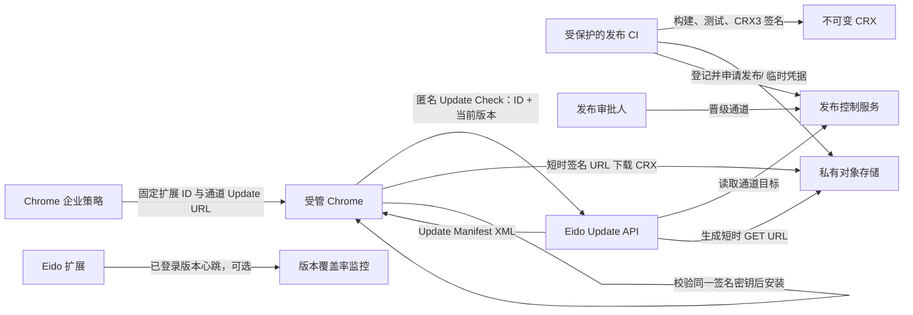
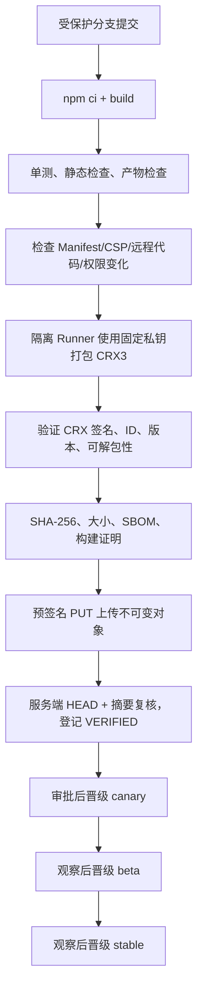

# Eido 企业内部 Chrome 插件私有分发与自动更新技术方案

> 文档状态：方案评审稿，不包含代码实现  
> 适用组件：`frontend-extension`、Eido Gateway、企业终端管理、对象存储  
> 当前插件基线：Manifest V3，版本 `0.1.2`，最低 Chrome `116`  
> 最后核对：2026-07-27

## 1. 结论先行

推荐采用以下主方案：

1. 企业终端通过 Chrome 企业策略安装并锁定 Eido 扩展。
2. CI 构建扩展后，使用同一把长期签名私钥生成 CRX3 包。
3. CRX 以不可变对象写入私有对象存储，不使用可覆盖的 `latest.crx`。
4. Chrome 原生更新器访问 Eido Update API；Update API 根据发布通道选择版本，向对象存储申请短时预签名下载 URL，并返回 Chrome Update Manifest XML。
5. Chrome 直接从对象存储下载 CRX，验证扩展 ID、版本和 CRX 签名后安装。
6. 发布采用 `canary -> beta -> stable` 三个企业策略分组；坏版本通过停止通道、撤回通道目标和发布更高版本热修复处理。

核心链路如下：



### 1.1 必须先接受的浏览器约束

这不是一个可以完全在扩展业务代码中实现的“自更新器”。Chrome 扩展不能下载一个 CRX 后自行覆盖自己；Manifest V3 也不允许把远程 JavaScript 当作更新代码执行。

- Chrome 官方只支持 Chrome Web Store 和受管环境自托管两类正式分发方式。
- Windows、macOS 上的非商店自托管扩展只能通过企业策略安装。
- Windows 设备必须加入 AD、Azure AD，或纳入 Chrome Enterprise Core；macOS 必须由 MDM/MCX 管理、加入域，或纳入 Chrome Enterprise Core。
- Linux 可以自托管，但企业环境仍建议统一使用策略。
- Chrome 的后台更新请求不携带 Cookie，也忽略响应中的 `Set-Cookie`，因此 Update API 不能依赖 Eido CAS 登录态。

如果公司的 Windows/macOS 终端没有任何浏览器或设备管理能力，则“非 Chrome 商店 + 无人工操作 + 自动更新”这个组合不可实现。此时只能先建设 Chrome Enterprise Core/AD/MDM 管理，或者退化为人工更新开发者模式扩展；后者不应作为生产方案。

官方依据：

- [Chrome 扩展分发方式](https://developer.chrome.com/docs/extensions/how-to/distribute)
- [自托管扩展、更新 XML 与 CRX 签名](https://developer.chrome.com/docs/extensions/how-to/distribute/host-on-linux)
- [ExtensionInstallForcelist 企业策略](https://chromeenterprise.google/policies/extension-install-forcelist/)
- [ExtensionSettings 企业策略](https://chromeenterprise.google/policies/extension-settings/)
- [扩展更新生命周期](https://developer.chrome.com/docs/extensions/develop/concepts/extensions-update-lifecycle)

## 2. 目标与非目标

### 2.1 目标

- 插件不发布到 Chrome Web Store。
- 正式插件包只存放在公司的私有对象存储中。
- 终端不持有对象存储长期密钥，通过服务端获得短时下载地址。
- 保持固定扩展 ID，确保后端 CORS、Native Messaging 和企业策略长期稳定。
- 支持测试、灰度、正式三个发布环，并能快速暂停、撤回和热修复。
- 更新失败不影响当前已安装版本继续运行。
- 关键操作可审计，签名密钥、发布权限和对象存储权限相互隔离。
- 能观察各版本覆盖率、更新 API 可用性和对象存储下载错误。

### 2.2 非目标

- 不在本方案中实现代码。
- 不支持扩展自行解压 ZIP/CRX 后覆盖安装目录。
- 不通过远程脚本绕过 CRX 发布；MV3 的 JavaScript、Wasm 和 CSS 必须随扩展包发布。
- 不保证对象包永不被公司员工复制。CRX 最终必须到达终端，能运行扩展的用户原则上也能读取扩展资源；本方案保护的是下载入口、完整性和供应链，不是客户端代码 DRM。
- 不把 Eido 用户登录态作为 Chrome 原生更新请求的认证手段。
- 首期不做单用户随机百分比灰度；使用企业组织单元/设备组作为稳定发布环。

## 3. 当前系统现状与差距

当前仓库中的扩展位于 `frontend-extension`：

- `public/manifest.json` 使用 Manifest V3，版本为 `0.1.2`，最低 Chrome 版本为 `116`。
- `package.json` 版本同为 `0.1.2`，目前需要人工保持一致。
- README 只描述 `npm run build` 后在 `chrome://extensions` 加载 `dist`，没有 CRX 签名、企业策略、更新地址和发布控制链路。
- 后端使用 FastAPI；sandbox 部署下存在中央 Gateway 和按用户启动的 user runtime。
- 后端 CORS 目前允许 `chrome-extension://.*`，固定正式扩展 ID 后可以收紧。
- Native Launcher 已经按扩展 ID 限制 `allowed_origins`，正式发布 ID 必须同步进入 Launcher 安装包。
- 项目依赖中已有腾讯云 COS SDK，但扩展更新应采用独立的最小权限账号和独立桶/前缀，不能复用技能运行时中的 COS 凭据。

需要补齐的能力：

1. 固定扩展签名密钥和生产扩展 ID。
2. CRX3 自动打包、签名、验证与制品登记。
3. 全局发布元数据和通道控制。
4. 无 Cookie 的 Chrome Update Manifest API。
5. 对象存储预签名下载。
6. 企业策略安装和分环。
7. 插件侧更新就绪提示、状态迁移和版本心跳。
8. 发布、暂停、撤回、热修复和应急密钥事件流程。

## 4. 总体架构

### 4.1 组件职责

| 组件 | 职责 | 不应承担的职责 |
| --- | --- | --- |
| 发布 CI | 构建、测试、生成 SBOM、CRX3 签名、计算摘要、上传、登记候选版本 | 不直接修改 stable 通道 |
| CRX 签名服务/受保护 Runner | 在隔离环境使用固定私钥签名 | 不持有对象存储长期管理权限 |
| 发布控制服务 | 保存制品元数据、审批、通道指针、审计记录 | 不代理插件业务流量 |
| Update API | 解析 Chrome 更新请求、选择通道目标、生成预签名 URL、返回 XML | 不依赖 CAS Cookie，不执行用户业务 |
| 私有对象存储 | 保存不可变 CRX、SBOM、构建证明和发布说明 | 不保存 CRX 私钥，不公开桶列表 |
| 企业终端管理 | 首次安装、强制安装、分配通道、禁止用户移除 | 不生成或签名 CRX |
| Chrome 原生更新器 | 定期检查、下载、校验并原子安装新版本 | 不向 Update API发送 Eido Cookie |
| 扩展运行时 | 显示更新就绪状态、在安全时机重载、上报当前版本 | 不下载和安装 CRX |

### 4.2 在 Eido 部署中的位置

发布控制和 Update API 是全局能力，必须运行在 Gateway/控制面，不能放在按用户创建的 `eido-user-*` 容器中。推荐路由：

```text
公网或企业网络入口
└── https://updates.eido.example.com/v1/chrome/{channel}  # 长期稳定公共 URL，无 CAS
    └── Eido Gateway / 独立 Update Service
        ├── /api/v1/extension-updates/{channel}           # 内部应用路由
        ├── extension_releases 数据库
        └── 对象存储签名客户端

受保护管理入口
└── /api/v1/admin/extension-releases/**   # 管理员或 CI 身份认证
    └── 发布控制服务
```

若 Eido Gateway 当前只有单副本，可先使用独立 SQLite 文件并放入 gateway 持久卷。若未来变成多副本，发布元数据需迁移至 PostgreSQL/MySQL，通道切换使用数据库事务或 compare-and-swap，不能依赖单进程锁。

推荐使用独立的 `updates.eido.example.com` 域名。Update URL 会进入已发布 CRX 和企业策略，生命周期远长于普通业务 API；独立域名可以避免登录重定向、CAS 中间件、SPA 路由和业务 API 改版影响旧客户端。现有 Nginx 后续只需增加精确反向代理，不改变 `/ai-eido/api` 用户业务链路。

## 5. 首次安装与企业策略

### 5.1 生产扩展 ID

扩展 ID 由签名公钥派生。第一次正式打包前必须：

1. 在隔离环境生成专用 RSA 私钥。
2. 用该私钥打包首个 CRX3。
3. 记录生成的 32 位扩展 ID。
4. 导出公钥并记录指纹；私钥进入密钥管理系统，禁止提交 Git、上传对象存储或发送给开发人员。
5. CI 每次发布都验证生成的扩展 ID 等于登记的生产 ID。

`manifest.json` 的 `key` 字段只包含公钥，可用于让未打包开发构建保持同一 ID；它不是秘密。正式 CRX 的身份最终仍由 CRX 签名密钥决定。

生产、日常开发建议使用不同 ID，避免开发构建误调用正式 Native Launcher 或正式后端白名单。如果测试环需要验证真实升级，应使用同一生产 ID 和同一签名密钥，但仅在受保护 CI 产生 CRX，不把私钥下发给开发机。

### 5.2 策略示例

企业策略必须同时固定安装方式和通道更新 URL。示意配置：

```json
{
  "ExtensionSettings": {
    "<EIDO_EXTENSION_ID>": {
      "installation_mode": "force_installed",
      "update_url": "https://updates.eido.example.com/v1/chrome/stable",
      "override_update_url": true
    }
  }
}
```

`ExtensionInstallForcelist` 的等价条目：

```text
<EIDO_EXTENSION_ID>;https://updates.eido.example.com/v1/chrome/stable
```

要求：

- 正式员工组织单元使用 `stable`。
- 内部测试人员使用 `beta`。
- 研发和发布验证设备使用 `canary`。
- 三组均配置 `override_update_url=true`。否则首次安装可能走策略 URL，但后续更新回到 CRX 自身 `manifest.update_url`，导致 canary/beta 意外进入 stable。
- CRX 自身的 `manifest.update_url` 固定为 stable 地址，作为策略未覆盖时的安全默认值。
- 企业策略只通过 HTTPS 地址取更新，证书必须由终端信任。

### 5.3 各平台前提

| 平台 | 自托管自动安装前提 | 推荐管理方式 |
| --- | --- | --- |
| Windows | AD、Azure AD 或 Chrome Enterprise Core 纳管 | Chrome Enterprise Core 或域组策略 |
| macOS | MDM/MCX、域管理或 Chrome Enterprise Core 纳管 | MDM 配置描述文件 |
| Linux | 支持自托管，企业场景建议策略 | `/etc/opt/chrome/policies/managed` 或企业云管理 |
| 未纳管 Windows/macOS | 不支持本方案的无交互自动安装 | 先纳管；否则只提供人工开发模式更新 |

## 6. 制品构建与签名

### 6.1 版本规则

Chrome `version` 只能包含 1 到 4 段、每段 `0..65535` 的整数。推荐统一为：

```text
主版本.次版本.修订号.构建号
例如：0.1.3.42
```

- `version` 用于机器比较，必须单调递增。
- Git 提交、分支、发布日期等信息放到 `version_name` 和发布元数据，不塞入 `version`。
- `frontend-extension/public/manifest.json` 作为扩展版本唯一事实来源；CI 检查 `package.json` 与其一致。
- 同一版本号一经上传不得重建或覆盖。任何内容变化都必须使用更高版本。
- 更新 XML 中的 `version` 必须与 CRX 内 `manifest.json` 完全一致。

Chrome 的版本比较从左到右进行，缺失段视为 0，因此 `0.1.3.1` 高于 `0.1.3`。

### 6.2 发布流水线



流水线必须执行：

- 锁定依赖安装，禁止发布时隐式升级 npm 依赖。
- 运行 `frontend-extension` 的测试和构建。
- 检查构建产物只包含本地脚本；MV3 不允许远程托管代码。
- 比较权限清单，新增 `permissions`、`host_permissions`、content script 匹配范围必须触发安全复核。
- 使用登记私钥生成 CRX3，并从 CRX 反向验证扩展 ID。
- 解包复核 Manifest 版本、`minimum_chrome_version`、`update_url` 和构建配置。
- 计算 CRX SHA-256、字节数和 SBOM，保存 Git commit、流水线 ID、构建时间和操作者。
- 上传完成后由服务端从对象存储重新读取或流式抽查，不能只信任 CI 上报的摘要。
- 候选版本完成验证后状态为 `VERIFIED`；只有独立审批动作才能把通道指向该版本。

### 6.3 签名密钥管理

签名私钥泄露意味着攻击者可以产生被现有 Chrome 信任的恶意更新，是本系统最高等级风险。

控制要求：

- 使用独立于代码仓库、对象存储和 Eido 后端的密钥管理域。
- 推荐在专用自托管发布 Runner 中临时解封加密 PEM；Runner 任务结束后清理工作目录、内存盘和临时 Keychain。
- CI 日志禁止输出私钥路径内容、环境变量、打包命令完整参数和预签名 URL。
- 私钥读取和 stable 发布使用双人审批；构建者与发布者权限分离。
- 只保留加密备份并定期做离线恢复演练。
- 不做常规轮换。更换 CRX 签名密钥会改变扩展 ID，相当于发布一个新扩展，需要重新下发企业策略、CORS 白名单和 Native Messaging `allowed_origins`。

## 7. 对象存储设计

### 7.1 桶与对象键

使用独立私有桶或至少独立前缀：

```text
eido-private-releases/
└── chrome-extension/
    └── <extension-id>/
        └── releases/
            └── 0.1.3.42/
                ├── eido-extension-0.1.3.42.crx
                ├── manifest.json
                ├── sbom.spdx.json
                ├── provenance.json
                └── release-notes.md
```

约束：

- 对象键含扩展 ID 和完整版本，全部不可变。
- 禁止 `latest.crx`、`stable.crx` 这类可覆盖对象；stable 是数据库通道指针，不是对象名。
- 开启对象版本控制；条件允许时开启对象锁/WORM 和跨区域复制。
- 已发布 CRX 不物理删除。`REVOKED` 只影响服务端选择，不删除审计证据。
- CRX 响应类型设为 `application/x-chrome-extension`。
- 对象存储不需要为网页 JavaScript 配置 CORS，因为下载者是 Chrome 原生更新器，不是扩展页面的 `fetch`。

### 7.2 权限

| 身份 | 最小权限 |
| --- | --- |
| 发布 CI | 仅可向指定版本前缀执行一次性 PUT；不能覆盖、删除或列桶 |
| 发布控制服务 | HEAD/GET 制品，生成指定前缀的短时 GET URL；不能读取签名私钥 |
| 运维管理员 | 查看元数据；物理删除需要单独的 break-glass 流程 |
| 终端 Chrome | 仅持有单对象、短时、只读预签名 URL |

优先让 CI 向发布控制服务申请一次性预签名 PUT 或云厂商 STS 临时凭据，避免给 CI 配置对象存储长期 SecretId/SecretKey。

### 7.3 下载 URL

Update API 每次正常更新检查时生成预签名 GET URL：

- 有效期建议 15 分钟，覆盖网络抖动和终端时钟偏差。
- 权限只覆盖一个确切对象键，仅允许 GET/HEAD。
- URL 使用 HTTPS。
- 预签名 URL 含有多个查询参数，写入 XML `codebase` 属性前必须按 XML 规则转义，例如 `&` 转为 `&amp;`。
- Update XML 设置 `Cache-Control: no-store`，防止网关或代理缓存带有即将过期的签名 URL。
- 对象是不可变的；对象元数据可以使用短缓存，但不能让缓存绕过签名 URL 到期校验。
- 日志中只记录 `release_id` 和对象键摘要，不记录完整预签名 URL。

## 8. 发布元数据模型

发布元数据是全局控制面数据，不与用户的 `chat_sessions.db` 混放。建议模型如下：

### 8.1 `extension_products`

| 字段 | 类型 | 说明 |
| --- | --- | --- |
| `id` | UUID/Text PK | 产品内部 ID |
| `extension_id` | Char(32) UNIQUE | Chrome 扩展 ID，只允许 `a-p` |
| `name` | Text | `Eido Chrome Extension` |
| `public_key_sha256` | Text | 登记公钥指纹 |
| `default_channel` | Text | `stable` |
| `created_at` | Timestamp | 创建时间 |

### 8.2 `extension_releases`

| 字段 | 类型 | 说明 |
| --- | --- | --- |
| `id` | UUID/Text PK | 发布 ID |
| `product_id` | FK | 扩展产品 |
| `version` | Text UNIQUE(product) | Chrome 数字版本 |
| `version_major..build` | Integer | 规范化比较字段 |
| `object_key` | Text UNIQUE | CRX 不可变对象键 |
| `sha256` | Char(64) | CRX 摘要 |
| `size_bytes` | Integer | CRX 大小 |
| `min_chrome_version` | Text | 与 Manifest/XML 对齐 |
| `git_commit` | Text | 源码提交 |
| `pipeline_run_id` | Text | CI 运行 ID |
| `artifact_status` | Enum | `UPLOADING/VERIFIED/REVOKED` |
| `release_notes` | Text | 变更与风险 |
| `created_by` | Text | 构建身份 |
| `verified_at` | Timestamp | 服务端验证时间 |
| `created_at` | Timestamp | 创建时间 |

### 8.3 `extension_channels`

| 字段 | 类型 | 说明 |
| --- | --- | --- |
| `product_id` | FK | 扩展产品 |
| `channel` | PK part | `canary/beta/stable` |
| `target_release_id` | FK nullable | 当前对外目标版本 |
| `suspended` | Boolean | 是否暂停所有更新响应 |
| `revision` | Integer | 乐观锁/CAS 版本 |
| `updated_by` | Text | 修改人 |
| `updated_at` | Timestamp | 修改时间 |

### 8.4 `extension_release_events`

追加写审计表：

| 字段 | 说明 |
| --- | --- |
| `id` | 全局事件 ID |
| `action` | `CREATE/VERIFY/PROMOTE/SUSPEND/RESUME/WITHDRAW/REVOKE` |
| `release_id/channel` | 操作目标 |
| `before_json/after_json` | 操作前后快照 |
| `actor/approver` | 操作者和审批者 |
| `reason/change_ticket` | 原因与变更单 |
| `created_at/trace_id` | 时间与链路 ID |

通道更新与审计事件必须在同一数据库事务中提交。

## 9. Update API 设计

### 9.1 请求

建议地址：

```http
GET https://updates.eido.example.com/v1/chrome/stable?x=id%3D<EXTENSION_ID>%26v%3D0.1.2
```

Chrome 可能在一个请求中重复传入多个 `x` 参数，每个内部值形如：

```text
id=<32位扩展ID>&v=<当前版本>
```

服务端要求：

- 支持重复 `x` 参数，不假定永远只有一个扩展。
- 对外只接受 `canary/beta/stable` 白名单通道。
- 扩展 ID 必须严格为 32 个 `a-p` 字符。
- 当前版本必须符合 Chrome 1 到 4 段整数规则，拒绝超长和异常嵌套编码。
- 单请求设置扩展数和 URL 长度上限，避免解析型 DoS。
- 未知扩展 ID 返回合法的 `noupdate` XML，不返回内部版本或对象信息。
- 该接口不要求 CAS/Session 用户身份，也不路由到 user sandbox。
- 接口不需要 CORS；应允许 Chrome 更新器的无 `Origin` 请求。

### 9.2 版本选择

对每个已知扩展：

1. 读取请求 URL 对应通道。
2. 若通道 `suspended=true`，不提供任何新版本。
3. 读取 `target_release_id`，确认制品状态为 `VERIFIED` 且不是 `REVOKED`。
4. 比较目标版本与客户端版本。
5. 只有目标版本更高且满足最低 Chrome 约束时才生成短时下载 URL。
6. 生成 Update Manifest XML。

Chrome 会比较 XML 版本和本地版本；当没有可提供的更高版本时，首期统一返回协议明确支持的 `<updatecheck status="noupdate"/>`，减少不必要的签名 URL 生成。

如果使用 `prodversionmin`，Update API 还需要从 Chrome 更新请求中解析浏览器版本，并与 CRX 内 `minimum_chrome_version` 保持一致。无可靠浏览器版本时宁可不加 XML 约束，交由 CRX Manifest 的 `minimum_chrome_version` 控制；上线前必须在目标 Chrome 版本矩阵中验证行为。

### 9.3 成功响应

```http
HTTP/1.1 200 OK
Content-Type: application/xml; charset=utf-8
Cache-Control: no-store
X-Content-Type-Options: nosniff
```

```xml
<?xml version="1.0" encoding="UTF-8"?>
<gupdate xmlns="http://www.google.com/update2/response" protocol="2.0">
  <app appid="<EIDO_EXTENSION_ID>">
    <updatecheck
      codebase="https://cos.example.com/.../eido-extension-0.1.3.42.crx?sign=...&amp;expires=..."
      version="0.1.3.42" />
  </app>
</gupdate>
```

无更新响应示例：

```xml
<?xml version="1.0" encoding="UTF-8"?>
<gupdate xmlns="http://www.google.com/update2/response" protocol="2.0">
  <app appid="<EIDO_EXTENSION_ID>">
    <updatecheck status="noupdate" />
  </app>
</gupdate>
```

注意：

- `codebase` 必须是 HTTPS CRX 地址。
- XML 中的版本必须和 CRX Manifest 一致。
- 预签名 URL 不能写日志。
- 返回 XML 前使用 XML 库构造节点，不通过字符串拼接未受信输入。

### 9.4 错误策略

| 场景 | 对 Chrome 的响应 | 服务端处理 |
| --- | --- | --- |
| 无更新 | `200` + `status="noupdate"` XML | 计入 `no_update` |
| 未知扩展 ID | `200` + `status="noupdate"` XML | 低级别安全指标 |
| 通道暂停 | `200` + `status="noupdate"` XML | 计入 `suspended` |
| 对象不存在/摘要不符 | `503` | 高优告警，禁止生成 URL |
| COS 临时错误 | `503` | 告警并让 Chrome 后续重试 |
| 数据库不可用 | `503` | 不回退到未经验证的 `latest` 对象 |
| 请求畸形 | `400` | 限流，避免回显详细内部信息 |

更新服务故障不应卸载或破坏现有扩展；Chrome 保留当前版本并在后续周期重试。

### 9.5 更新接口的访问控制边界

由于 Chrome 明确不发送 Cookie，Update API 必须视为匿名制品发现入口。私有桶和短时 URL 可以防止对象永久公开，但不能阻止任何能访问 Update API 的人申请一个短时 CRX 地址。

推荐按敏感程度选择：

1. 一般企业内部代码：Update API 只开放在企业内网/VPN/Zero Trust 网络，配合 WAF、IP/网络身份策略；这是推荐基线。
2. 员工广泛远程办公：Update API 可公网访问，但只暴露固定扩展 ID 的当前 CRX，使用限流和短时 URL。接受 CRX 可被合法终端用户复制这一事实。
3. 极高保密要求：引入持续运行且具有设备证书的本机更新代理，由本机代理认证后获取 CRX，再向 `localhost` 提供 Chrome 更新协议。这会显著增加安装、守护进程、证书轮换和跨平台运维成本，不建议首期采用。

不要把永久密钥放在 `manifest.update_url` 查询参数中。Manifest 和企业策略在终端上均可查看，URL 参数只能作为可撤销的分发标识，不能当作真正秘密。

## 10. 发布管理 API

管理 API 与 Chrome Update API 分离，必须使用管理员认证、RBAC、审计和 CSRF 防护。建议接口：

| 方法 | 路径 | 作用 | 权限 |
| --- | --- | --- | --- |
| `POST` | `/api/v1/admin/extension-releases` | 创建候选版本并返回一次性上传凭据 | `release_builder` |
| `POST` | `/api/v1/admin/extension-releases/{id}/complete` | 上传完成，触发服务端校验 | `release_builder` |
| `GET` | `/api/v1/admin/extension-releases/{id}` | 查看制品、验证和通道状态 | `release_viewer` |
| `POST` | `/api/v1/admin/extension-channels/{channel}/promote` | 通道指向更高版本 | `release_manager` + 审批 |
| `POST` | `/api/v1/admin/extension-channels/{channel}/suspend` | 暂停通道更新 | `release_manager` |
| `POST` | `/api/v1/admin/extension-channels/{channel}/withdraw` | 紧急撤回到已知良好目标 | `release_manager` + break-glass |
| `POST` | `/api/v1/admin/extension-releases/{id}/revoke` | 标记制品不再可选 | `security_admin` |
| `GET` | `/api/v1/admin/extension-release-events` | 查询审计记录 | `auditor` |

### 10.1 创建候选版本

请求包含：

```json
{
  "extension_id": "<EIDO_EXTENSION_ID>",
  "version": "0.1.3.42",
  "size_bytes": 1234567,
  "sha256": "...",
  "min_chrome_version": "116",
  "git_commit": "...",
  "pipeline_run_id": "..."
}
```

服务端验证版本大于所有已登记版本、对象键不存在，创建 `UPLOADING` 记录并返回仅对该对象有效的一次性 PUT URL。上传 URL 建议 10 分钟过期，限制 Content-Length 和 Content-Type。

### 10.2 完成上传

`complete` 不是简单改状态。服务端必须：

1. HEAD 校验对象存在、大小正确。
2. 流式计算或可信服务端校验 SHA-256。
3. 解读 CRX3 头与签名，确认扩展 ID 等于生产 ID。
4. 解包读取 Manifest，确认版本、最低 Chrome 版本和 Update URL。
5. 确认包内无路径穿越、意外私钥、`.env`、source map 敏感内容或远程执行代码。
6. 校验成功后改为 `VERIFIED`；失败则保持不可发布并记录原因。

### 10.3 晋级

通道只能指向 `VERIFIED` 制品。正常 `promote` 必须满足新版本高于通道当前版本，并使用 `revision` 乐观锁避免两个管理员并发覆盖。

stable 晋级建议强制填写：

- 变更单号；
- canary/beta 观察时间；
- 自动化测试报告；
- 新增权限说明；
- 数据迁移和回滚说明；
- 第二审批人。

## 11. 灰度策略

### 11.1 推荐：企业组织单元分环

Chrome 更新请求没有可依赖的 Eido 用户 Cookie，也不天然提供稳定设备 ID。不要按 Update API 的随机数或公网 IP 做百分比灰度，否则同一设备可能在不同请求中反复命中不同结果，NAT 下还会让大量员工绑定在同一结果。

首期使用稳定企业分组：

| 通道 | 建议范围 | 最短观察期 | 进入条件 |
| --- | --- | --- | --- |
| canary | 研发、QA、发布负责人，约 1%–5% | 4 小时或一个工作日 | 自动测试通过 |
| beta | IT、业务种子用户，约 10%–20% | 1–2 个工作日 | canary 无阻断问题 |
| stable | 全体受管终端 | 按风险决定 | beta 指标达标并审批 |

每个组织单元通过企业策略配置相应的 Update URL。需要紧急安全修复时可以缩短观察期，但仍应先在最小 canary 组完成安装和基本功能验证。

### 11.2 后续可选：稳定设备分桶

只有在组织单元不足以支持灰度时，才考虑设备分桶：

- 已登录扩展从 Eido 后端获得非敏感的稳定 cohort 标记。
- 扩展使用 Chrome 支持的 update URL data 向原生更新请求附加 cohort。
- Update API 验证签名后的 cohort 声明并选择版本。

该机制会增加协议兼容和隐私复杂度，且不能替代企业策略完成首次安装，因此不纳入首期。

## 12. 客户端更新生命周期

Chrome 默认在启动时和之后每隔数小时检查更新。下载完成不等于立即切换：MV3 扩展需要进入空闲状态；打开的 Side Panel 会推迟安装。

插件侧后续实现原则：

1. 监听 `chrome.runtime.onUpdateAvailable`，记录待安装版本。
2. 聊天流式响应、文件上传、Native Launcher 请求或权限确认进行中时，不调用 `chrome.runtime.reload()`。
3. 空闲时在 Side Panel 显示“新版本已准备好”，允许用户立即刷新；低风险场景也可在面板关闭后由 Chrome 自然安装。
4. 紧急版本只有在确认没有未保存操作时才主动 reload。
5. 后端检测到扩展版本低于最低兼容版本时，可以返回结构化 `426 Upgrade Required`，插件只在此时调用一次 `requestUpdateCheck()`；不能用定时器频繁请求，Chrome 会限流。
6. 更新完成后的 `runtime.onInstalled(reason=update)` 执行幂等数据迁移。

### 12.1 本地数据迁移

当前扩展把本机会话、OpenCode Session 映射和设置放在 `localStorage`/`chrome.storage.local`。自动更新必须保证：

- 存储数据包含显式 `schema_version`。
- 迁移按版本逐级、幂等执行，先复制/验证后替换关键数据。
- 不能在首次加载新版本时无条件清空旧存储。
- 新版本写入的数据若旧版本无法理解，应在发布说明中标记“不可数据回滚”。
- 至少在 `N-1 -> N`、跨两个版本升级和损坏数据恢复三种路径上测试。
- 更新期间正在运行的 OpenCode 服务可能继续执行，插件重载后要通过现有 session 映射恢复状态，而不是重复提交用户消息。

## 13. 回滚、撤回与故障处理

### 13.1 Chrome 不支持自动降级

如果 `0.1.3.42` 有严重问题，把 stable 指针改回 `0.1.2` 不会让已经安装 `0.1.3.42` 的 Chrome 降级。

正确处理：

1. 立即将 stable 通道撤回到上一已知良好版本，使尚未更新的旧客户端不再拿到坏版本。
2. 必要时设置 `suspended=true`，停止该通道所有新更新。
3. 从上一良好提交生成修复代码，但必须发布为更高版本，例如 `0.1.3.43`。
4. 先 canary 验证，再按紧急流程晋级 stable。
5. 已安装坏版本的客户端只有看到更高版本后才能自动恢复。

因此本文中的“回滚”实际由两部分组成：阻止坏版本继续扩散，以及发布更高版本的回退构建。

### 13.2 应急矩阵

| 故障 | 立即动作 | 恢复动作 |
| --- | --- | --- |
| 新版本业务故障 | 撤回通道目标/暂停 | 发布更高版本热修复 |
| 新版本导致后端不兼容 | 后端按版本禁用危险功能，返回升级/维护提示 | 发布兼容版本 |
| Update API 故障 | 当前版本继续运行，告警 | 恢复 API；Chrome 自动重试 |
| COS 403/过期 URL | Update XML 禁止缓存，检查签名时钟和权限 | 修复签名配置后重试 |
| CRX 对象损坏 | 标记 `REVOKED`、停止生成 URL | 从可信构建记录发布新版本 |
| 发布数据库丢失 | 不从桶中自动选择“最大版本” | 从审计备份恢复通道元数据 |
| 签名私钥疑似泄露 | 冻结全部发布、吊销 CI 访问、启动安全事件 | 新扩展 ID、重新下发策略和 Launcher |

### 13.3 不应做的事情

- 覆盖同版本 CRX 对象。
- 用低版本号期待 Chrome 降级。
- Update API 失败时直接返回桶里按文件名排序的“最新文件”。
- 在坏版本已扩散后删除对象而不发布更高版本；这只会让下载失败，不能修复已安装客户端。
- 为追求立即安装，在用户正在执行聊天或文件操作时强制 reload。

## 14. 安全设计

### 14.1 信任链

```text
受保护源码分支
  -> 可复现构建与测试
  -> CRX 固定私钥签名
  -> 服务端校验 ID/版本/摘要
  -> 不可变对象存储
  -> 经审批的通道指针
  -> HTTPS Update XML
  -> 短时对象 URL
  -> Chrome 验证同一 CRX 签名并安装
```

对象存储签名 URL 和 CRX 签名解决不同问题：

- 预签名 URL 控制“谁在什么时间可以取哪个对象”。
- CRX 签名控制“这个对象是否由同一扩展发布者生成”。
- SHA-256 用于发布系统内部校验、审计和告警；Chrome 的最终身份校验仍依赖 CRX 签名。

### 14.2 威胁与控制

| 威胁 | 主要控制 | 剩余风险 |
| --- | --- | --- |
| 对象被篡改 | CRX 签名、SHA-256、对象不可变 | 下载失败，可造成拒绝服务 |
| Update API 被篡改 | TLS、最小权限、只返回 VERIFIED 制品 | 若签名私钥安全，攻击者不能造有效新 CRX，但可冻结更新 |
| CI 供应链被攻破 | 保护分支、依赖锁、隔离签名、双人审批、SBOM | 有权使用签名流程的攻击仍是高风险 |
| 签名私钥泄露 | KMS/加密保管、隔离 Runner、审计、双人审批 | 泄露后只能迁移新扩展 ID |
| 旧版本冻结攻击 | 版本覆盖率监控、Update API SLO、后端最低版本门槛 | 离线终端仍会长期停留旧版 |
| 预签名 URL 泄露 | 15 分钟 TTL、单对象 GET、日志脱敏 | 有效期内可被转发下载 |
| 匿名 Update API 被扫描 | 内网/VPN、WAF、限流、固定 ID 白名单 | CRX 仍可被合法终端用户复制 |
| 恶意降级 | Chrome 版本单调比较、正常发布禁止通道降级 | 已装坏版本不能自动降级 |
| 缓存返回过期 URL | Update XML `no-store`、不可变对象键 | 错误配置可能导致阶段性 403 |

### 14.3 与现有 Eido 安全边界的联动

- 固定生产扩展 ID 后，把 `BACKEND_CORS_ORIGIN_REGEX=chrome-extension://.*` 收紧为精确 Origin；如保留开发 ID，显式列出而不是通配。
- Native Launcher 正式安装包的 `allowed_origins` 必须包含生产 ID；开发 ID 与生产 ID 分开登记。
- 当前 Launcher 下载地址指向 GitHub Release。如果整个内部插件供应链都要求私有化，应把 Launcher 安装包也纳入独立的签名、对象存储和预签名下载流程；但 Launcher 是 macOS 安装包，不使用 Chrome 扩展 Update XML，应单独设计版本更新。
- 更新服务的 COS 凭据与技能中的 COS 凭据隔离。用户技能执行环境不应具有读取扩展发布桶的权限。
- Update API 不接受客户端传来的任意对象键、文件名或 Bucket；对象键只能由已验证 release_id 从数据库解析。

## 15. 可观测性与审计

### 15.1 指标

Update API：

- `extension_update_checks_total{channel,current_version,result}`
- `extension_update_offers_total{channel,target_version}`
- `extension_update_manifest_latency_ms`
- `extension_update_presign_errors_total{reason}`
- `extension_update_unknown_id_total`
- `extension_update_suspended_total{channel}`

对象存储：

- CRX GET 请求数、成功率、403/404/5xx；
- 下载字节数与出口流量；
- 预签名 URL 生成失败率；
- 跨区域复制和对象完整性状态。

发布控制：

- 各通道目标版本和停留时间；
- 候选版本验证失败数；
- stable 发布次数、撤回次数和审批耗时；
- 制品摘要复核失败告警。

### 15.2 版本覆盖率

仅凭 Update API 只能知道“某版本检查过更新”，不能确认新版本已经安装，因为安装可能因 Side Panel 活跃而延迟。

推荐扩展在用户已登录后发送低频版本心跳，或在正常业务请求增加：

```text
X-Eido-Extension-Id: <id>
X-Eido-Extension-Version: 0.1.3.42
X-Eido-Extension-Channel: stable
```

注意：

- 版本头用于兼容性和统计，不是安全认证，客户端可以伪造。
- 心跳不上传浏览历史、网页内容、本机项目目录或 OpenCode 信息。
- 同一用户/版本按天聚合，避免形成不必要的细粒度行为轨迹。
- 目标指标使用“过去 24 小时活跃扩展版本分布”，而不是 Update API 下载数。

### 15.3 告警建议

- Update API 5 分钟可用率低于 99.9%。
- 某通道预签名失败率连续 5 分钟超过 1%。
- stable 晋级后 30 分钟仍无新版本心跳。
- stable 新版本错误率、认证失败率或聊天失败率显著高于上一版本。
- 发现数据库摘要与对象重新计算摘要不一致。
- 非发布窗口发生 stable 通道变更或签名密钥读取。

## 16. 性能、缓存与可用性

### 16.1 流量估算

Chrome 每隔数小时检查一次。若有 `N` 台设备、平均每 4 小时一次：

```text
平均更新检查 QPS ≈ N / 14,400
```

10 万台设备平均约 7 QPS，但浏览器启动、早高峰和策略刷新会产生明显突发，应按平均值的 20–50 倍设计瞬时容量。

### 16.2 缓存策略

- 带预签名 URL 的动态 Update XML：`no-store`。
- 发布通道数据：进程内缓存 5–15 秒，通道变更后主动失效；缓存值必须包含 `revision`。
- CRX 对象：不可变，可由对象存储缓存。若另接 CDN，必须采用 CDN 自身的鉴权方案，不能假定对象存储预签名 URL 可直接换成 CDN 域名。
- 管理 API：不缓存。

如果希望 Update XML 由 CDN 长时间缓存，就不能把短时 COS URL直接放入 XML。可改为稳定的 Eido 下载网关地址，由下载网关每次请求再生成 COS URL并 302 跳转或代理字节；是否采用 302 必须先在目标 Chrome 版本矩阵中验证。首期推荐动态 XML直出预签名 URL，链路更简单。

### 16.3 可用性原则

- Update API 不可用时，已安装插件继续可用。
- 发布数据库、对象存储或签名服务任一异常时，默认不发布新版本。
- Update API 是读取路径，不应依赖用户 sandbox 启动。
- 通道目标和最近发布元数据定期备份；恢复后先只读核对，不自动选择桶中最大版本。
- 服务端、对象存储和客户端时钟使用 NTP；预签名 URL 留出合理时钟偏差。

## 17. 测试方案

### 17.1 协议测试

- 单个和多个重复 `x` 参数。
- 合法/非法扩展 ID、版本、超长参数、重复编码。
- XML namespace、Content-Type、UTF-8 和特殊字符转义。
- 预签名 URL 中 `&` 正确转义为 `&amp;`。
- 无更新、未知 ID、暂停、COS 不可用、数据库不可用。
- `minimum_chrome_version` 和可选 `prodversionmin` 行为。

### 17.2 制品测试

- 首次 CRX 安装成功，扩展 ID 与登记值一致。
- 相同私钥、更高版本可更新。
- 不同私钥的 CRX 被 Chrome 拒绝。
- 同版本不同内容不会被发布系统接受。
- 更低版本不会覆盖已安装高版本。
- CRX 下载响应为 `application/x-chrome-extension`。
- Manifest、package 版本、XML 版本和数据库版本完全一致。

### 17.3 企业策略矩阵

至少覆盖：

- Windows：AD/Azure AD/Chrome Enterprise Core 中实际采用的一种管理方式。
- macOS：实际 MDM 产品和目标系统版本。
- Linux：公司支持的发行版和 managed policy 路径。
- canary/beta/stable 三个组织单元的 `override_update_url`。
- 新设备首次安装、已有设备更新、用户禁用/删除限制、策略移除后的行为。
- `chrome://policy` 和 `chrome://extensions-internals` 中的诊断信息。

### 17.4 Eido 功能回归

- Side Panel 打开时下载更新但延迟安装。
- 聊天流、附件上传、权限确认进行中不强制 reload。
- 更新后云端会话、本机会话、OpenCode 映射、设置和登录态保持。
- `onInstalled(update)` 数据迁移幂等。
- Native Messaging 仍认可生产扩展 ID。
- 后端 CORS 只接受登记的生产/开发 ID。
- 新增权限、host permissions 和 CSP 变化符合安全预期。

### 17.5 故障演练

- stable 发布后立即撤回，确认未更新客户端不再获得坏版本。
- 用更高版本的旧代码完成恢复，确认已安装坏版本可前进修复。
- 预签名 URL 过期、COS 403、对象 404、Update API 503。
- 发布数据库从备份恢复，不会把未审批 CRX 自动推给 stable。
- 签名私钥不可用时发布失败，但 Update API 仍能服务现有通道。

## 18. 发布与回滚运行手册

### 18.1 常规发布

1. 合并到受保护发布分支，确定唯一 Chrome 版本号。
2. CI 构建、测试、签名、校验、上传并登记 `VERIFIED` 候选。
3. 发布负责人复核权限差异、SBOM、摘要、版本和更新地址。
4. 晋级 canary，强制测试设备在 `chrome://extensions` 触发一次更新，完成基本功能验证。
5. 观察错误率、版本心跳、Update API 和 COS 指标。
6. 晋级 beta，按规定观察。
7. 双人审批后晋级 stable。
8. 观察覆盖率直到达到目标；记录未升级设备清单并由 IT 排查策略或网络。

### 18.2 紧急停止

1. `suspend stable`，确保 Update API 返回 `noupdate`。
2. 确认审计事件和监控生效。
3. 判断是否需要把 stable 目标撤回到上一良好版本，以便尚未升级的更老客户端仍可到达良好版本。
4. 发布更高版本热修复，绝不复用版本号。
5. 从 canary 最小验证后按应急审批恢复 stable。

### 18.3 签名密钥事件

1. 冻结所有通道和发布凭据。
2. 保留日志和 Runner 证据，确认泄露范围。
3. 生成新签名密钥和新扩展 ID。
4. 更新企业策略、后端精确 CORS、Native Launcher `allowed_origins`、监控和 Update API 产品登记。
5. 并行安装新扩展，迁移必要配置；旧扩展停止业务访问后从策略移除。

密钥泄露不能通过普通版本更新彻底修复，因为旧密钥已具备签发任意更高版本的能力。

## 19. 分阶段实施计划

### 阶段 0：管理前提确认

- 终端清单：Windows/macOS/Linux 数量、Chrome 版本、是否纳管。
- 确定使用 Chrome Enterprise Core、AD/Azure AD、MDM 的具体组合。
- 确定 Update API 是内网/VPN还是公网。
- 确定对象存储供应商、区域、桶和数据保留要求。

退出条件：在至少一台 Windows 和一台 macOS 目标设备上确认企业策略可以从自定义 URL 强制安装测试扩展。

### 阶段 1：建立身份与制品链

- 生成并托管正式 CRX 私钥。
- 固定生产扩展 ID。
- 建立不可变对象结构、最小权限和版本控制。
- 完成 CI 构建、签名、摘要和制品验证设计。
- 更新 Native Launcher 与 CORS 的生产 ID 清单。

退出条件：同一密钥的 `N -> N+1` CRX 可在隔离测试机手工触发更新，不同密钥包会被拒绝。

### 阶段 2：Update API 与发布控制

- 建立全局发布数据库。
- 实现候选上传、服务端校验、通道和审计。
- 实现无 Cookie 的 Update Manifest XML 和对象预签名 URL。
- 配置路由、TLS、WAF、监控和备份。

退出条件：协议、异常和故障演练通过；服务故障不影响当前版本运行。

### 阶段 3：灰度与客户端体验

- 建立 canary/beta/stable 组织单元及策略。
- 增加更新就绪提示、安全 reload 和幂等存储迁移。
- 增加低频版本心跳和兼容性提示。
- 完成跨平台验收。

退出条件：完整走通 canary 到 stable，并成功演练“撤回 + 更高版本恢复”。

### 阶段 4：生产运营

- 编写值班手册和审批流程。
- 设置 SLO、告警、覆盖率看板和月度密钥审计。
- 定期验证备份、私钥恢复和策略下发。
- 根据规模决定是否把 SQLite 升级为外部数据库、是否引入 CDN/下载网关。

## 20. 需要业务与 IT 最终确认的决策

| 决策 | 推荐值 | 影响 |
| --- | --- | --- |
| 终端是否已纳管 | 必须是 | 否则 Windows/macOS 无法实现非商店自动更新 |
| Update API 网络范围 | 企业内网/VPN 优先 | 决定制品被外部发现的风险和远程办公体验 |
| 安装模式 | `force_installed` | 用户不可卸载/禁用，适合企业强制插件 |
| 灰度方式 | 企业组织单元三环 | 稳定、易审计，不依赖匿名请求中的设备身份 |
| 对象存储 | 独立私有桶/前缀 | 便于最小权限、审计和保留 |
| 下载 URL TTL | 15 分钟 | 兼顾安全、时钟偏差和弱网络 |
| 更新 XML 缓存 | `no-store` | 避免缓存过期预签名 URL |
| stable 审批 | 双人审批 | 降低供应链误发和账号失陷风险 |
| 发布元数据库 | 单 Gateway 先 SQLite，多副本改 PostgreSQL | 与现有部署适配，同时保留扩展路径 |
| 正式/开发扩展 ID | 分离 | 避免开发构建接入生产 Native Host 和生产策略 |

## 21. 验收标准

方案落地后必须同时满足：

- 受管新设备无需访问 Chrome Web Store 即可自动安装 Eido 扩展。
- stable、beta、canary 能由企业策略稳定分流，重启后不串通道。
- Chrome 的 Update API 请求不依赖 Cookie，仍可拿到合法 XML。
- CRX 从私有对象存储的短时 URL 下载，桶和对象不存在公共读权限。
- 使用错误私钥、错误扩展 ID、相同版本不同内容或摘要不符时无法发布。
- Update API、数据库或对象存储故障时，当前已安装扩展继续运行。
- 坏版本能在 10 分钟内停止继续扩散，并通过更高版本恢复已升级客户端。
- 更新过程中不丢失 Eido 设置、会话和本机 OpenCode 映射。
- 可从审计日志回答“谁在何时把哪个 Git 提交、哪个 SHA-256 的 CRX 推到了哪个通道”。
- 固定生产扩展 ID 后，后端 CORS 和 Native Launcher 白名单不再使用不必要的通配范围。

## 22. 参考资料

- [Chrome：Distribute your extension](https://developer.chrome.com/docs/extensions/how-to/distribute)
- [Chrome：Self-host extensions and update manifest](https://developer.chrome.com/docs/extensions/how-to/distribute/host-on-linux)
- [Chrome：Use alternative installation methods](https://developer.chrome.com/docs/extensions/how-to/distribute/install-extensions)
- [Chrome Enterprise：ExtensionInstallForcelist](https://chromeenterprise.google/policies/extension-install-forcelist/)
- [Chrome Enterprise：ExtensionSettings](https://chromeenterprise.google/policies/extension-settings/)
- [Chrome：Extension update lifecycle](https://developer.chrome.com/docs/extensions/develop/concepts/extensions-update-lifecycle)
- [Chrome：runtime API](https://developer.chrome.com/docs/extensions/reference/api/runtime/)
- [Chrome：Manifest version rules](https://developer.chrome.com/docs/extensions/reference/manifest/version)
- [Chrome：Manifest V3 remote-code restrictions](https://developer.chrome.com/docs/extensions/develop/migrate/what-is-mv3)
- [Chromium：Update protocol `noupdate` response](https://chromium.googlesource.com/chromium/src/+/main/docs/updater/protocol_4.md)

## 附录 A：腾讯云 COS 落地建议

仓库当前已经依赖腾讯云 COS Python SDK。如果生产环境沿用 COS，建议按以下参数落地，但仍应使用扩展发布专用子账号/角色，不复用现有技能密钥。

### A.1 COS 配置

| 项目 | 建议值 |
| --- | --- |
| Bucket ACL | `private`，禁止公有读 |
| Bucket 用途 | 扩展发布专用，不与用户附件、技能文件混放 |
| Region | 与 Eido Gateway 同地域或同大区 |
| Versioning | 开启 |
| Object Lock | 有合规/防误删需求时申请开启，先确认多 AZ、智能分层等限制 |
| 服务端加密 | 使用公司云安全规范要求的 SSE 方式 |
| 下载签名 | Python SDK `get_presigned_url`，`GET`，默认 900 秒 |
| 上传签名 | 一次性 `PUT`，限制确切 Key、Content-Type 和 Content-Length |
| CRX Content-Type | `application/x-chrome-extension`，上传时一次设置正确 |
| 自定义域名 | 可选；必须确保参与签名的 Host 与实际请求 Host 一致 |

腾讯云官方说明预签名 URL 可以使用永久或临时密钥；本方案优先使用 STS 临时密钥和最小权限。若只能使用长期子账号密钥，则该身份只允许对 `chrome-extension/<extension-id>/releases/*` 执行必要的 `HeadObject/GetObject` 和签名相关访问，不允许 Delete、PutACL、修改 Bucket Policy 或访问其他前缀。

COS 预签名 URL 不支持直接替换成 CDN 域名；若后续需要 CDN，应启用 CDN 自身的 URL 鉴权并设计独立下载网关，不能把 COS 签名参数原样交给 CDN。

### A.2 建议配置项

以下是配置边界，不代表本稿要求立即添加代码：

```text
EIDO_EXTENSION_UPDATE_ENABLED=true
EIDO_EXTENSION_ID=<32位生产ID>
EIDO_EXTENSION_UPDATE_BASE_URL=https://updates.eido.example.com/v1/chrome
EIDO_EXTENSION_RELEASES_DB=/data/extension_releases.db
EIDO_EXTENSION_COS_REGION=ap-<region>
EIDO_EXTENSION_COS_BUCKET=<private-bucket-appid>
EIDO_EXTENSION_COS_PREFIX=chrome-extension/<extension-id>/releases
EIDO_EXTENSION_DOWNLOAD_URL_TTL_SECONDS=900
EIDO_EXTENSION_ALLOWED_CHANNELS=canary,beta,stable
```

密钥字段必须使用 Secret 类型并通过部署平台注入，不能写入 `.env` 示例的真实值、Docker 镜像、前端构建变量或扩展 Manifest。

### A.3 COS 特有验收

- 不带签名直接访问 CRX 对象返回拒绝访问。
- 预签名 URL 只允许下载目标对象，过期后不能使用。
- 对象上传后 Content-Type 已正确设置；若启用 Object Lock，不依赖发布后修改元数据。
- 打开版本控制后，覆盖尝试不会静默消灭历史版本；发布系统仍主动拒绝同 Key 上传。
- COS 访问日志中可以按 release_id/object key 对账，但已脱敏 URL 查询签名。
- 使用公司代理、VPN 和目标 Chrome 版本实测大文件下载，不因 Host 改写导致 COS 签名失败。

腾讯云参考：

- [COS Python SDK 生成预签名 URL](https://cloud.tencent.com/document/product/436/35153)
- [COS 预签名授权下载](https://cloud.tencent.com/document/product/436/14116)
- [COS 访问控制与私有资源](https://cloud.tencent.com/document/product/436/68279)
- [COS 版本控制](https://cloud.tencent.com/document/product/436/41901)
- [COS 对象锁定](https://cloud.tencent.com/document/product/436/55294)
