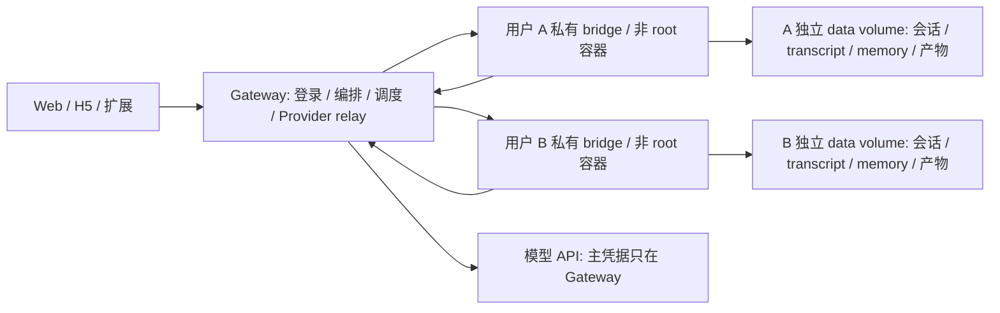

# Claude Code 原生多用户平台优化

日期：2026-09-18。目标是让 Claude Code 负责执行、会话、工具、技能、记忆与压缩；Eido 负责认证、Docker 编排、业务数据及界面。

## 问题与实施结果

| 原状 | 本次改动 | 实际边界 |
| --- | --- | --- |
| 新会话仅发送 `hi` 仍启动完整 Claude Code，实测 24.5 秒、$0.1151，且返回冗长项目介绍 | 仅对新会话、无 Project、无网页/流水线上下文的精确问候使用本地响应；其它输入仍进入 Claude Code；同时默认启用 `CLAUDE_CODE_SIMPLE_SYSTEM_PROMPT=1` | 本地问候不创建模型会话，实测约 0.4 ms、$0；已有历史、Project 或上下文时不会命中 |
| SDK 未启用 partial messages，完整 AssistantMessage 才显示正文 | 原生 text_delta 立即转为 SSE，前端按动画帧合并渲染，去掉最终消息重复文本 | TTFT 不再包含整段生成等待，但仍受模型、网络和容器冷启动影响 |
| 原生会话与连接池已有基础实现，但存在跨 asyncio task 关闭 AnyIO scope 的问题 | 独立 owner task 管理 SDK 生命周期，按用户/会话复用；模型、MCP、技能及项目变更重新建连接 | 重建连接保留原生 SID；项目语义变化仍按原有规则失效 |
| 每轮读取/发送固定消息窗口，长浏览器上下文截断 | 前端只发送最新消息；正常轮次原生 resume；恢复和 PreCompact 时归档完整历史，并选取初始目标、最近对话和检索命中内容 | 无新增摘要模型请求；原文可 Grep/Read。检索为词项及中文双字匹配，不是语义向量检索 |
| 已有用户/Project memory，但未完整结合原生默认提示与压缩过程 | `claude_code` preset、原生任务清单/Agent 工具、autoMemory、原生自动压缩、PreCompact 归档、`/compact` 原样调用 | 压缩/记忆仍由模型执行，不承诺无损；精确信息可查完整归档 |
| OpenCode、本机 launcher、多 agent 分支并存 | 删除后端实现、本机 launcher、扩展本机运行分支、发布工作流与专用测试；提取技能目录、事件转换、SDK 生命周期模块 | 旧数据库字段名仅保留在迁移及迁移测试中，用于删除该字段 |
| 模型固定 | `ANTHROPIC_MODEL` 默认值、`CLAUDE_MODELS` allowlist、三个客户端模型选择器、后端验证及队列传递 | 只支持 Claude Code 可使用的模型；兼容 provider 需配置其实际模型 ID |
| 额度受限后失败结束，部分错误被标成完成 | 429/rejected 按 reset 时间或有上限的退避自动等待、发心跳，再续接原生 SID；前端保留错误状态 | 不把原始任务重新执行；无 SID 时明确失败；进程重启不会自动恢复正在等待的队列任务 |

SDK 锁定 `claude-agent-sdk==0.2.156`，随附 Claude Code `2.1.276`。本机 CLI 已更新至相同版本。Docker 镜像通过 SDK 的 bundled CLI 提供 `claude`，避免 npm 与 SDK 两套 CLI 漂移。版本以 2026-09-19 的 npm/PyPI registry 查询结果为准。

`CLAUDE_CODE_SIMPLE_SYSTEM_PROMPT=1` 只精简默认系统提示和工具描述，仍保留工具、hooks、MCP、Skills、memory 和 CLAUDE.md 发现。没有使用 `CLAUDE_CODE_SIMPLE=1`，因为后者会关闭这些原生能力。

## Docker 隔离边界



- 每个用户独立网络、数据卷和派生凭据；user runtime 绑定身份，拒绝其它用户身份及网关 cookie 回退。
- 使用 UID/GID 10001、只读 root filesystem、drop ALL capabilities、no-new-privileges、独立 tmpfs、CPU/内存/PID 限制；只有网关挂 Docker socket。
- Anthropic API key/auth token 留在网关；用户通过独立 token 访问固定路径的 streaming provider relay。Bedrock/Vertex/Foundry 等云身份仍需部署方单独配置，本轮没有构建跨云凭据代理。
- 技能目录以只读方式挂载。技能管理经网关接口完成。
- 定时脚本也进入所属用户容器，网关不再执行用户脚本。输出响应限长、超时/取消终止进程组。
- 长 SSE 请求持有活动租约；GC 额外检查运行中的任务，避免静默执行/等待额度时回收。短时健康缓存减少 Docker inspect/health 开销。
- Docker 不可用或容器/卷归属不匹配时拒绝运行，禁止自动降级到共享进程。
- Docker 构建上下文排除 `.env`、用户数据库、memory、skills 与本地输出。隔离仍依赖共享宿主内核，属于容器边界，不是独立 VM。

## 配置与升级

```dotenv
ANTHROPIC_MODEL=sonnet
CLAUDE_MODELS=["sonnet","opus","haiku"]
# 可选；部分兼容模型不支持所有 effort 值
# CLAUDE_EFFORT=medium
CLAUDE_COMPACT_PERCENT=80
CLAUDE_SIMPLE_SYSTEM_PROMPT=true
EIDO_SANDBOX_IDLE_TTL=900
EIDO_SANDBOX_HEALTH_TTL=15
EIDO_USER_TMPFS_SIZE=512m
```

多用户部署使用 Compose `sandbox` profile。网关内网入口默认 `http://eido-gateway/ai-eido`，通过镜像 nginx 进入 API；不能直接指向只监听 loopback 的 gateway uvicorn 8000 端口。独立部署网关时配置 `EIDO_GATEWAY_CONTAINER` 和 `EIDO_GATEWAY_INTERNAL_URL`。

升级流程：备份既有用户数据卷与 gateway registry；构建三个前端、gateway 和 user 镜像；在旧任务完成后停止并移除旧用户容器（保留 volume），再重启新网关。新版拒绝复用旧隔离版本容器，避免继续使用共享密钥和共享网络。旧版无 label 的数据卷仅在 registry 能确认归属时复用；49–64 字符长用户 ID 的命名不再截断，部署前需显式核对旧卷映射。旧短期 token 在此次签名方案升级后需要重新生成。

本次没有替换运行中的生产容器，没有删除用户数据卷。

## 验证

- 后端自动测试覆盖 native resume、模型切换、逐 token 输出去重、压缩 options/归档、额度等待后续接、取消和错误、项目及历史数据库迁移。
- 新会话精确问候的运行时测试耗时约 0.4 ms，产生 3 个 SSE 帧，不创建 SDK session，也不调用付费模型；已有历史、Project 或附加上下文均绕过该快路径。
- 隔离测试覆盖跨用户凭据伪造、cookie 回退拒绝、provider relay header/429 透传、活动任务 GC 防护、定时脚本禁止网关执行。
- 三个前端 TypeScript 检查及生产构建、扩展 Node 测试通过。
- 真实模型单会话烟测（当前配置 glm-5.2）：首轮正文约 7.35 秒；同一原生客户端第二轮约 1.73 秒；手动 compact 完成约 28.03 秒，压缩后正确返回先前标记，首字约 1.62 秒。这是单次样本，不是改造前后基准或生产 P95。
- Docker 实测另见下方补充记录。

复现 Docker 测试（使用合成凭据和离线 Anthropic 测试服务，不调用付费模型）：

```sh
# 在仓库根构建
 docker build -f docker/user.Dockerfile -t eido-user:verify .
# 在 backend 目录运行
 EIDO_TEST_USER_IMAGE=eido-user:verify python -m pytest tests/test_docker_isolation.py -v -s
```

后续生产量化应分别记录容器启动、SDK 连接、first_text_ms、总时长和模型 cache usage，按模型/冷暖启动统计 P50/P95。本轮未引入预热用户池，避免为未活跃用户持续消耗容器资源。

## 官方依据

- [Claude Code changelog](https://github.com/anthropics/claude-code/blob/main/CHANGELOG.md)
- [Python Agent SDK changelog](https://github.com/anthropics/claude-agent-sdk-python/blob/main/CHANGELOG.md)
- [Streaming output](https://code.claude.com/docs/en/agent-sdk/streaming-output)
- [Memory](https://code.claude.com/docs/en/memory)
- [Python SDK reference](https://code.claude.com/docs/en/agent-sdk/python)
- [Claude Code environment variables](https://code.claude.com/docs/en/env-vars)
- [Agent SDK sessions and resume](https://platform.claude.com/cookbook/claude-agent-sdk-04-migrating-from-openai-agents-sdk)
