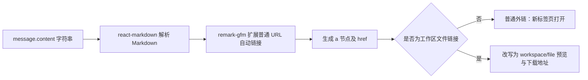
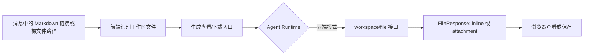
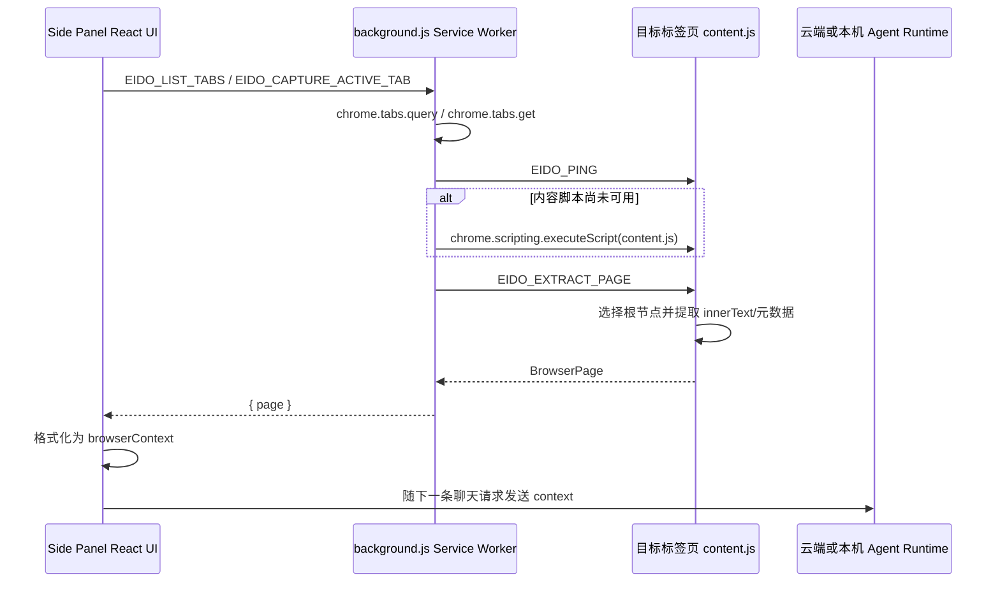

# 前端消息渲染与 Chrome 插件网页采集机制

> 分析日期：2026-07-15  
> 分析范围：桌面 Web 前端、移动端/Chrome 插件复用前端、Chrome Manifest V3 后台脚本与内容脚本，以及网页上下文发送链路。

## 1. 结论摘要

1. 消息正文按 Markdown 渲染。桌面端和插件端都使用 `react-markdown`，并通过 `remark-gfm` 增加 GFM 表格、删除线、任务列表、自动链接等语法支持。
2. 普通网页链接不是由业务代码使用正则表达式扫描出来的，而是先由 Markdown/GFM 解析器识别为 `a` 节点，再交给自定义 `a` 组件渲染。工作区文件链接则会再经过业务正则分类，并改写成预览/下载地址。
3. Chrome 插件版本为 `0.1.2`，采用 Manifest V3，最低 Chrome 版本为 116。插件 UI 运行在 Side Panel 中。
4. 当前活动标签页通过后台 Service Worker 调用 `chrome.tabs.query({ active: true, currentWindow: true })` 获取；标签页列表通过 `chrome.tabs.query({})` 获取。
5. 页面内容由注入目标页面的 `content.js` 提取。它优先选择 `article`，其次是 `main`、`body`、`documentElement`，读取 `innerText`，而不是上传 HTML 或完整 DOM。
6. 内容脚本虽然收集了页面链接，但构造最终 Agent 上下文时并没有使用 `links` 字段；Agent 实际收到的是页面标题、URL、摘要、用户选中文本、标题结构和纯文本正文。
7. Side Panel 首次挂载时会自动读取当前活动页，并在用户发送下一条消息时附加该页面上下文；当前实现并不要求用户先手动点击“读取当前页”。

## 2. 版本与主要依赖

| 项目 | 当前值 | 代码位置 |
| --- | --- | --- |
| 插件版本 | `0.1.2` | `frontend-extension/public/manifest.json:5`、`frontend-extension/package.json:4` |
| Manifest | V3 | `frontend-extension/public/manifest.json:2` |
| 最低 Chrome | 116 | `frontend-extension/public/manifest.json:6` |
| 插件 UI | Chrome Side Panel | `frontend-extension/public/manifest.json:10-12` |
| React | `19.2.3` | `frontend-extension/package.json:16` |
| `react-markdown` | `9.1.0` | `frontend-extension/package.json:18` |
| `remark-gfm` | `4.0.1` | `frontend-extension/package.json:19` |

插件声明了 `activeTab`、`tabs`、`scripting`、`sidePanel`、`storage` 等权限，并使用 `<all_urls>` 作为 host permission 和 content script 匹配范围。参见 `frontend-extension/public/manifest.json:23-43`。

## 3. 消息内容如何渲染

### 3.1 数据进入组件

桌面端会话消息模型的核心字段是：

```ts
interface Message {
  id: string;
  role: 'user' | 'assistant' | 'system';
  content: string;
  thinking?: string;
  thinkingLog?: string[];
  executionSteps?: ExecutionStep[];
  workflowMermaid?: string;
  references?: Reference[];
  timestamp: number;
}
```

历史消息由 `hydrateSession()` 将后端持久化消息转成前端 `Message`。流式对话时，`ApiService.streamChat()` 读取 SSE；每收到一个 `content` 事件，就把 `data.content` 追加到 `fullText`，再通过 `onChunk` 更新当前 assistant 消息。因此流式回复每次更新都会触发 React 重新解析和渲染当前累计 Markdown。

相关位置：

- `frontend/types.ts:135-150`
- `frontend/services/api.ts:52-72`
- `frontend/services/api.ts:633-704`
- `frontend-mobile/src/hooks/useChatSend.ts:46-69`

### 3.2 Markdown 渲染主链路

桌面端在 `ChatArea` 中遍历 `session.messages`，将 `m.content` 交给：

```tsx
<ReactMarkdown
  remarkPlugins={[remarkGfm]}
  components={MarkdownComponents}
>
  {m.content || typingPlaceholder}
</ReactMarkdown>
```

插件没有复用桌面 `ChatArea`，而是复用移动端 `MessageItem`，但渲染方案相同：`ReactMarkdown + remarkGfm + 自定义 components`。

渲染分工如下：

| 层 | 职责 |
| --- | --- |
| `react-markdown` | 把 Markdown 文本解析成语法树，并转换成 React 元素 |
| `remark-gfm` | 支持 GFM 表格、删除线、任务列表、普通 URL/邮箱自动链接等扩展语法 |
| `MarkdownComponents` | 覆盖 `a`、`img`、`code` 等节点的最终 React 渲染方式 |
| `.markdown-body` CSS | 控制标题、段落、列表、代码块、表格、引用、链接和图片样式 |

桌面端位置：`frontend/components/ChatArea.tsx:492-563, 631-641`。  
插件/移动端位置：`frontend-mobile/src/components/MessageItem.tsx:120-171, 204-213`。

当前没有配置 `rehype-raw`，因此消息中的原始 HTML 不会作为可执行 HTML 直接渲染。这也避免了把模型输出中的 `<script>` 或事件属性直接注入页面。

### 3.3 普通链接如何被识别

普通链接的识别主要发生在 Markdown 解析阶段，不是 `ChatArea` 自己扫描字符串。

支持的典型形式包括：

```md
[OpenAI](https://openai.com)
<https://openai.com>
https://openai.com
www.example.com
```

- 第一种、第二种由标准 Markdown 链接/自动链接语法识别。
- 后两种由 `remark-gfm` 的 literal autolink 能力识别。
- 识别完成后，解析器产生 `a` 节点，自定义 `a({ href, children })` 组件收到最终 `href`。
- 普通链接最终使用 `target="_blank"` 和 `rel="noopener noreferrer"` 在新标签页打开。

因此，“链接识别”和“链接分类”是两个阶段：



### 3.4 工作区文件链接如何被识别

工作区文件链接有一套额外的业务规则。`isWorkspaceFileLink(href)` 会调用 `normalizeWorkspacePath(href)`：

1. 去掉首尾尖括号和末尾常见标点。
2. 排除 `http:`、`https:`、`data:`、`mailto:` 和 `#` 开头的地址。
3. 仅接受以下路径形态之一：
   - 绝对路径：`/...`
   - `output/` 或 `outputs/` 下的路径
   - `upload/` 或 `uploads/` 下的路径
   - `.claude/skills/<技能名>/output/` 下的路径
4. 文件扩展名必须是：`md`、`pdf`、`csv`、`xls`、`xlsx`、`html`、`htm`、`txt`、`json`、`png`、`jpg`、`jpeg`、`gif`、`webp`、`svg`。

命中后，桌面端会把链接改写为：

```text
GET /api/v1/workspace/file?path=<path>&session_id=<session>
GET /api/v1/workspace/file?path=<path>&download=true&filename=<name>&session_id=<session>
```

第一个用于预览/打开，第二个用于下载。插件云端模式使用相同 API。

相关位置：

- 桌面规则：`frontend/components/ChatArea.tsx:9-81`
- 桌面链接组件：`frontend/components/ChatArea.tsx:526-561`
- 移动端/插件规则：`frontend-mobile/src/utils/workspaceFiles.ts:3-64`
- 移动端/插件链接组件：`frontend-mobile/src/components/MessageItem.tsx:147-169`
- URL 构造：`frontend/services/api.ts:4-20`

需要注意：仅仅在消息中出现一个普通本地路径，并不会让 Markdown 解析器把它变成正文中的 `a` 节点；但后续“生成文件”扫描器会识别符合规则的裸路径，并在消息下方额外生成文件卡片。

### 3.5 图片、生成文件和特殊代码渲染

图片：

- `http://`、`https://`、`data:` 图片地址直接作为 `src`。
- 本地/工作区图片路径通过 workspace file API 转成预览地址。
- 图片外层有链接，点击后在新标签页查看原图。

生成文件：

- 从 Markdown 文件链接、正文中的裸文件路径、`thinking` 和 `thinkingLog` 中的“生成文件/保存到/导出到”等提示提取路径。
- 使用 `Map` 按路径去重。
- 图片文件额外显示缩略图；其他文件显示打开和下载按钮。

内联代码：

- 桌面端若内联 `code` 内容包含 `@`，会尝试按技能名匹配技能，并显示技能图标和标签样式。
- 其他代码块交给默认 Markdown code/pre 节点和 `.markdown-body` 样式处理。

### 3.6 查看与下载文件的完整链路

“查看/下载文件”不是单一步骤，而是由以下三层共同完成：



#### 3.6.1 从消息中解析文件

文件可能以两种方式出现在消息里。

第一种是 Markdown 文件链接：

```md
[查看报告](outputs/report.pdf)
```

`react-markdown` 先把它解析成带有 `href="outputs/report.pdf"` 的 `a` 节点，之后自定义 `a` 组件调用 `isWorkspaceFileLink()` 判断是否属于工作区文件。判断规则见 3.4 节。

第二种是消息中的裸文件路径：

```text
文件已生成：outputs/report.pdf
```

裸路径通常不会被 Markdown 解析成 `a` 节点，但 `extractGeneratedFiles()` 会分别扫描：

- `message.content` 中的 Markdown 文件链接；
- `message.content` 中符合扩展名和目录规则的裸文件路径；
- `message.thinking` 中“生成文件”“保存到”“导出到”等提示后的路径；
- `message.thinkingLog` 中相同形式的路径。

扫描结果使用 `Map` 按完整路径去重，最后在消息下方渲染“生成文件”卡片。图片卡片还会附带缩略图。

因此，正文链接和生成文件卡片是两条并行链路：正文链接依赖 Markdown 产生 `a` 节点；生成文件卡片可以识别没有 Markdown 语法的裸路径。

相关位置：

- 桌面端：`frontend/components/ChatArea.tsx:9-81, 526-561, 644-687`
- 移动端/插件：`frontend-mobile/src/utils/workspaceFiles.ts:3-64`
- 移动端/插件文件卡片：`frontend-mobile/src/components/MessageItem.tsx:216-280`

#### 3.6.2 云端模式的查看与下载

云端模式下，查看和下载使用同一个工作区文件接口，只是查询参数不同。

查看：

```text
GET /api/v1/workspace/file
    ?path=outputs/report.pdf
    &session_id=<session-id>
```

下载：

```text
GET /api/v1/workspace/file
    ?path=outputs/report.pdf
    &session_id=<session-id>
    &download=true
    &filename=report.pdf
```

`getWorkspaceFileUrl()` 使用 `URLSearchParams` 对路径、文件名和会话 ID 编码，避免直接拼接未转义参数。前端根据入口类型决定是否添加 `download=true`。

后端 `GET /workspace/file` 的处理过程如下：

1. 通过登录态取得当前 `user_id`。
2. 如果提供 `session_id`，先确认该会话存在且属于当前用户。
3. 校验 `session_id` 只包含字母、数字、下划线和连字符，长度为 1 至 64。
4. 将传入路径解析到 `.eido/workspaces/<session_id>/` 会话目录下。
5. 使用 `Path.resolve()` 和 `relative_to(session_root)` 检查最终路径，阻止 `../`、绝对路径或符号链接造成的目录越界。
6. 检查目标存在且是普通文件。
7. 使用 FastAPI/Starlette `FileResponse` 返回文件。

查看和下载的核心区别是响应的 `Content-Disposition`：

```python
content_disposition_type="attachment" if download else "inline"
```

- `inline`：告诉浏览器尽量在页面中直接展示。
- `attachment`：告诉浏览器把文件作为附件保存，下载文件名来自 `filename` 参数或原文件名。

后端只为 PNG、JPEG、GIF、WebP 和 SVG 显式设置 MIME 类型；其他类型交给 `FileResponse`/系统 MIME 推断。最终是否能够预览由浏览器能力和响应 MIME 类型共同决定：

| 文件类型 | 查看时的常见行为 |
| --- | --- |
| PNG/JPEG/GIF/WebP/SVG | 浏览器直接显示；消息卡片中的图片还可通过 `` 内嵌 |
| PDF | 通常使用浏览器内置 PDF 阅读器 |
| TXT/CSV/Markdown/JSON | 通常显示为文本，具体取决于 MIME 推断 |
| HTML | `inline` 时通常作为网页加载 |
| XLS/XLSX | 浏览器通常不具备原生预览能力，可能直接下载或交给外部应用 |
| 未识别类型 | 通常作为二进制文件下载或显示失败 |

换言之，云端 Eido 不会自行解析 PDF、Excel 或 Markdown 的内容来生成专用阅读器；它负责鉴权、安全解析路径和返回文件，实际查看由浏览器完成。

相关位置：

- URL 构造：`frontend/services/api.ts:4-20`
- 云端 Runtime：`frontend-mobile/src/runtime/eidoCloudRuntime.ts:4-14`
- 工作区文件接口：`backend/app/api/v1/endpoints/workspace.py:28-97`
- 会话路径安全解析：`backend/app/services/session_workspace.py:19-29, 61-89`

## 4. Chrome 插件如何读取标签页和页面内容

### 4.1 整体架构



三层职责：

- `frontend-extension/src/main.tsx`：Side Panel UI、标签页列表、已采集页面状态、上下文格式化。
- `frontend-extension/public/background.js`：调用 Chrome Tabs/Scripting API，校验页面是否可读，负责 UI 与内容脚本之间的消息转发。
- `frontend-extension/public/content.js`：运行在目标网页上下文中，读取页面 DOM 可见文本和元信息。

### 4.2 获取当前活动标签页

用户点击“读取当前页”，或插件 Side Panel 首次挂载时，UI 发送：

```ts
chrome.runtime.sendMessage({ type: 'EIDO_CAPTURE_ACTIVE_TAB' })
```

后台脚本处理过程：

```js
chrome.tabs.query({ active: true, currentWindow: true })
```

它从结果中取第一个标签页，检查 `tab.id`，再调用 `captureTab(tab.id)`。这里的“当前页”是当前窗口中的活动标签页，而不是 Side Panel 自己。

位置：

- UI：`frontend-extension/src/main.tsx:269-280`
- 首次自动读取：`frontend-extension/src/main.tsx:296-299`
- 后台：`frontend-extension/public/background.js:170-178`

### 4.3 获取所有打开的标签页

“刷新标签”或首次挂载时，UI 发送 `EIDO_LIST_TABS`。后台使用：

```js
chrome.tabs.query({})
```

查询结果经过 `isReadableTab()` 过滤。以下内部/受限协议会被排除：

```text
chrome:  edge:  brave:  vivaldi:  about:  devtools:
```

返回 UI 的字段是 `id`、`title`、`url`、`active`、`windowId`、`favIconUrl`。UI 展示所有窗口中可读的标签页，点击某项时发送 `EIDO_CAPTURE_TAB` 和对应 `tabId`。

位置：`frontend-extension/public/background.js:8, 43-45, 144-159`，`frontend-extension/src/main.tsx:255-263`。

### 4.4 确保内容脚本可用

`captureTab(tabId)` 先调用 `chrome.tabs.get(tabId)` 再校验 URL。之后执行 `ensureContentScript(tabId)`：

1. 向标签页发送 `EIDO_PING`。
2. 如果成功，说明 `content.js` 已存在。
3. 如果失败，调用 `chrome.scripting.executeScript({ target: { tabId }, files: ['content.js'] })` 动态注入。
4. 注入仍失败时，返回“无法向该标签页注入读取脚本”。

虽然 manifest 已配置 `content_scripts` 在 `document_idle` 自动注入，动态注入仍可处理扩展安装前已打开的页面、脚本未加载或导航时序等情况。`content.js` 使用 `window.__EIDO_CONTENT_SCRIPT_READY__` 防止重复注册监听器。

位置：`frontend-extension/public/background.js:47-75`、`frontend-extension/public/content.js:1-3`。

### 4.5 页面正文提取算法

收到 `EIDO_EXTRACT_PAGE` 后，内容脚本同步调用 `extractPage()`。

#### 根节点选择

按顺序选择第一个存在的节点：

```js
document.querySelector('article') ||
document.querySelector('main') ||
document.body ||
document.documentElement
```

这是一种轻量正文启发式：文章页通常能避开导航和页脚；没有语义标签时则退化为整页可见文本。

#### 文本清洗

正文来自 `root.innerText`，之后：

1. 使用 `\s+` 把连续空白（包括换行）压成一个空格。
2. 删除零宽字符 `U+200B` 至 `U+200D` 和 `U+FEFF`。
3. 去除首尾空白。
4. 最多保留 80,000 个 JavaScript 字符，并返回 `truncated` 标志。

由于使用 `innerText`，脚本不会直接返回页面 HTML、DOM 属性、CSS 或不可见节点文本；但也会丢失大部分原始段落和版面结构。

#### 同时提取的字段

| 字段 | 来源/规则 |
| --- | --- |
| `title` | `document.title`，为空时使用 canonical URL |
| `url` | `location.href` |
| `canonicalUrl` | `<link rel="canonical">`，不存在时使用当前 URL |
| `description` | `meta[name/property="description"]` 或 `og:description` |
| `siteName` | `meta[name/property="site_name"]` 或 `og:site_name` |
| `selection` | `window.getSelection().toString()` |
| `headings` | 根节点内前 80 个 `h1/h2/h3`，格式如 `h2: 标题` |
| `links` | 根节点内前 120 个有文本的 `a[href]`，格式如 `文字 (绝对URL)` |
| `text` | 根节点清洗后的 `innerText`，最多 80,000 字符 |
| `capturedAt` | 当前 ISO 时间 |

位置：`frontend-extension/public/content.js:5-68`。

### 4.6 从 BrowserPage 到 Agent 上下文

UI 会把页面保存到 `pages` 状态：

- 相同 `url` 的页面会被最新采集结果替换。
- 最多保留 6 个页面。
- 页面只保存在当前插件 UI 的 React 内存状态中；这条链路没有把页面写入 `chrome.storage`，组件重新加载后会丢失。

`buildBrowserContext()` 将每页转换为 Markdown 文本：

```md
## 浏览器网页上下文

以下内容来自用户通过 Chrome 插件显式选择的网页……

---

### 页面 1: 页面标题

URL: https://example.com

摘要: ...

用户选中文本:
...

页面标题结构:
h1: ...
h2: ...

正文:
...
```

格式化阶段的限制：

- 单页选中文本最多 8,000 字符。
- 标题结构最多 40 条。
- 单页正文最多 24,000 字符。
- 如果内容脚本已经在 80,000 字符处截断，会附加说明。

值得注意的是，`canonicalUrl`、`siteName` 和 `links` 虽然已采集并保存在 `BrowserPage` 中，但 `formatPageForContext()` 当前没有把它们写入最终上下文。因此链接目标 URL 不会因为 `collectLinks()` 而进入 Agent；正文 `innerText` 通常只保留链接显示文字。

位置：`frontend-extension/src/main.tsx:37-101, 265-267`。

### 4.7 上下文随消息发送

构造出的 `browserContext` 作为属性传入移动端复用的 `App → ChatView → useChatSend`。发送聊天时，它作为 `AgentRuntime.streamChat()` 的 `context` 参数传递。

云端模式：

1. `eidoCloudRuntime` 复用 `ApiService.streamChat()`。
2. 前端将上下文放到 `POST /api/v1/chat/chat` 的 JSON `context` 字段。
3. 后端将超过 4,000 字符的完整 `context` 存入会话 `.eido-context` 文件，只注入摘要片段和可读取路径，不丢弃尾部。

位置：

- 属性传递：`frontend-extension/src/main.tsx:301-345`
- 发送：`frontend-mobile/src/hooks/useChatSend.ts:75-94, 120-132`
- 云端请求：`frontend/services/api.ts:590-629`
- 云端上下文：`backend/app/services/claude_runtime.py`，超过 4,000 字符的正文完整写入会话工作区，提示中附带预览和路径。
- 本地安全包装与 120,000 字符限制：`frontend-extension/src/localAgentRuntime.ts:117-137`

## 5. 当前实现的边界与风险

### 5.1 页面采集边界

- 只读取主文档，不递归读取 iframe，也不进入 Shadow DOM。
- `article`/`main` 是简单启发式，可能选到不完整正文，也可能把广告、评论等一起带入。
- `document_idle` 只代表初始 DOM 已完成；持续异步加载的 SPA 内容需要用户稍后重新点击读取。
- 把所有空白压成单空格会破坏段落、列表、表格和代码的结构，降低模型理解长文档的质量。
- 只取第一个 `article` 或 `main`，多文章聚合页可能只拿到其中一部分。
- 浏览器内置页、开发者工具页及其他禁止注入的页面无法读取。

### 5.2 链接处理边界

- 普通 URL 是否成为链接依赖 Markdown/GFM 语法；并非任意看起来像域名的字符串都一定被识别。
- 工作区文件类型是白名单，未列出的扩展名不会获得专用预览/下载处理。
- `collectLinks()` 的结果没有进入 Agent 上下文，当前页面分析无法可靠知道锚文本背后的 URL。
- 相对网页链接若被 Markdown 识别但不符合工作区文件规则，会按普通 `a` 渲染，并相对 Eido 页面/扩展页面地址解析。

### 5.3 上下文容量不一致

2026-09 更新：采集层允许单页 80,000 字符，UI 格式化层仍允许单页正文 24,000 字符、最多 6 页。后端不再截断收到的正文，超过 4,000 字符时完整落盘到会话 `.eido-context`，提示中携带预览与 Read 路径。前端采集及格式化上限仍是独立限制。

### 5.4 权限与安全

- `<all_urls>`、`tabs` 和 `scripting` 能力较强，页面何时被读取、哪些内容会随消息发送，应在界面中保持可见、可控。
- 实际代码在 Side Panel 首次挂载时会自动执行 `captureActive()`；这与上下文固定文案中“用户显式选择”的说法不完全一致。若产品要求严格的显式授权，应取消自动采集，或在首次采集前增加清晰的开关/确认。
- 内容脚本只回传数据，不执行网页提供的脚本；消息正文也未启用 raw HTML 渲染。
- 云端将网页/上游数据标记为参考内容，明确不可覆盖用户指令。
- 外部消息链接使用 `noopener noreferrer`，降低新标签页反向控制来源页面的风险。

### 5.5 一个桌面端正则差异

移动端 `GENERATED_FILE_HINT_PATTERN` 在模板字符串中使用 `\\s*`，能生成正则空白匹配 `\s*`；桌面端当前写成 `\s*`，在 JavaScript 字符串求值后会成为字面量 `s*`。这会导致桌面端从 `thinking/thinkingLog` 的“保存到: 路径”类文本提取生成文件时行为异常。正文中的 Markdown 文件链接和裸文件路径扫描不受此问题影响。

位置：

- 桌面端：`frontend/components/ChatArea.tsx:18-22`
- 移动端：`frontend-mobile/src/utils/workspaceFiles.ts:12-15`

## 6. 建议的后续改进顺序

1. 后端完整落盘与引用路径已实现；后续可继续统一前端采集上限与 token 预算。
2. 将 `links`、`canonicalUrl`、`siteName` 有选择地加入上下文；至少保留正文中重要锚点的目标 URL。
3. 保留段落换行，改用更稳健的正文抽取算法，并为动态页面提供“等待网络稳定后采集”或重新采集提示。
4. 修复桌面端 `GENERATED_FILE_HINT_PATTERN` 的转义差异，并把文件路径识别规则抽成桌面/移动端共享模块，避免继续漂移。
5. 为链接识别、工作区文件分类、标签页过滤、正文长度和多页截断补充自动化测试。
