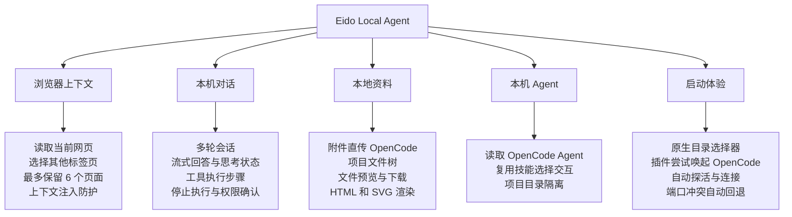
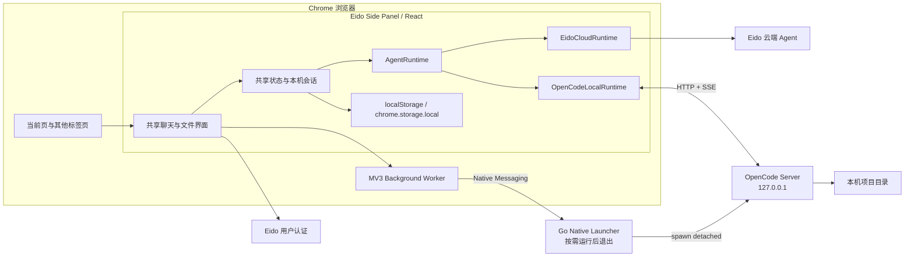
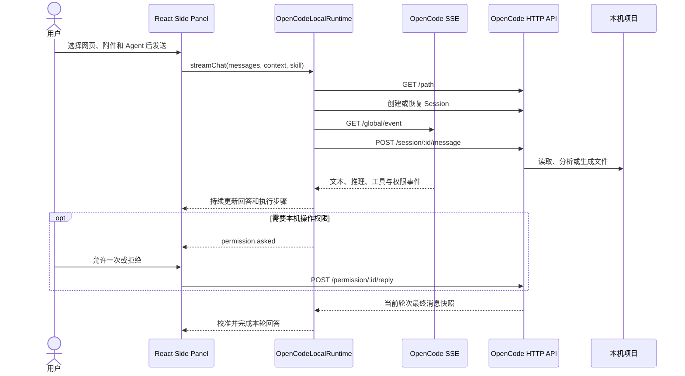
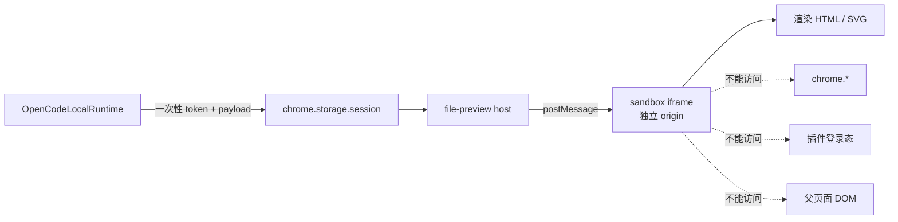
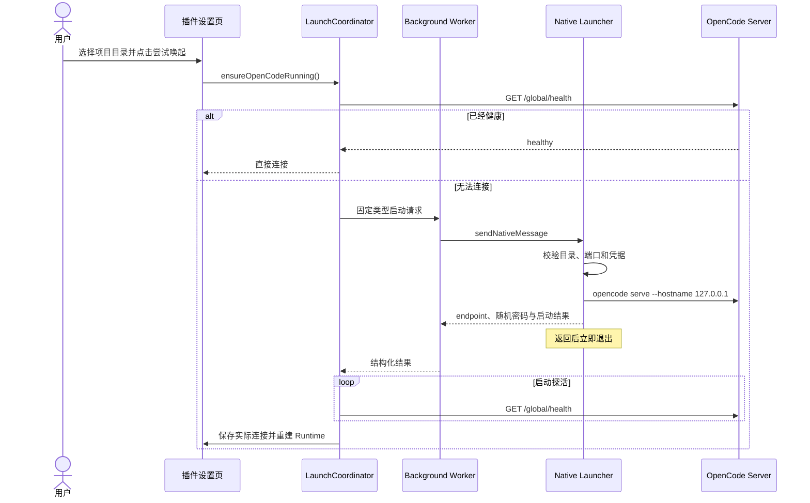
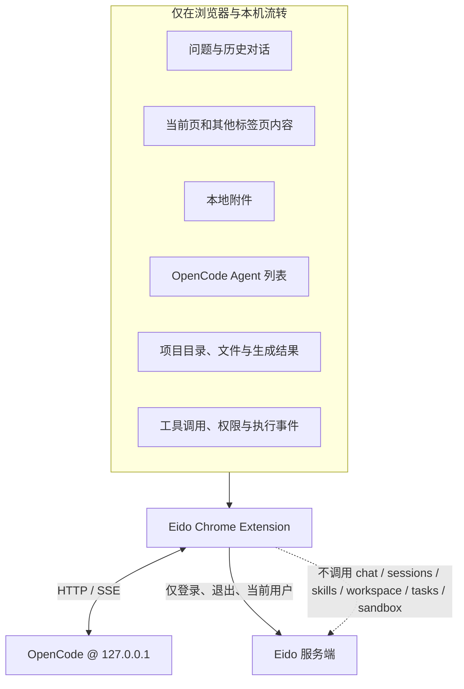

# 把本地 Agent 放进浏览器侧边栏：Eido Local Agent 功能与技术解析

> Eido Local Agent 已在 Chrome 侧边栏插件中完成首期实现。它保留云端 Agent 的完整入口，同时允许用户把对话、网页上下文、附件和项目文件交给本机 OpenCode 处理。除 Eido 用户认证外，本机模式的数据不经过 Eido 后端。

浏览器很适合获取信息，本地 Agent 很适合操作项目。Eido Local Agent 把两者放进同一个交互里：用户无需离开正在阅读的网页，便可以在浏览器右侧打开 Eido，选择当前页或其他标签页作为上下文，再让 OpenCode 在指定的本机项目中分析、修改和生成文件。

更重要的是，本机模式不是一套独立页面。它与云端模式共享同一套 React 界面、消息组件和操作习惯，只在执行层切换 Runtime。因此，用户可以按任务需要选择数据留在本机，或继续使用原有云端 Agent，而不必学习两套产品。

## 一、Local Agent 能做什么



### 1. 网页内容直接进入本机分析

插件通过 content script 提取页面标题、URL 和正文。用户可以读取当前页，也可以从已打开的标签页列表中选择其他页面。已选页面在侧边栏中统一管理，发送消息时被组装为浏览器上下文。

本机模式下，这些网页内容只进入 OpenCode 请求，不调用 Eido 聊天接口。网页上下文被明确标记为“不受信数据”，其中出现的文字不能改变用户目标、工作目录或权限策略；单次上下文还设有长度上限，避免超大页面占满模型上下文。

### 2. 复用云端模式的完整对话体验

本机 OpenCode 支持多轮对话、流式文本、推理状态、工具步骤、停止执行和权限确认。界面继续使用移动端 H5 的窄屏布局，当前对话、技能广场、我的设置、附件入口、页面上下文按钮和文件面板的位置保持一致。

用户切换执行位置时，只替换底层 `AgentRuntime`，聊天组件并不知道当前请求由云端还是 OpenCode 执行。这一设计让本机能力可以持续演进，同时避免复制一套容易产生行为差异的页面。

### 3. 附件不经过 Eido 文件服务

本地附件先暂存在扩展内存中，发送时转换为 OpenCode 支持的 Data URL `FilePartInput`，单文件限制为 20 MB。发送成功后，插件立即清理对应的内存引用。

这意味着附件不会上传到 Eido 工作区，也不会触发 Eido 的文件 API。浏览器刷新或侧边栏被回收时，尚未发送的内存附件不会被长期保留。

### 4. 浏览和预览本机项目产物

插件可以通过 OpenCode 文件 API 展示当前项目的文件树，并按需读取文件内容。默认最多递归两层、展示 300 个节点，同时跳过 `.git`、`node_modules`、构建目录以及 OpenCode 标记为 ignored 的内容。

普通文本、图片、PDF 等文件使用短生命周期 Blob URL 打开或下载。HTML 与 SVG 则进入独立的安全预览链路，展示实际渲染结果，而不是把源码当成普通文本输出。

### 5. 在插件中尝试唤起 OpenCode

Chrome 扩展本身不能直接运行本机可执行文件。Eido 使用 Chrome Native Messaging 配合 Go 编写的 Native Launcher，实现“从插件发起启动”的体验：用户在设置中选择项目目录并点击“尝试唤起 OpenCode”，插件便会完成检测、启动、探活和连接设置更新。

Launcher 不是常驻服务，也不是聊天代理。Chrome 在收到请求时启动它，它完成一次 OpenCode 检测或进程创建后立即退出。之后的聊天、事件和文件数据仍由插件直连 OpenCode HTTP/SSE，不经过 Launcher。

## 二、总体架构：一套界面，两种执行位置



核心抽象是 `AgentRuntime`。云端实现继续封装 Eido 原有的流式聊天、附件、工作区和技能接口；本机实现负责把同样的 UI 动作映射到 OpenCode API。

```ts
interface AgentRuntime {
  id: string;
  label: string;
  isLocal: boolean;
  streamChat(...): Promise<void>;
  uploadChatFile(...): Promise<{ path: string; name: string }>;
  listWorkspaceFiles(...): Promise<WorkspaceFileNode[]>;
  openWorkspaceFile?(...): Promise<void>;
  respondToConfirmation?(...): Promise<void>;
  listSkills?(): Promise<Skill[]>;
  deleteSession?(...): Promise<void>;
}
```

可选能力用于表达供应商差异。例如 OpenCode 当前没有通用文件删除接口，本机 Runtime 会明确声明不可删除，界面隐藏对应操作；云端模式原有的文件删除能力不受影响。

## 三、一次本机对话如何完成



OpenCode 的 `/global/event` 是全局事件流，同一时间可能包含多个 Session、后台标题生成或其他任务的事件。插件不能把收到的所有文本简单拼接到当前回答中，否则续聊时容易出现内容重复、串轮或提前结束。

当前实现采用三层关联：

1. 先按 `sessionID` 过滤当前 OpenCode Session。
2. 再通过 user message ID 与 assistant `parentID` 识别当前轮次。
3. SSE 用于实时展示，`POST /message` 返回的最终快照用于最后校准。

文本和 reasoning 还会按 part ID 独立保存。增量事件只更新对应 part，快照事件则覆盖该 part 的临时内容，最终按首次出现顺序重建回答。这套机制解决了连续聊天中重复累加、不同轮次内容混入和尾部 `idle` 事件误判等问题。

## 四、会话、Agent 与数据存储

Eido 本机会话 ID 和 OpenCode Session ID 属于两个命名空间，插件维护如下映射：

```text
Eido local session id -> { providerSessionId, directory }
```

映射保存在 `chrome.storage.local`。本地聊天会话和消息按 Eido 用户 ID 保存在扩展 `localStorage`，因此刷新侧边栏后仍可恢复。项目目录发生变化时，插件不会复用旧目录的 OpenCode Session，以免上下文和文件操作越过项目边界。

首次创建 OpenCode Session 时，插件会附带有限的本地历史；后续轮次由 OpenCode Session 自身维护上下文，不会反复发送全部历史。

技能交互也保持一致。本机模式调用 OpenCode `/agent`，把可见 Agent 映射为共享 `Skill` 模型，因此仍可使用技能广场、选择技能和 `@` 提及等现有交互。云端技能 API 不会在本机模式中被调用。

## 五、HTML/SVG 预览为什么需要独立沙箱

生成的 HTML 可能包含脚本，而扩展页面本身拥有 `chrome.storage`、标签页等高权限 API。如果直接把任意 HTML 插入 Side Panel，文件中的脚本可能读取插件状态或操作父页面。

Eido 因此将预览拆成 host 与 Manifest V3 sandbox 两层：



预览数据只通过随机 token 在 `chrome.storage.session` 中短暂传递。host 读取后立即删除 payload，再通过 `postMessage` 发送给独立 origin 的 sandbox iframe。sandbox 不具备扩展权限，也不能读取插件登录态或父页面 DOM；五分钟兜底任务会清理未被消费的数据。

## 六、插件如何安全地启动 OpenCode



启动链路采用严格白名单，而不是允许插件传入任意 Shell 命令：

- Background Worker 只接受扩展自身发送的固定消息类型。
- Native 协议只支持 `ping`、`detect`、`select_directory` 和 `launch`。
- hostname 固定为 `127.0.0.1`，端口必须在有效范围内。
- workspace 必须是存在的绝对目录，并在 Launcher 中解析符号链接后再次校验。
- OpenCode 可执行文件只从 PATH 和少量受支持的安装目录中发现。
- 用户未填写密码时，Launcher 生成随机密码并只返回给插件。
- 如果首选端口已有密码不匹配的 OpenCode，Launcher 不会结束用户进程，而是选择相邻可用端口启动插件管理的实例。
- 启动日志写入用户目录下的 Eido 日志目录，方便排查，但 Launcher 不记录聊天、网页或附件数据。

## 七、清晰的数据边界



本机模式允许访问 Eido 后端的范围只有用户认证，包括登录、退出和获取当前用户。以下内容不会发送给 Eido：聊天内容、网页上下文、附件、OpenCode Agent、项目路径、项目文件、执行事件和权限决定。

此外，OpenCode 地址只接受 `127.0.0.1`、`localhost` 或 `::1` 的 HTTP URL。本机连接失败时，插件会留在本机模式并显示错误，不会静默降级到云端，从而避免数据在用户不知情时改变流向。

## 八、用户使用路径

在 OpenCode 与 Eido Native Launcher 已安装的前提下，用户不需要操作命令行：

1. 打开 Chrome 右侧的 Eido 插件。
2. 登录后进入“我的设置”，把执行位置切换为“本机”。
3. 使用原生目录选择器选择需要操作的项目文件夹。
4. 点击“尝试唤起 OpenCode”，等待插件自动检测、启动并连接。
5. 回到当前对话，可加入网页、附件或选择 OpenCode Agent 后直接提问。
6. 在文件面板查看、预览或下载 OpenCode 生成的结果。

如果用户已经手工启动 OpenCode，也可以填写对应的回环地址和凭据后直接测试连接。插件始终优先复用健康且凭据匹配的现有实例。

## 九、代码模块与职责

| 模块 | 职责 |
| --- | --- |
| `frontend-extension/src/localAgentRuntime.ts` | OpenCode HTTP/SSE 适配、会话、附件、文件、Agent 与权限事件 |
| `frontend-extension/src/LocalAgentSettingsControl.tsx` | 云端/本机切换、连接测试、目录选择和唤起入口 |
| `frontend-extension/src/local-agent/openCodeLaunchCoordinator.ts` | 健康检查、启动去重、Native Launcher 调用、探活与设置更新 |
| `frontend-extension/src/local-agent/nativeLauncherClient.ts` | Side Panel 与 Background Worker 的类型化消息通信 |
| `frontend-extension/public/background.js` | 标签页读取协调、Native Messaging 调用与来源校验 |
| `frontend-extension/public/native-launcher-protocol.js` | Native 请求白名单、字段约束与错误归一化 |
| `frontend-extension/public/file-preview/` | HTML/SVG host、sandbox 和预览样式 |
| `native-launcher/` | Go Native Messaging Host、OpenCode 发现、目录选择与进程启动 |

这套模块边界为未来接入 OpenClaw 等其他本地 Agent 留出了空间。新的供应商应实现独立 `AgentRuntime`，继续复用 React 界面；Native Messaging 只解决浏览器不能完成的进程发现与启动，不应承载聊天和文件协议。

## 十、当前状态与后续工作

首期核心链路已经实现：本机/云端 Runtime 切换、OpenCode HTTP/SSE 对话、会话续聊、网页上下文、附件、Agent 映射、权限确认、项目文件、HTML/SVG 安全预览、Native Messaging 协议、macOS Launcher、目录选择、端口回退和启动探活均已落地。其中 Native 协议、Launcher 请求处理、进程发现和端口选择已有自动测试，插件整体通过 TypeScript 构建校验。

目前仍有三个明确边界：

- macOS universal 图形安装器及签名、公证发布流水线已经实现；正式产物需要使用固定扩展 ID 和 Apple Developer 发布凭据构建。
- 当前首期 Launcher 覆盖 macOS，Windows 与 Linux 需要各自的 Native Host 注册和目录选择实现。
- Side Panel 被关闭、扩展刷新或浏览器回收页面时，当前 SSE 连接会中断；OpenCode 任务可能仍在继续，但尚未实现断点级事件回放。

后续重点不是扩张 Launcher 的职责，而是完善跨平台分发和浏览器生命周期：补齐 Windows/Linux 安装与卸载，并在需要后台持续任务时评估 Manifest V3 offscreen document 和基于 Session 消息的状态恢复。

## 结语

Eido Local Agent 的核心价值，并不只是“在插件里调用 OpenCode”。它建立了一条边界清晰的本机执行路径：浏览器负责获取用户正在阅读的上下文，React 界面负责统一交互，OpenCode 负责本机推理和工具执行，Native Launcher 只在必要时帮助启动进程。

这种分层让隐私、体验和工程可维护性同时成立。用户可以在熟悉的侧边栏中使用本地 Agent，云端能力保持原样，网页和项目数据的流向也始终可解释、可验证。
