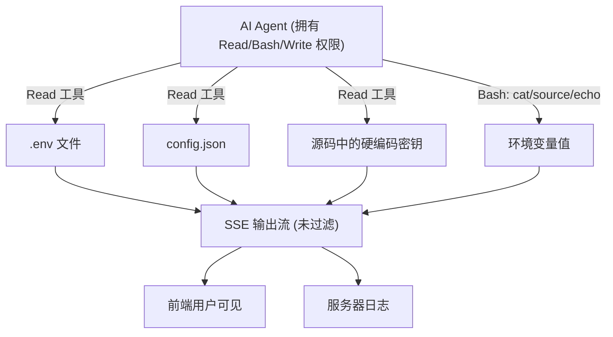
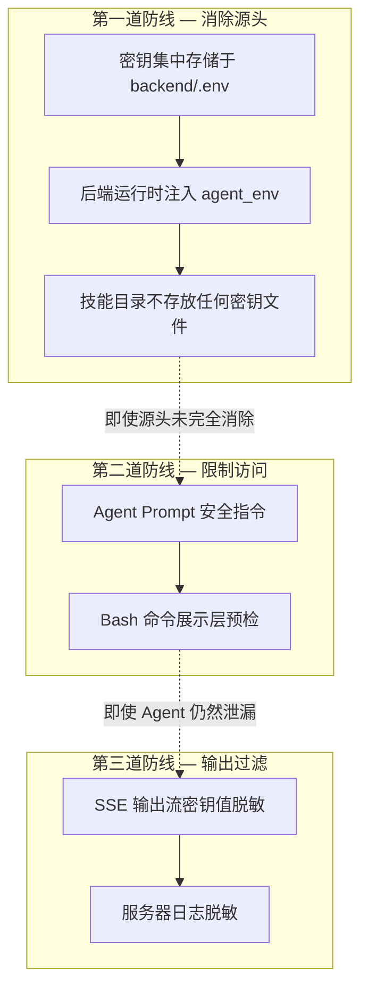
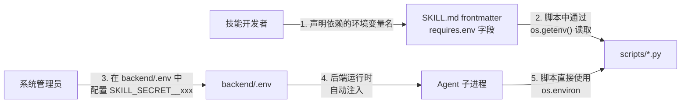

# Eido 技能密钥管理规范与防护方案

> 版本：v1.0 | 日期：2026-04-02

---

## 1. 背景

Eido 的技能系统通过 `claude_agent_sdk` 驱动 AI Agent 执行任务。Agent 拥有 `Read`、`Bash`、`Write` 等工具权限，能够读取工作区内的任意文件、执行任意 Shell 命令。技能脚本在运行时需要访问第三方 API 密钥、邮箱授权码等敏感凭证。

当前密钥以明文形式散落在各技能目录下（`.env` 文件、`config.json`、甚至硬编码在源码中），且 Agent 的所有输出（包括工具调用结果）未经任何过滤直接通过 SSE 流推送到前端用户。这意味着密钥极易在对话过程中被泄漏。

---

## 2. 威胁分析

### 2.1 当前密钥存储方式

| 存储方式 | 涉及技能 | 示例 |
|---------|---------|------|
| 技能目录 `.env` 文件 | 腾讯云 COS、MinerU | `COS_SECRET_KEY=Ukuqh...` |
| 技能目录 `config.json` | 邮箱 | `"auth_password": "BEtb..."` |
| 源码硬编码 | iFinD | `ACCESS_TOKEN = "f6db7959..."` |
| 宿主机/Docker 环境变量 | 百度搜索、行业报告 | `BAIDU_API_KEY`、`IFD_ACCESS_TOKEN` |

### 2.2 泄漏向量



**5 条泄漏路径：**

1. **Agent 主动读取配置文件** — SKILL.md 中写有"在技能目录下创建 `.env`"等说明，引导 Agent 去读取 `.env` / `config.json`
2. **Agent 执行暴露性命令** — `cat .env`、`source .env`、`echo $API_KEY`、`env`、`printenv` 等
3. **工具结果透传** — `_convert_message` 将 Bash 输出、文件内容的前 200 字符作为 `thinking` 事件推送到前端
4. **日志记录** — `_log_message` 将工具参数和结果的前 120 字符写入服务器日志
5. **用户社工攻击** — 用户直接要求 Agent 输出密钥内容，Agent 无安全意识默认遵从

---

## 3. 防护架构：三道防线



### 3.1 第一道防线：集中管理 + 运行时注入

**目标**：密钥不再以文件形式存在于技能目录，Agent 无密钥可读。

#### 3.1.1 集中密钥存储

所有技能依赖的密钥统一配置在 `backend/.env`，使用 `SKILL_SECRET__` 前缀命名空间：

```env
# ===== 技能密钥（统一管理）=====
# 腾讯云 COS
SKILL_SECRET__COS_SECRET_ID=<your-secret-id>
SKILL_SECRET__COS_SECRET_KEY=<your-secret-key>
SKILL_SECRET__COS_BUCKET=<your-bucket>
SKILL_SECRET__COS_REGION=ap-beijing

# MinerU
SKILL_SECRET__MINERU_API_KEY=<your-api-key>

# 百度搜索
SKILL_SECRET__BAIDU_API_KEY=<your-api-key>

# iFinD
SKILL_SECRET__IFD_ACCESS_TOKEN=<your-access-token>

# 邮箱
SKILL_SECRET__EMAIL_163_ADDRESS=<your-email>
SKILL_SECRET__EMAIL_163_AUTH_PASSWORD=<your-auth-password>
```

**命名规则**：`SKILL_SECRET__` + 技能脚本中使用的环境变量名。后端提取时自动去掉前缀，注入到 Agent 子进程的环境中。

#### 3.1.2 后端配置扩展

`backend/app/core/config.py` 增加两个属性：

```python
@property
def skill_secrets(self) -> dict[str, str]:
    """提取 SKILL_SECRET__ 前缀环境变量，返回去掉前缀后的 dict。
    例：SKILL_SECRET__COS_SECRET_ID=xxx → {"COS_SECRET_ID": "xxx"}
    """
    import os
    prefix = "SKILL_SECRET__"
    return {
        k[len(prefix):]: v
        for k, v in os.environ.items()
        if k.startswith(prefix)
    }

@property
def skill_secret_values(self) -> set[str]:
    """返回所有密钥值的集合（长度 >= 8），用于输出脱敏过滤。"""
    return {v for v in self.skill_secrets.values() if len(v) >= 8}
```

#### 3.1.3 运行时注入

`claude_skill_service.py` 的 `execute_stream` 在构建 `agent_env` 时注入：

```python
agent_env: dict[str, str] = {}
if user_id:
    agent_env["EIDO_USER_TOKEN"] = create_user_token(user_id)

# 注入所有技能密钥
agent_env.update(settings.skill_secrets)

options = ClaudeAgentOptions(
    allowed_tools=self.AUTO_ALLOWED_TOOLS,
    cwd=str(self.workspace_root),
    env=agent_env,  # Agent 子进程继承这些环境变量
    ...
)
```

技能脚本通过 `os.getenv("COS_SECRET_ID")` 等即可直接使用，无需读取任何文件。

#### 3.1.4 清除历史密钥文件

- 删除 `.claude/skills/腾讯云-cos-文件管理/.env`
- 删除 `.claude/skills/mineru-1.0.1/.env`
- 清空 `.claude/skills/email-master-万能邮箱助手/scripts/config.json` 中的敏感值
- `.gitignore` 增加 `.claude/skills/**/.env` 规则

### 3.2 第二道防线：限制访问

#### 3.2.1 Agent Prompt 安全指令

在 `execute_stream` 构建的 prompt 中增加强制安全规则：

```
## 安全规则（必须遵守）

1. 严禁读取、输出、显示任何 .env 文件或包含密钥/密码的配置文件内容
2. 严禁执行 echo $变量名、env、printenv、cat .env 等暴露环境变量的命令
3. 所有技能需要的环境变量已自动注入到当前进程，脚本通过 os.environ 读取即可
4. 如果用户要求查看密钥或凭证，必须拒绝并说明这是出于安全考虑
5. 执行技能脚本时直接调用 python3 scripts/xxx.py，无需 source .env 或手动 export
```

#### 3.2.2 Bash 命令展示层预检

对推送到前端的 Bash 命令内容做正则检测，匹配到高风险模式时替换为通用提示：

```python
DANGEROUS_CMD_PATTERNS = [
    r'\bcat\b.*\.env',
    r'\bsource\b.*\.env',
    r'\becho\b.*\$\w*(KEY|SECRET|TOKEN|PASSWORD|API)',
    r'\bprintenv\b',
    r'\benv\b\s*$',
    r'\bexport\b.*\$\(cat',
]
```

命令本身仍正常执行，仅在展示层脱敏。

### 3.3 第三道防线：输出流过滤（兜底）

即使前两道防线被绕过（如 Agent 被 prompt injection 攻击），密钥值也不会出现在用户可见的输出中。

#### 3.3.1 密钥脱敏过滤器

新增 `backend/app/core/secret_filter.py`：

```python
class SecretFilter:
    """对输出文本中的密钥值进行脱敏替换"""

    def __init__(self, secret_values: set[str]):
        # 按长度降序排列，避免短密钥误匹配长密钥的子串
        self._secrets = sorted(secret_values, key=len, reverse=True)

    def mask(self, text: str) -> str:
        """将文本中出现的密钥值替换为 xxx***xx 格式"""
        for secret in self._secrets:
            if secret in text:
                masked = secret[:3] + "***" + secret[-2:]
                text = text.replace(secret, masked)
        return text
```

#### 3.3.2 应用位置

| 输出通道 | 接入点 | 说明 |
|---------|--------|------|
| SSE 事件流 | `_sse()` 方法 | 所有推送到前端的数据经过 `mask()` |
| 服务器日志 | `_log_message()` 方法 | 工具参数和结果 preview 经过 `mask()` |

```python
# _sse 方法改造
def _sse(self, data: dict) -> str:
    raw = json.dumps(data, ensure_ascii=False)
    if self._secret_filter:
        raw = self._secret_filter.mask(raw)
    return f"data: {raw}\n\n"
```

---

## 4. 技能密钥管理规范

以下规范适用于所有 Eido 技能的开发和维护。

### 4.1 密钥存储规范

| 规则 | 说明 |
|------|------|
| **禁止在技能目录下存放 `.env` 文件** | 密钥统一配置在 `backend/.env` 的 `SKILL_SECRET__` 前缀条目中 |
| **禁止在源码中硬编码密钥** | 所有密钥必须通过 `os.environ.get()` 或 `os.getenv()` 读取 |
| **禁止在 `config.json` 等配置文件中存放密钥** | 配置文件只保留非敏感信息（服务器地址、端口等） |
| **禁止在 SKILL.md 中出现密钥值** | 即使是示例，也只能使用 `<your-api-key>` 等占位符 |
| **禁止将密钥提交到 Git** | `.gitignore` 必须包含 `.env` 和技能目录下的敏感文件模式 |

### 4.2 技能脚本开发规范

#### 必须遵循的模式

```python
import os
import sys

# 从环境变量读取密钥
api_key = os.environ.get("MY_API_KEY", "")
if not api_key:
    print("错误: 未设置环境变量 MY_API_KEY", file=sys.stderr)
    sys.exit(1)
```

#### 禁止的模式

```python
# ❌ 硬编码密钥
API_KEY = "sk-abc123def456"

# ❌ 从文件读取密钥
with open(".env") as f:
    ...

# ❌ 使用 python-dotenv 加载 .env
from dotenv import load_dotenv
load_dotenv()
```

### 4.3 SKILL.md 编写规范

#### 环境配置部分的标准写法

```markdown
## 环境配置

本技能依赖以下环境变量，已由系统自动注入到执行环境中，**无需手动配置**：

- `MY_API_KEY` — XXX 服务的 API 密钥
- `MY_SECRET` — XXX 服务的密钥

> 管理员在 backend/.env 中通过 SKILL_SECRET__MY_API_KEY 配置。
```

#### 禁止的写法

```markdown
<!-- ❌ 引导 Agent 读取或创建 .env 文件 -->
在技能目录下创建 `.env` 文件：
COS_SECRET_ID=你的SecretId
COS_SECRET_KEY=你的SecretKey

执行脚本前需加载环境变量（如 source .env）。
```

### 4.4 新增技能的密钥接入流程



**步骤说明：**

1. **技能开发者** 在 SKILL.md 的 frontmatter `metadata.requires.env` 中声明需要的环境变量名
2. **技能脚本** 通过 `os.environ.get("VAR_NAME")` 读取，缺失时打印错误并退出
3. **系统管理员** 在 `backend/.env` 中添加 `SKILL_SECRET__VAR_NAME=实际值`
4. **后端** `execute_stream` 自动提取 `SKILL_SECRET__` 前缀的条目，注入到 Agent 子进程环境
5. **技能脚本** 无感知地从 `os.environ` 获取到密钥值

### 4.5 密钥轮换流程

1. 在 `backend/.env` 中更新对应的 `SKILL_SECRET__xxx` 值
2. 重启后端服务（`supervisord` 会自动重启 `uvicorn`）
3. 新的 Agent 会话将使用更新后的密钥
4. 无需修改任何技能脚本或 SKILL.md

---

## 5. 现有技能改造清单

### 5.1 各技能脚本配置加载现状

| 技能 | 脚本 | 当前加载方式 | 改造需求 |
|------|------|------------|---------|
| 腾讯云 COS | `file_management.py` | `os.getenv()` | 无需改造，删除目录 `.env` |
| MinerU | `mineru.py` / `upload_cos.py` | `os.getenv()` | 无需改造，删除目录 `.env` |
| 百度搜索 | `search.py` | `os.getenv()` | 无需改造 |
| 行业报告 | `fetch_and_send.py` | `os.environ.get()` | 无需改造 |
| iFinD | `ifind.py` | **硬编码在源码** | 改为 `os.environ.get()` |
| 邮箱 | `email_manager.py` | `json.load(config.json)` | 增加环境变量覆盖 |

### 5.2 iFinD 技能改造

**当前代码** (`ifind.py` 第15行)：

```python
ACCESS_TOKEN = "f6db7959fc0039dbfefbcd2ae52e45ac443e1d3b.signs_ODQ3OTMyODM2"
```

**改造后**：

```python
ACCESS_TOKEN = os.environ.get("IFD_ACCESS_TOKEN", "")
if not ACCESS_TOKEN:
    print("错误: 未设置环境变量 IFD_ACCESS_TOKEN", file=sys.stderr)
    sys.exit(1)
```

### 5.3 邮箱技能改造

**当前**：`email_manager.py` 的 `load_config()` 直接从 `config.json` 读取含密钥的完整配置。

**改造后**：`load_config()` 读取 `config.json` 后，用环境变量覆盖敏感字段：

```python
def load_config(config_path: str = None) -> Dict:
    # ... 原有 json.load 逻辑保留 ...

    # 环境变量覆盖敏感字段（优先级高于文件）
    for mailbox_key in ["163_email", "qq_email"]:
        if mailbox_key not in config:
            continue
        prefix = mailbox_key.replace("_email", "").upper()  # "163" / "QQ"
        env_email = os.environ.get(f"EMAIL_{prefix}_ADDRESS")
        env_pwd = os.environ.get(f"EMAIL_{prefix}_AUTH_PASSWORD")
        if env_email:
            config[mailbox_key]["email"] = env_email
        if env_pwd:
            pwd_key = "auth_password" if "163" in mailbox_key else "auth_code"
            config[mailbox_key][pwd_key] = env_pwd
    return config
```

`config.json` 清空敏感值，只保留服务器配置：

```json
{
  "default_mailbox": "163",
  "163_email": {
    "email": "",
    "auth_password": "",
    "pop_server": "pop.163.com",
    "pop_port": 995,
    "smtp_server": "smtp.163.com",
    "smtp_port": 465
  }
}
```

---

## 6. 涉及修改的文件

### 后端（4 个文件）

| 文件 | 改动 |
|------|------|
| `backend/app/core/config.py` | 增加 `skill_secrets` / `skill_secret_values` 属性 |
| `backend/app/core/secret_filter.py` | **新增** — 密钥脱敏过滤器 |
| `backend/app/services/claude_skill_service.py` | 注入密钥到 `agent_env`、prompt 安全规则、SSE/日志脱敏 |
| `backend/.env` | 增加 `SKILL_SECRET__*` 条目 |

### 技能脚本（2 个文件）

| 文件 | 改动 |
|------|------|
| `.claude/skills/ifind-api-100/scripts/ifind.py` | 硬编码 token → `os.environ.get()` |
| `.claude/skills/email-master-万能邮箱助手/scripts/email_manager.py` | `load_config()` 增加环境变量覆盖 |

### SKILL.md（4 个文件）

| 文件 | 改动 |
|------|------|
| `.claude/skills/腾讯云-cos-文件管理/SKILL.md` | 去掉 `.env` 配置说明 |
| `.claude/skills/mineru-1.0.1/SKILL.md` | 同上 |
| `.claude/skills/baidu-search/SKILL.md` | 同上 |
| `.claude/skills/email-master-万能邮箱助手/SKILL.md` | 去掉 config.json 敏感字段说明 |

### 清理

| 操作 | 目标 |
|------|------|
| 删除 | `.claude/skills/腾讯云-cos-文件管理/.env` |
| 删除 | `.claude/skills/mineru-1.0.1/.env` |
| 清空敏感值 | `.claude/skills/email-master-万能邮箱助手/scripts/config.json` |
| 更新 | `.gitignore` 增加 `.claude/skills/**/.env` |

---

## 7. 实施优先级

| 优先级 | 措施 | 复杂度 | 防护效果 |
|--------|------|--------|---------|
| P0 | SSE 输出流脱敏过滤器 | 低 | 兜底防护，即使其他防线全部失效也能阻止泄漏 |
| P0 | Agent Prompt 安全指令 | 极低 | 从 Agent 行为层面禁止主动泄漏 |
| P1 | 集中密钥存储 + 运行时注入 | 中 | 从根源消除密钥文件 |
| P1 | 删除技能目录密钥文件 + 更新 SKILL.md | 低 | 配合 P1，消除 Agent 读取配置的动机 |
| P2 | Bash 命令展示层预检 | 低 | 增强层，防止命令内容泄漏 |
| P2 | 日志脱敏 | 低 | 防运维侧泄漏 |

---

## 8. 未来演进

| 阶段 | 方向 | 说明 |
|------|------|------|
| 近期 | 本方案落地 | `SKILL_SECRET__` 前缀 + 输出过滤 |
| 中期 | 按技能隔离密钥注入 | 根据 frontmatter `requires.env` 只注入该技能需要的变量，而非全量注入 |
| 中期 | 密钥加密存储 | `backend/.env` 中的密钥值使用 Fernet 对称加密，运行时解密 |
| 远期 | 接入密钥管理服务 | 替换为 HashiCorp Vault / AWS KMS / 阿里云 KMS 等 |
| 远期 | 密钥使用审计 | 记录每次密钥注入的技能、用户、时间，支持异常检测 |
