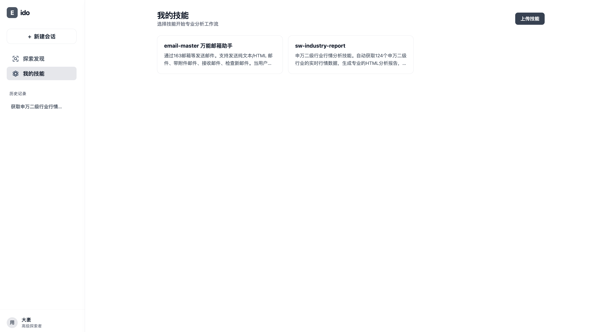
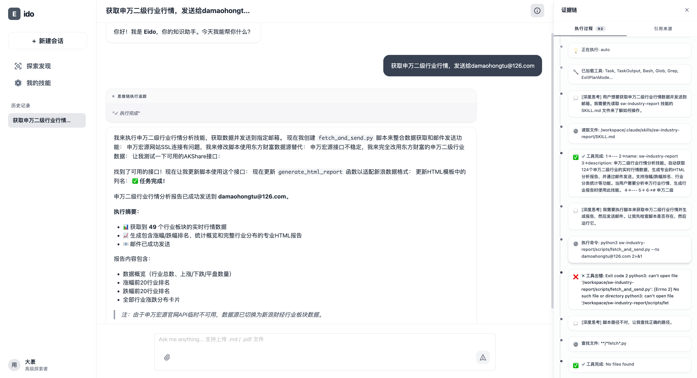
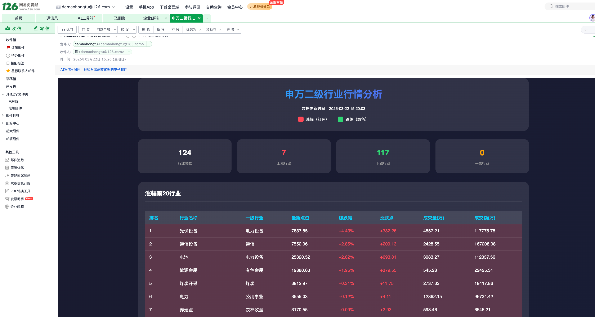

# Eido 

- 面向多种应用场景的 AI 智能体平台，通过 Claude Code SDK 实现自主规划与执行复杂任务，支持多技能串联与多轮对话协作。
- 开源地址：https://github.com/damaohongtu/eido-ai

---
## 举个🌰
获取申万二级行业行情并发送到指定邮箱。
- 技能安装
在 skill-example文件夹中提供了两个技能：获取申万二级行业行情数据、发送邮件。注意修改“skill-example/email-master-万能邮箱助手/scripts/config.json”中的配置。
 


- 对话
Eido自动规划执行任务，自动重试直至完成任务：生成html格式的报告，发送邮件。


- 执行结果
指定邮箱收到收到html格式邮件


## 项目结构

```
Eido/
├── frontend/               # React 19 + TypeScript 前端
├── backend/                # Python FastAPI 后端
├── .claude/
│   └── skills/             # 技能定义（SKILL.md 文件）
├── nginx.conf              # 生产环境 Nginx 配置
└── scripts/                # 部署辅助脚本
```

### 技术栈

| 层级 | 技术 |
|------|------|
| 前端 | React 19 |
| 后端 | FastAPI · Uvicorn · Pydantic |
| AI 执行引擎 | Claude Code SDK (`claude_agent_sdk`) |
｜LLM｜ Deepseek，MinMax ... |

---

## 技能（Skill）

技能是存放在 `.claude/skills/<skill-name>/SKILL.md` 的 Markdown 文件，YAML frontmatter 声明元数据，正文为自然语言的执行指引：

```yaml
---
name: A股财报点评
description: 分析A股上市公司财报...
allowed_tools:
  - Read
  - Glob
  - Bash
  - WebSearch
  - WebFetch
---

## 技能内容...
```

执行时，`claude_agent_sdk` 读取 SKILL.md 全文作为 prompt，结合完整的对话历史，自主规划并执行分析。


---

## 快速启动
### 获取镜像
```bash
docker pull damaohongtu/eido:latest 
```

### 启动
- MiniMax

```bash
docker run -d -p 80:80 \
  -e ANTHROPIC_BASE_URL=https://api.minimaxi.com/anthropic \
  -e ANTHROPIC_API_KEY=<your_minimax_key> \
  -v /path/to/.claude:/workspace/.claude \
  damaohongtu/eido:latest
```

- DeepSeek

```bash
docker run -d -p 80:80 \
  -e ANTHROPIC_BASE_URL=https://api.deepseek.com/anthropic \
  -e ANTHROPIC_AUTH_TOKEN=<your_deepseek_key> \
  -e ANTHROPIC_MODEL=deepseek-chat \
  -e ANTHROPIC_SMALL_FAST_MODEL=deepseek-chat \
  -e API_TIMEOUT_MS=600000 \
  -e CLAUDE_CODE_DISABLE_NONESSENTIAL_TRAFFIC=1 \
  -v /path/to/.claude:/workspace/.claude \
  damaohongtu/eido:latest
```

## 本地运行

### 前置要求

- Python 3.11+
- Node.js 18+
- @anthropic-ai/claude-code
```bash
npm install -g @anthropic-ai/claude-code --registry https://registry.npmmirror.com
```
- 配置 `backend/.env`（参见 `backend/.env.example`）
- 配置环境变量
```bash
export ANTHROPIC_API_KEY='your-api-key-here'
export ANTHROPIC_BASE_URL='your-base-url'
```

### 后端

```bash
cd backend
pip install -r requirements.txt
python run.py
# 服务启动在 http://localhost:8000
# API 文档: http://localhost:8000/api/v1/docs
```

```shell
curl -X POST "http://localhost:8000/api/v1/chat/chat" \
  -H "Content-Type: application/json" \
  -d '{
    "messages": [
      {"role": "user", "content": "你有哪些技能？"}
    ]
  }'
```

### 前端

```bash
cd frontend
npm install
npm run dev
# 服务启动在 http://localhost:5173
```


---

## 生产部署

使用 Nginx 反向代理，统一 `/ai-eido` 前缀：

- 前端：`http://your-domain/ai-eido`
- 后端 API：`http://your-domain/ai-eido/api/`

```bash
# 构建前端
cd frontend && npm run build

# 复制 Nginx 配置并重载
sudo cp nginx.conf /etc/nginx/sites-available/eido
sudo nginx -s reload
```

---

## 新增技能

在 `.claude/skills/` 下创建新目录并添加 `SKILL.md`：

```bash
mkdir .claude/skills/my-skill
cat > .claude/skills/my-skill/SKILL.md << 'EOF'
---
name: 我的技能
description: 技能的简短描述，显示在选择菜单中
allowed_tools:
  - Read
  - Bash
---

# 技能执行指引

在此用自然语言描述技能的执行逻辑、输入输出格式等。
EOF
```

重启后端后技能自动加载，无需数据库操作。`allowed_tools` 完整列表参见 [Claude Code SDK 文档](https://docs.anthropic.com/claude-code)。

