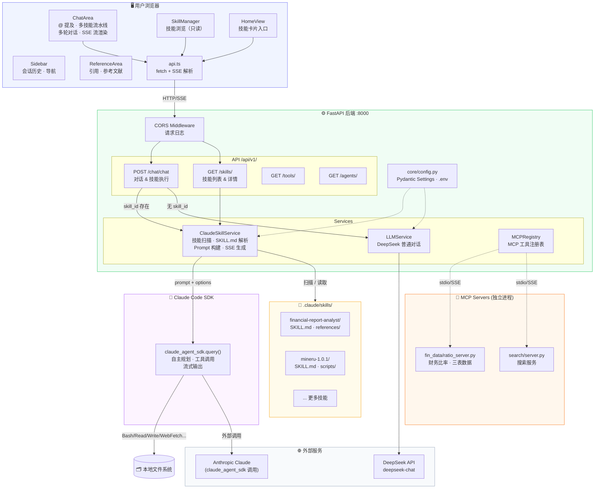
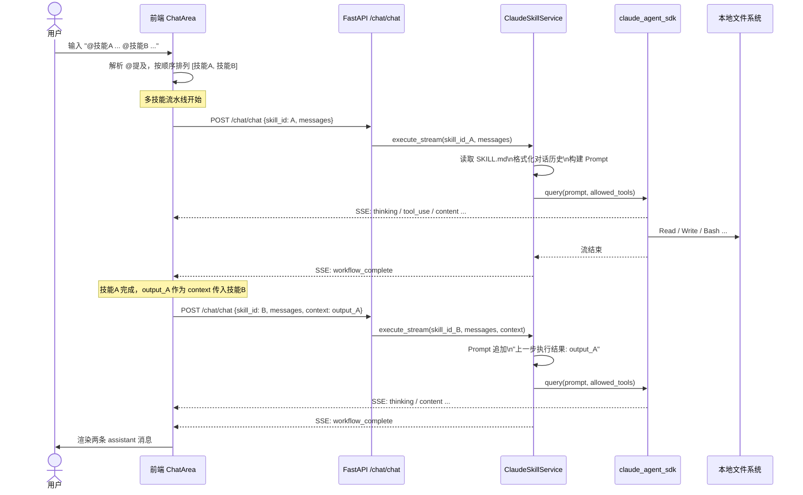
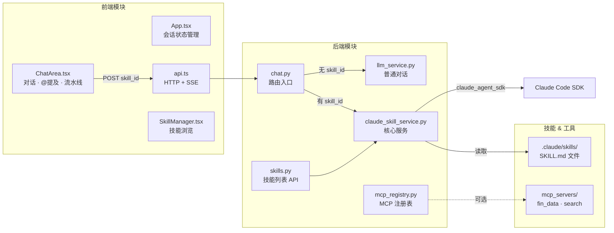

# Eido 整体架构图

## 系统架构

```mermaid
graph TB
    subgraph 用户浏览器["🖥️ 用户浏览器"]
        direction TB
        UI_Sidebar["Sidebar\n会话历史 · 导航"]
        UI_Chat["ChatArea\n@ 提及 · 多技能流水线\n多轮对话 · SSE 流渲染"]
        UI_Skills["SkillManager\n技能浏览（只读）"]
        UI_Home["HomeView\n技能卡片入口"]
        UI_Ref["ReferenceArea\n引用 · 参考文献"]
        API_TS["api.ts\nfetch + SSE 解析"]
    end

    subgraph 后端["⚙️ FastAPI 后端 :8000"]
        direction TB
        MW["CORS Middleware\n请求日志"]

        subgraph 路由层["API /api/v1/"]
            EP_Chat["POST /chat/chat\n对话 & 技能执行"]
            EP_Skills["GET  /skills/\n技能列表 & 详情"]
            EP_Tools["GET  /tools/"]
            EP_Agents["GET  /agents/"]
        end

        subgraph 服务层["Services"]
            SVC_Skill["ClaudeSkillService\n技能扫描 · SKILL.md 解析\nPrompt 构建 · SSE 生成"]
            SVC_LLM["LLMService\nDeepSeek 普通对话"]
            SVC_MCP["MCPRegistry\nMCP 工具注册表"]
        end

        Config["core/config.py\nPydantic Settings · .env"]
    end

    subgraph 技能引擎["🤖 Claude Code SDK"]
        SDK["claude_agent_sdk.query()\n自主规划 · 工具调用\n流式输出"]
    end

    subgraph 技能库["📁 .claude/skills/"]
        SK1["financial-report-analyst/\nSKILL.md · references/"]
        SK2["mineru-1.0.1/\nSKILL.md · scripts/"]
        SK3["... 更多技能"]
    end

    subgraph MCP服务["🔧 MCP Servers (独立进程)"]
        MCP_Fin["fin_data/ratio_server.py\n财务比率 · 三表数据"]
        MCP_Search["search/server.py\n搜索服务"]
    end

    subgraph 外部["🌐 外部服务"]
        DS["DeepSeek API\ndeepseek-chat"]
        Claude["Anthropic Claude\n(claude_agent_sdk 调用)"]
    end

    %% 前端内部
    UI_Chat --> API_TS
    UI_Skills --> API_TS
    UI_Home --> API_TS

    %% 前端 → 后端
    API_TS -->|"HTTP/SSE"| MW
    MW --> EP_Chat
    MW --> EP_Skills

    %% 路由 → 服务
    EP_Chat -->|"skill_id 存在"| SVC_Skill
    EP_Chat -->|"无 skill_id"| SVC_LLM
    EP_Skills --> SVC_Skill

    %% 服务 → 技能库
    SVC_Skill -->|"扫描 / 读取"| 技能库

    %% 服务 → SDK
    SVC_Skill -->|"prompt + options"| SDK

    %% SDK → 工具
    SDK -->|"Bash/Read/Write/WebFetch..."| 本地文件系统
    SDK -->|"外部调用"| Claude

    %% 普通对话
    SVC_LLM --> DS

    %% MCP 注册
    SVC_MCP -.->|"stdio/SSE"| MCP_Fin
    SVC_MCP -.->|"stdio/SSE"| MCP_Search

    %% 配置
    Config -.-> SVC_Skill
    Config -.-> SVC_LLM

    本地文件系统[("🗂️ 本地文件系统")]

    style 用户浏览器 fill:#f0f4ff,stroke:#6366f1
    style 后端 fill:#f0fdf4,stroke:#22c55e
    style 技能引擎 fill:#fdf4ff,stroke:#a855f7
    style 技能库 fill:#fffbeb,stroke:#f59e0b
    style MCP服务 fill:#fff7ed,stroke:#f97316
    style 外部 fill:#f8fafc,stroke:#94a3b8
```

---

## 技能执行流水线

```mermaid
sequenceDiagram
    actor 用户
    participant 前端 as 前端 ChatArea
    participant 后端 as FastAPI /chat/chat
    participant SVC as ClaudeSkillService
    participant SDK as claude_agent_sdk
    participant 文件 as 本地文件系统

    用户->>前端: 输入 "@技能A ... @技能B ..."
    前端->>前端: 解析 @提及，按顺序排列 [技能A, 技能B]

    Note over 前端: 多技能流水线开始

    前端->>后端: POST /chat/chat {skill_id: A, messages}
    后端->>SVC: execute_stream(skill_id_A, messages)
    SVC->>SVC: 读取 SKILL.md\n格式化对话历史\n构建 Prompt
    SVC->>SDK: query(prompt, allowed_tools)
    SDK-->>前端: SSE: thinking / tool_use / content ...
    SDK->>文件: Read / Write / Bash ...
    SDK-->>SVC: 流结束
    SVC-->>前端: SSE: workflow_complete

    Note over 前端: 技能A 完成，output_A 作为 context 传入技能B

    前端->>后端: POST /chat/chat {skill_id: B, messages, context: output_A}
    后端->>SVC: execute_stream(skill_id_B, messages, context)
    SVC->>SVC: Prompt 追加\n"上一步执行结果: output_A"
    SVC->>SDK: query(prompt, allowed_tools)
    SDK-->>前端: SSE: thinking / content ...
    SVC-->>前端: SSE: workflow_complete

    前端->>用户: 渲染两条 assistant 消息
```

---

## 目录与模块对应关系

```mermaid
graph LR
    subgraph 前端模块
        A1["App.tsx\n会话状态管理"]
        A2["ChatArea.tsx\n对话 · @提及 · 流水线"]
        A3["api.ts\nHTTP + SSE"]
        A4["SkillManager.tsx\n技能浏览"]
    end

    subgraph 后端模块
        B1["chat.py\n路由入口"]
        B2["claude_skill_service.py\n核心服务"]
        B3["llm_service.py\n普通对话"]
        B4["skills.py\n技能列表 API"]
        B5["mcp_registry.py\nMCP 注册表"]
    end

    subgraph 技能 & 工具
        C1[".claude/skills/\nSKILL.md 文件"]
        C2["mcp_servers/\nfin_data · search"]
    end

    A2 -->|"POST skill_id"| A3
    A3 --> B1
    B1 -->|"有 skill_id"| B2
    B1 -->|"无 skill_id"| B3
    B4 --> B2
    B2 -->|"读取"| C1
    B2 -->|"claude_agent_sdk"| SDK2["Claude Code SDK"]
    B5 -.->|"可选"| C2
```
